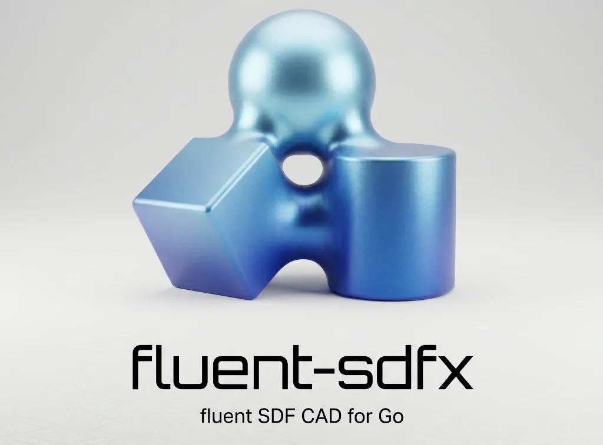
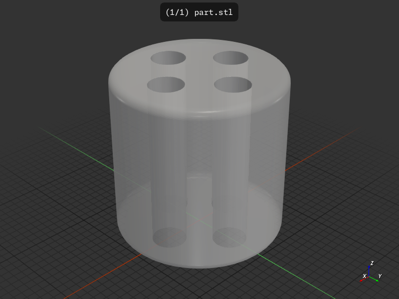

<p align="center">
  
</p>

<p align="center">
  <a href="https://pkg.go.dev/github.com/snowbldr/fluent-sdfx"></a>
  <a href="https://goreportcard.com/report/github.com/snowbldr/fluent-sdfx"></a>
  <a href="https://github.com/snowbldr/fluent-sdfx/actions/workflows/build.yml"></a>
  <a href="LICENSE"></a>
</p>

A fluent, chainable API for [sdfx](https://github.com/snowbldr/sdfx) — Go's signed distance function CAD library.

fluent-sdfx wraps sdfx's SDF2 and SDF3 types with `shape.Shape` and `solid.Solid`, giving you a chainable API that reads like a description of the part you're building. All angles are in degrees. All constructors handle errors internally so you can chain without interruption. An anchor-based [positioning API](https://snowbldr.github.io/fluent-sdfx/positioning/) (`Top`, `OnTopOf`, `Inside`, …) and a `layout` package of pattern helpers (`Polar`, `Grid`, `RectCorners`, …) let you place parts without bounding-box math.

📚 **[Read the docs](https://snowbldr.github.io/fluent-sdfx/)** — install, project setup, the dev loop, foundations, operations, cookbook recipes, and the full API reference.

> [!NOTE]
> **Status: v0.x.** The library is usable today but pre-1.0 — the public API may shift in response to early-user feedback. Watch [releases](https://github.com/snowbldr/fluent-sdfx/releases) for breaking-change notes; pin a tag if you need stability.

## Install

```bash
go get github.com/snowbldr/fluent-sdfx
```

## Quick example



```go
package main

import (
	"github.com/snowbldr/fluent-sdfx/layout"
	"github.com/snowbldr/fluent-sdfx/solid"
)

func main() {
	// A cylinder with 4 holes drilled through it at the corners of a 10x10 square.
	solid.Cylinder(20, 10, 1).
		Cut(solid.Cylinder(25, 2, 0).
			Multi(layout.RectCorners(10, 10)...)).
		STL("part.stl", 3.0)
}
```

The [quickstart](https://snowbldr.github.io/fluent-sdfx/quickstart/) walks through this exact part in five incremental steps.

## The recipe pattern

For multi-part assemblies, fluent-sdfx is meant to be written as **ingredients at the top, method at the bottom** — bare primitives in named variables, then one fluent expression that positions and combines them via anchors and `layout` helpers. No `pos1 := ...; result := pos1.Foo()` ladder. The [lantern cookbook](https://snowbldr.github.io/fluent-sdfx/cookbook-lantern/) is the canonical worked example, and the [positioning page](https://snowbldr.github.io/fluent-sdfx/positioning/#the-recipe-pattern) explains why.

## What's in the docs

- [**Install**](https://snowbldr.github.io/fluent-sdfx/install/) — Go, fluent-sdfx, f3d.
- [**Project setup**](https://snowbldr.github.io/fluent-sdfx/project-setup/) — scaffold a Go module and produce your first STL.
- [**Gallery**](https://snowbldr.github.io/fluent-sdfx/gallery/) — eight finished parts at a glance, each linking to its cookbook source.
- [**Coming from another CAD library**](https://snowbldr.github.io/fluent-sdfx/comparison/) — mapping table for OpenSCAD / CadQuery / Build123d / sdfx users.
- [**Dev loop with stldev**](https://snowbldr.github.io/fluent-sdfx/dev-loop/) — watch-rebuild-preview iteration cycle.
- [**Quickstart**](https://snowbldr.github.io/fluent-sdfx/quickstart/) — five steps to a non-trivial part.
- **Foundations** — vectors, 2D shapes, 3D solids, booleans, transforms, [positioning](https://snowbldr.github.io/fluent-sdfx/positioning/).
- **Operations** — extrude/revolve/loft/sweep, smooth blends, modifiers, patterns, cross-sections, text, output resolution, parametric helpers, [testing & validation](https://snowbldr.github.io/fluent-sdfx/testing-validation/).
- **Cookbook** — bolt assembly, enclosure, gear.
- [**API reference**](https://snowbldr.github.io/fluent-sdfx/api-reference/) — every type and method, package by package.

## Repo layout

```
fluent-sdfx/
├── shape/      2D primitives, builders, transforms, booleans
├── solid/      3D primitives, transforms, booleans, modifiers, anchor positioning
├── layout/     Pattern helpers (Polar, Grid, RectCorners, …) for .Multi(...)
├── obj/        Parametric helpers (bolts, panels, gears, …)
├── render/     Output formats (STL, 3MF, DXF, SVG, PNG)
├── mesh/       Triangle-mesh utilities
├── validate/   Mesh validation: watertight, volume, overhang, *testing.T helpers
├── plane/      Plane helpers for cross-sections
├── units/      Constants and unit conversions
├── vec/        Vector types (v2, v3, v2i, v3i, p2)
├── examples/   77 example projects
├── tutorial/   Runnable code paired with the docs site
└── docs/       The fntags-based documentation site
```

## License

MIT
