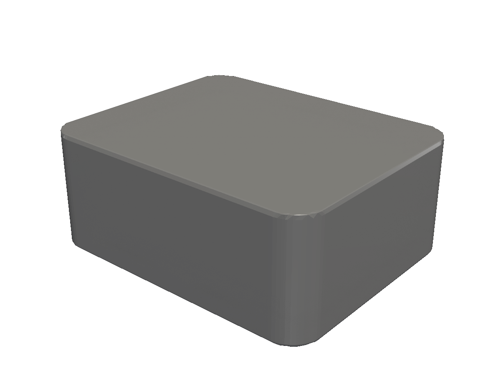
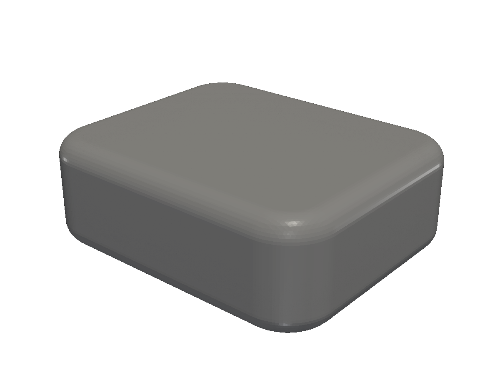
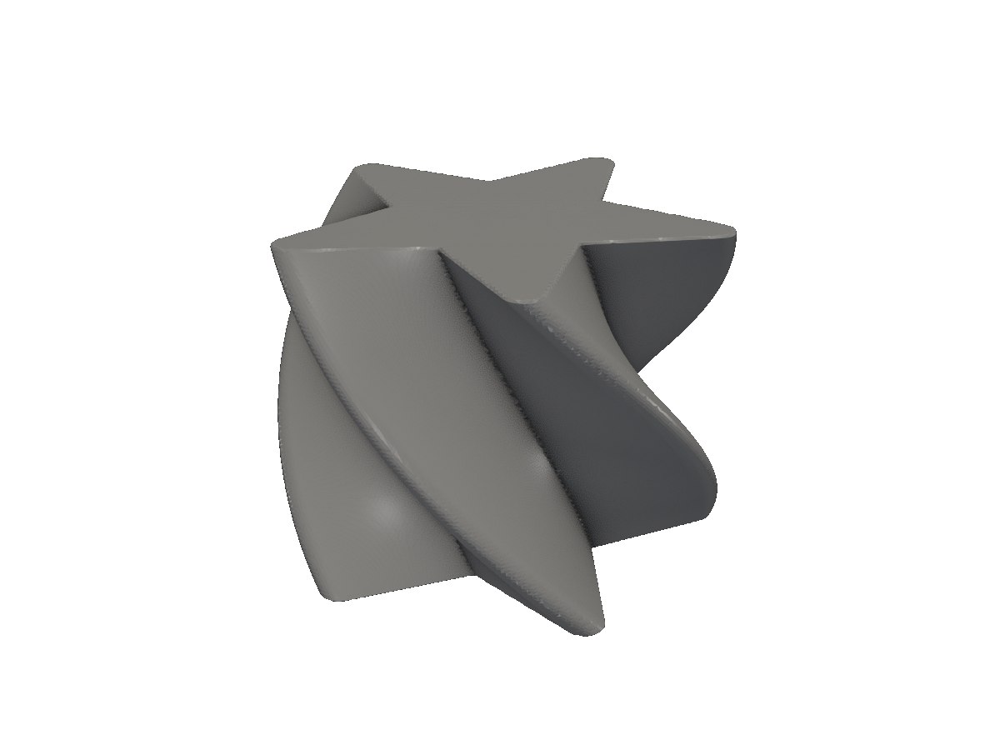
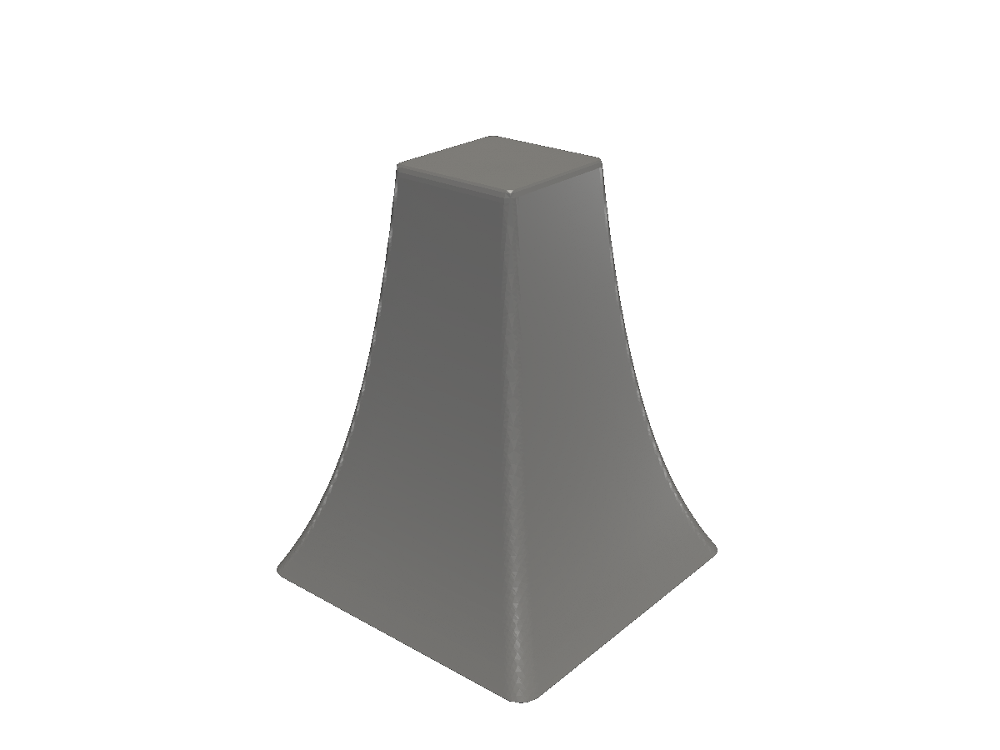
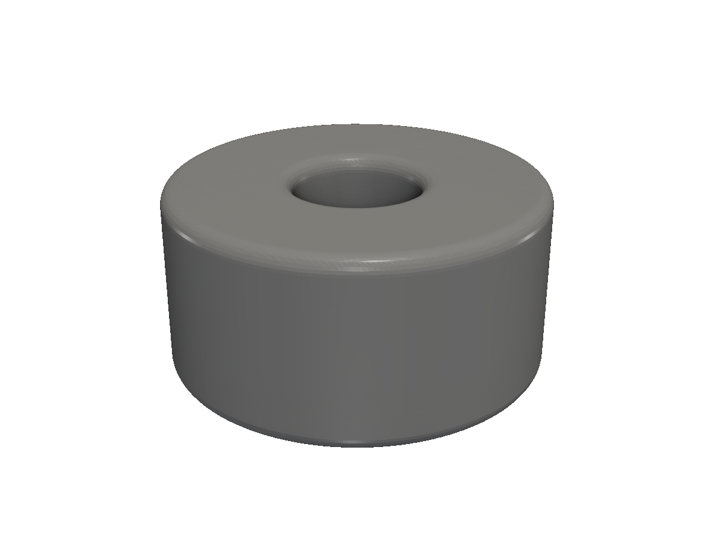
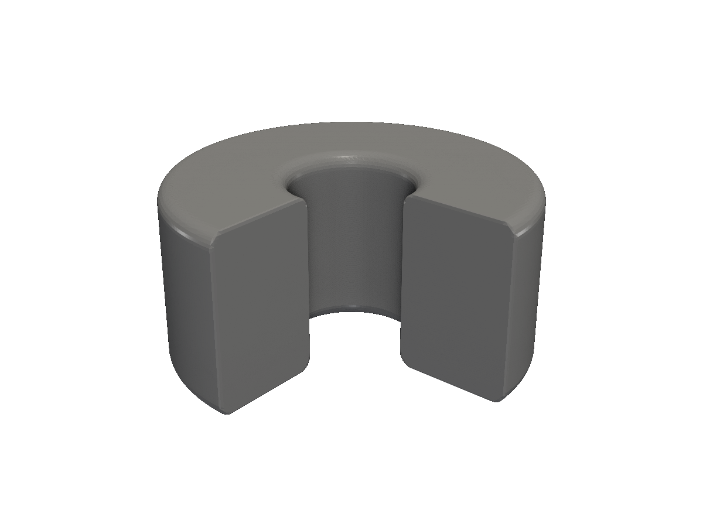
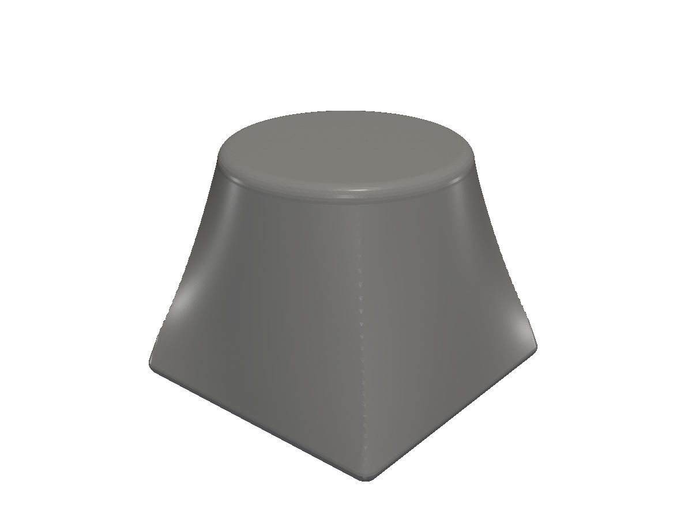
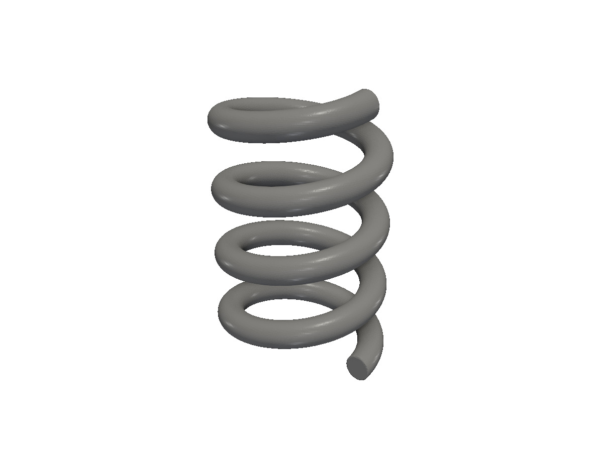
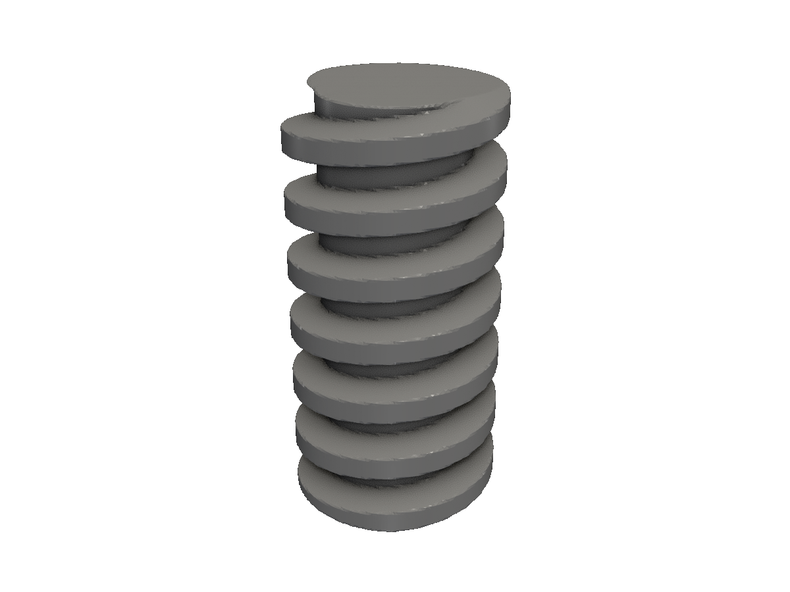

# 2D → 3D

Extrude, revolve, loft, sweep — turn a 2D profile into a 3D solid.

The fastest path to most 3D parts is "draw a 2D profile, then turn it into a solid." fluent-sdfx exposes seven such operations, all as methods on `*shape.Shape` that return a `*solid.Solid`.

| Method | What it does |
|---|---|
| `Extrude(h)` | Linear extrusion along Z. |
| `ExtrudeRounded(h, r)` | Linear extrusion with rounded top and bottom edges. |
| `TwistExtrude(h, twist)` | Extrude while rotating the profile around Z. |
| `ScaleExtrude(h, scale)` | Extrude while scaling the profile linearly. |
| `Revolve()` | Full 360° revolution around the Y axis. |
| `RevolveAngle(deg)` | Partial revolution. |
| `LoftTo(top, h, round)` | Smooth transition from this profile to another. |
| `SweepHelix(r, turns, h, flat)` | Sweep along a helical path. |
| `Screw(h, start, pitch, num)` | Helical thread sweep. |

## Extrude

The simplest 2D-to-3D op. The profile becomes the cross-section of a prism along Z.

<!-- src: tutorial/10-2d-to-3d/01-extrude/main.go -->
```go
// 2D → 3D: linear extrusion of a 2D profile.
package main

import (
	"github.com/snowbldr/fluent-sdfx/shape"
	v2 "github.com/snowbldr/fluent-sdfx/vec/v2"
)

func main() {
	shape.Rect(v2.XY(20, 16), 2).Extrude(8).STL("out.stl", 4.0)
}
```

<figure>
  
  <figcaption>A 20×16mm rectangle extruded 8mm along Z.</figcaption>
</figure>

## ExtrudeRounded

Same, but with a fillet on the top and bottom edges. Often what you want for printed parts — a pure linear extrusion has razor-sharp edges that snag.

<!-- src: tutorial/10-2d-to-3d/02-extrude-rounded/main.go -->
```go
// 2D → 3D: extrusion with rounded top and bottom edges.
package main

import (
	"github.com/snowbldr/fluent-sdfx/shape"
	v2 "github.com/snowbldr/fluent-sdfx/vec/v2"
)

func main() {
	shape.Rect(v2.XY(20, 16), 2).ExtrudeRounded(8, 1.5).STL("out.stl", 5.0)
}
```

<figure>
  
  <figcaption>The same rectangle, extruded with a 1.5mm rounded top and bottom.</figcaption>
</figure>

## TwistExtrude

Rotates the profile around Z over the height. The `twist` is in **radians** — use `units.DtoR(deg)` if you'd rather think in degrees.

<!-- src: tutorial/10-2d-to-3d/03-twist-extrude/main.go -->
```go
// 2D → 3D: extrusion that twists the profile around Z over the height.
//
// twist is in radians. units.DtoR converts from degrees if you'd rather.
package main

import (
	"github.com/snowbldr/fluent-sdfx/shape"
	"github.com/snowbldr/fluent-sdfx/units"
)

func main() {
	shape.Star(12, 5, 5).TwistExtrude(20, units.DtoR(90)).STL("out.stl", 5.0)
}
```

<figure>
  
  <figcaption>A star profile twisting 90° over a 20mm extrusion.</figcaption>
</figure>

## ScaleExtrude

Extrudes while scaling the profile linearly toward the top. `scale` is the (x, y) multiplier at the top — `(1, 1)` is no scaling, `(0.4, 0.4)` shrinks to 40%.

<!-- src: tutorial/10-2d-to-3d/04-scale-extrude/main.go -->
```go
// 2D → 3D: extrusion that scales the profile linearly over the height.
//
// scale is the (x, y) multiplier at the top of the extrusion. The bottom
// is the original size; the top is original × scale.
package main

import (
	"github.com/snowbldr/fluent-sdfx/shape"
	v2 "github.com/snowbldr/fluent-sdfx/vec/v2"
)

func main() {
	shape.Rect(v2.XY(16, 16), 1).ScaleExtrude(20, v2.XY(0.4, 0.4)).STL("out.stl", 5.0)
}
```

<figure>
  
  <figcaption>A 16mm square tapered to 40% of its size at the top.</figcaption>
</figure>

There's also `ScaleTwistExtrude(h, twist, scale)` that does both at once.

## Revolve

Rotates a 2D profile around the **Y axis** to produce a solid of revolution. The profile lives in the XY plane; +X is the radius from the axis.

<!-- src: tutorial/10-2d-to-3d/05-revolve/main.go -->
```go
// 2D → 3D: full revolution of a 2D profile around the Y axis.
//
// The profile lives in the XY plane; +X is the radius from the axis.
package main

import (
	"github.com/snowbldr/fluent-sdfx/shape"
	v2 "github.com/snowbldr/fluent-sdfx/vec/v2"
)

func main() {
	// A simple cup-like profile: rectangle offset from the axis.
	shape.Rect(v2.XY(8, 12), 1.0).
		Translate(v2.X(8)).
		Revolve().
		STL("out.stl", 5.0)
}
```

<figure>
  
  <figcaption>A small offset rectangle revolved into a flat ring.</figcaption>
</figure>

> [!NOTE]
> The axis is +Y, not +Z. This is an sdfx convention. Most CAD tools use Z; if you have an existing Z-axis profile, rotate it 90° around X first, or build the profile aware of the convention.

## RevolveAngle

A partial revolution. Useful for wedges, fan blades, and exposing the inside of a revolved part for diagrams.

<!-- src: tutorial/10-2d-to-3d/06-revolve-angle/main.go -->
```go
// 2D → 3D: partial revolution — a wedge of a full revolve.
//
// angleDeg is in degrees, measured from +X around the Y axis.
package main

import (
	"github.com/snowbldr/fluent-sdfx/shape"
	v2 "github.com/snowbldr/fluent-sdfx/vec/v2"
)

func main() {
	shape.Rect(v2.XY(8, 12), 1.0).
		Translate(v2.X(8)).
		RevolveAngle(270).
		STL("out.stl", 5.0)
}
```

<figure>
  
  <figcaption>Three-quarters of a revolved profile.</figcaption>
</figure>

## LoftTo

Transitions from one 2D profile (the receiver) to another (the argument) over a given height. The two profiles can have radically different geometry — fluent-sdfx interpolates the SDF between them.

<!-- src: tutorial/10-2d-to-3d/07-loft/main.go -->
```go
// 2D → 3D: loft transitions between two 2D profiles over a height.
//
// LoftTo blends from the receiver shape (bottom) to a target shape (top).
// The two profiles can have very different geometry — here a square base
// transitions to a circular top.
package main

import (
	"github.com/snowbldr/fluent-sdfx/shape"
	v2 "github.com/snowbldr/fluent-sdfx/vec/v2"
)

func main() {
	shape.Rect(v2.XY(20, 20), 0).
		LoftTo(shape.Circle(8), 18, 1).
		STL("out.stl", 5.0)
}
```

<figure>
  
  <figcaption>A 20mm square base lofted into an 8mm-radius circular top.</figcaption>
</figure>

The `round` parameter rolls off the top and bottom edges, similar to `ExtrudeRounded`.

## SweepHelix

Sweeps a 2D profile along a helical path. Used for springs, threads with non-standard profiles, and stylised columns.

<!-- src: tutorial/10-2d-to-3d/08-sweep-helix/main.go -->
```go
// 2D → 3D: SweepHelix sweeps a 2D profile along a helical path.
//
// radius is the helix radius; turns the number of revolutions; height the
// total axial length. flatEnds=true caps the sweep with flat planes
// perpendicular to Z.
package main

import "github.com/snowbldr/fluent-sdfx/shape"

func main() {
	shape.Circle(1.5).SweepHelix(8, 4, 30, true).STL("out.stl", 6.0)
}
```

<figure>
  
  <figcaption>A circle swept along a 4-turn helix, 8mm radius, 30mm tall.</figcaption>
</figure>

## Screw

A specialised helical sweep optimised for screw threads. Pair with the `shape.AcmeThread`, `shape.ISOThread`, `shape.ANSIButtressThread`, and `shape.PlasticButtressThread` thread profiles for standards-compliant threads, or use any custom 2D profile for stylised threads.

<!-- src: tutorial/10-2d-to-3d/09-screw/main.go -->
```go
// 2D → 3D: Screw revolves a thread profile around Z to make screw threads.
//
// height: total axial length. start: starting angular offset (radians).
// pitch: axial distance per turn. num: number of starts (parallel
// helices); 1 for a normal screw.
//
// shape.AcmeThread is a stock thread profile for the common case; for a
// custom thread, build a closed shape.Polygon and offset it from the axis.
package main

import "github.com/snowbldr/fluent-sdfx/shape"

func main() {
	shape.AcmeThread(5, 3).Screw(20, 0, 3, 1).STL("out.stl", 8.0)
}
```

<figure>
  
  <figcaption>A custom triangular thread profile screwed at 3mm pitch.</figcaption>
</figure>

For real fasteners, use `obj.Bolt` and `obj.Nut` — covered on [Parametric helpers](/obj-overview/).
