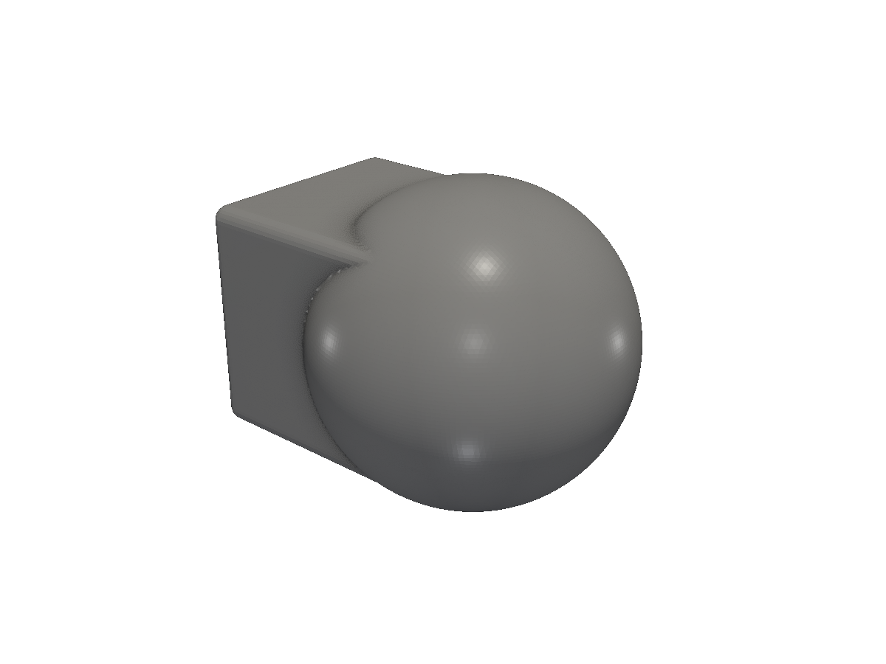
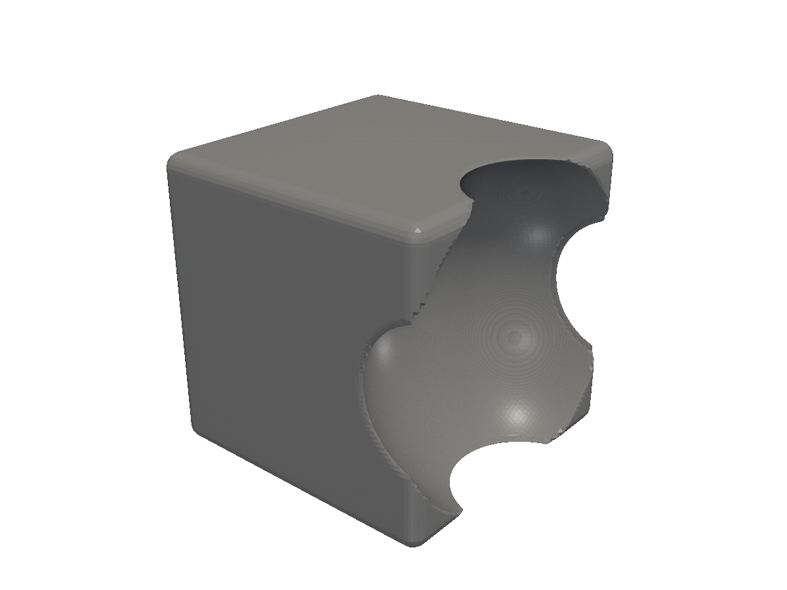
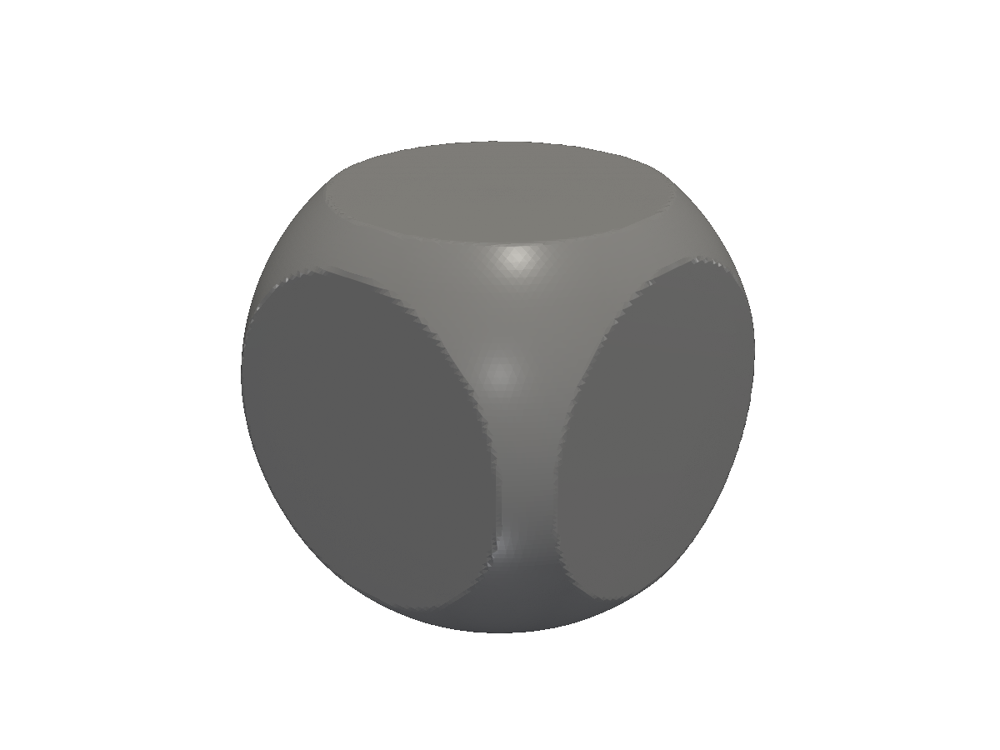
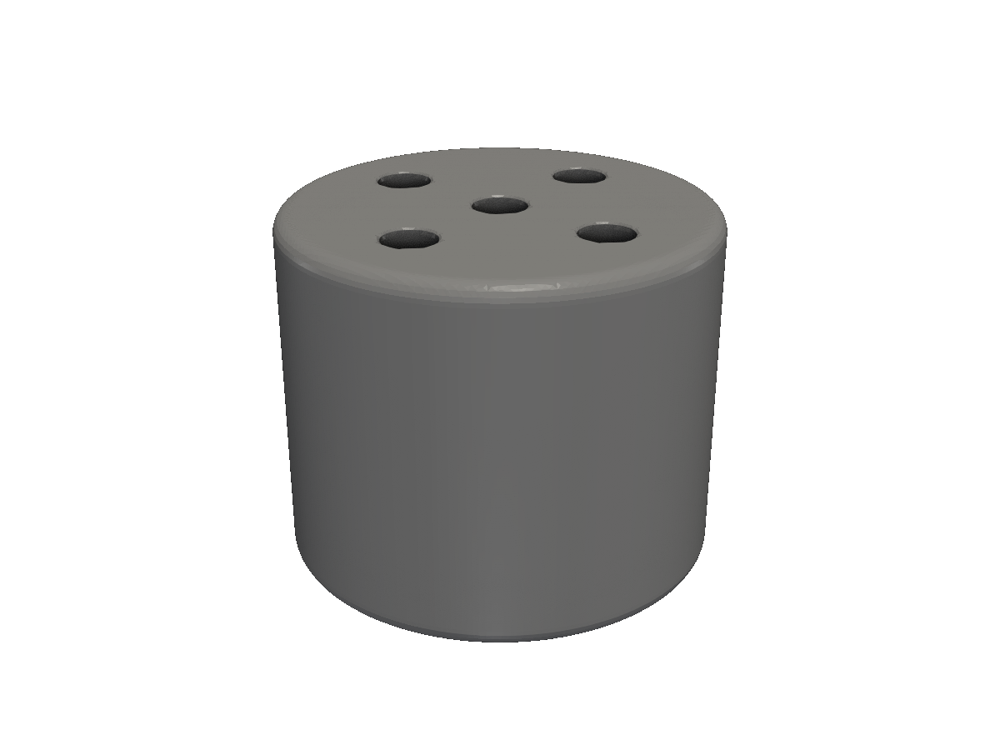

# Booleans

Union, Cut, and Intersect — the three set operations that compose primitives into real parts.

Three boolean operations cover almost every CAD modelling task:

| Method | Set operation | What it produces |
|---|---|---|
| `Union(others...)` (also `Add`) | A ∪ B | The combined volume of both solids. |
| `Cut(tools...)` (also `Difference`) | A − B | A with B removed. |
| `Intersect(others...)` | A ∩ B | The volume present in both. |

All three are methods on both `*shape.Shape` (2D) and `*solid.Solid` (3D), all are variadic, all return a new value without modifying the receiver. The smooth-blend variants — `SmoothUnion`, `SmoothCut`, `SmoothIntersect` — produce filleted joins instead of sharp creases, covered on the [Smooth blends](/smooth-blends/) page.

## Union — joining solids

<!-- src: tutorial/08-booleans/01-union/main.go -->
```go
// Booleans: Union joins two solids into one. Overlapping volume merges.
package main

import (
	"github.com/snowbldr/fluent-sdfx/solid"
	v3 "github.com/snowbldr/fluent-sdfx/vec/v3"
)

func main() {
	solid.Box(v3.XYZ(16, 16, 16), 1).
		Union(solid.Sphere(11).TranslateX(8)).
		STL("out.stl", 4.0)
}
```

<figure>
  
  <figcaption>A box and an off-centre sphere unioned. Where the volumes overlap, the surfaces merge.</figcaption>
</figure>

The variadic form lets you union any number of solids in one call:

```go
body.Union(boss1, boss2, boss3, lip)
```

The package-level `solid.UnionAll(s1, s2, s3, ...)` is equivalent and reads better when there's no obvious "primary" solid.

## Cut — subtracting tools

<!-- src: tutorial/08-booleans/02-cut/main.go -->
```go
// Booleans: Cut subtracts the tool from the body (set difference).
package main

import (
	"github.com/snowbldr/fluent-sdfx/solid"
	v3 "github.com/snowbldr/fluent-sdfx/vec/v3"
)

func main() {
	solid.Box(v3.XYZ(20, 20, 20), 1).
		Cut(solid.Sphere(11).TranslateX(11)).
		STL("out.stl", 4.0)
}
```

<figure>
  
  <figcaption>A box with a sphere subtracted from one face.</figcaption>
</figure>

The variadic Cut takes any number of tools and subtracts them all from the receiver. This is much faster than chaining individual `.Cut()` calls because the SDF only has to be re-evaluated once.

## Intersect — keeping the overlap

<!-- src: tutorial/08-booleans/03-intersect/main.go -->
```go
// Booleans: Intersect keeps only the volume common to both solids.
package main

import (
	"github.com/snowbldr/fluent-sdfx/solid"
	v3 "github.com/snowbldr/fluent-sdfx/vec/v3"
)

func main() {
	solid.Box(v3.XYZ(20, 20, 20), 1).
		Intersect(solid.Sphere(13)).
		STL("out.stl", 4.0)
}
```

<figure>
  
  <figcaption>The intersection of a box and a slightly oversized sphere — a box with rounded faces.</figcaption>
</figure>

`Intersect` is occasionally the cleanest way to round corners, clip a part to a bounding box, or trim a generative shape (like `Gyroid`) to fit inside a real volume.

## Multi-cut — drilling many holes

The variadic Cut is your friend when you need to drill, cut slots, or remove an array of features. One source tool, many translated copies, one `.Cut(...)` call:

<!-- src: tutorial/08-booleans/04-multi-cut/main.go -->
```go
// Booleans: Cut is variadic — pass any number of tools and they're all
// removed from the body in a single operation. `layout.Polar(7, 4)`
// returns 4 positions on a 7mm-radius circle to spread into Multi for
// the outer ring of holes; the central hole is its own argument.
package main

import (
	"github.com/snowbldr/fluent-sdfx/layout"
	"github.com/snowbldr/fluent-sdfx/solid"
)

func main() {
	hole := solid.Cylinder(25, 1.5, 0)
	solid.Cylinder(20, 12, 1).
		Cut(
			hole, // central
			hole.Multi(layout.Polar(7, 4)...),
		).STL("out.stl", 4.0)
}
```

<figure>
  
  <figcaption>Five holes drilled through a cylinder in a single Cut call.</figcaption>
</figure>

## Tips & gotchas

> [!TIP]
> Always make cutting tools longer or larger than the body they're removing from. fluent-sdfx is exact — a hole that's exactly as tall as the body will leave a single layer of mesh that may or may not survive the marching-cubes step depending on resolution. A 1–2× margin avoids the issue entirely.

> [!WARNING]
> The boolean `Cut(many)` is faster than chaining `.Cut(one).Cut(another)`, but the result is *always* the union of the tools subtracted from the body — there's no way to express "subtract A, then add C, then subtract B" in a single chain. For that pattern, do them in sequence: `body.Cut(A).Union(C).Cut(B)`.

> [!NOTE]
> For the smooth/filleted variants (`SmoothUnion(min, others...)`, `SmoothCut(max, tools...)`, `SmoothIntersect(max, others...)`) you'll need a *blend function* — see [Smooth blends](/smooth-blends/) for the catalogue and how to pick one.

## 2D booleans

Every operation above also works on `*shape.Shape`. The signatures are identical except they return `*Shape`:

```go
panel := obj.Panel2D(...)
holes := shape.Circle(2).Translate(...)
panel.Cut(holes).Extrude(3).STL("panel.stl", 5)
```

For more on combining 2D shapes, see [2D shapes](/shapes-2d/).
