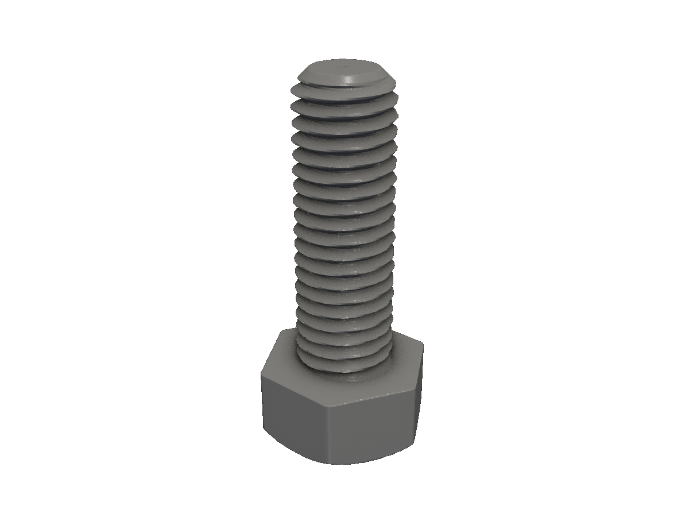
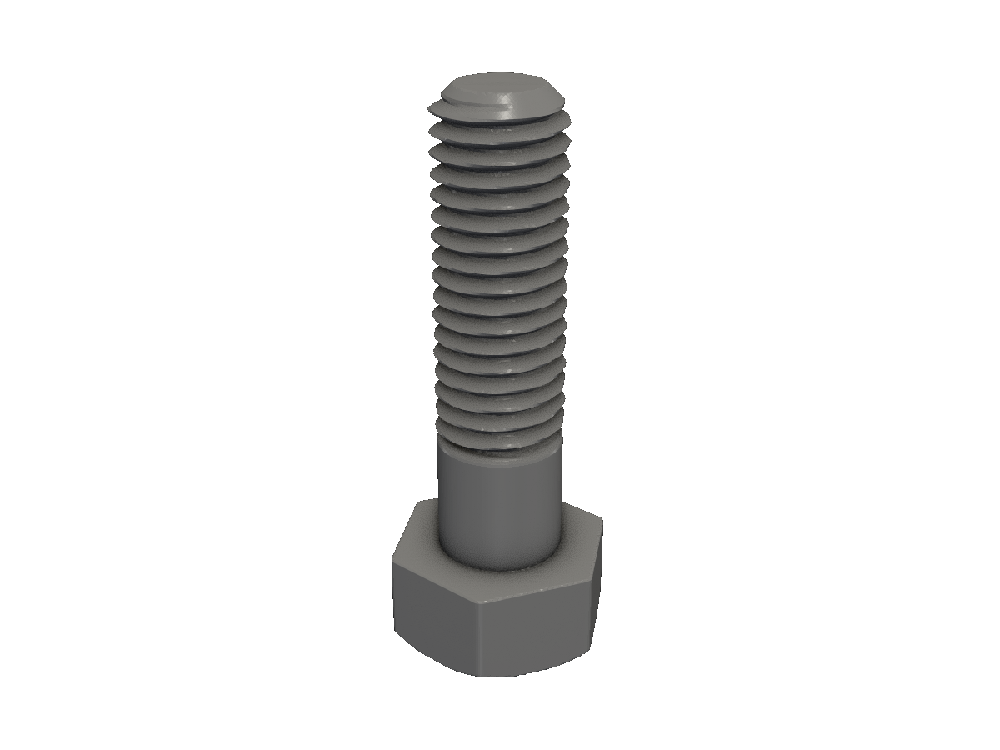
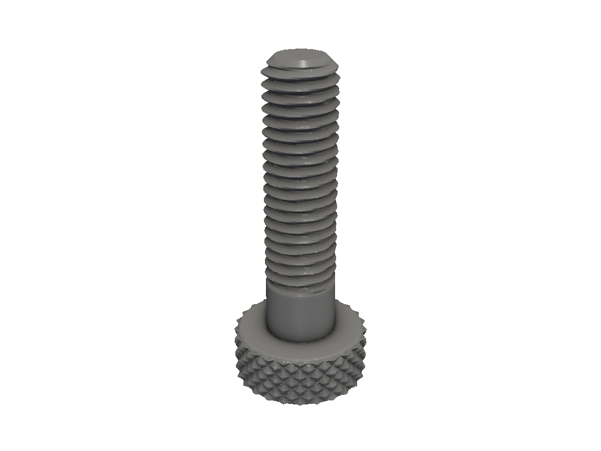
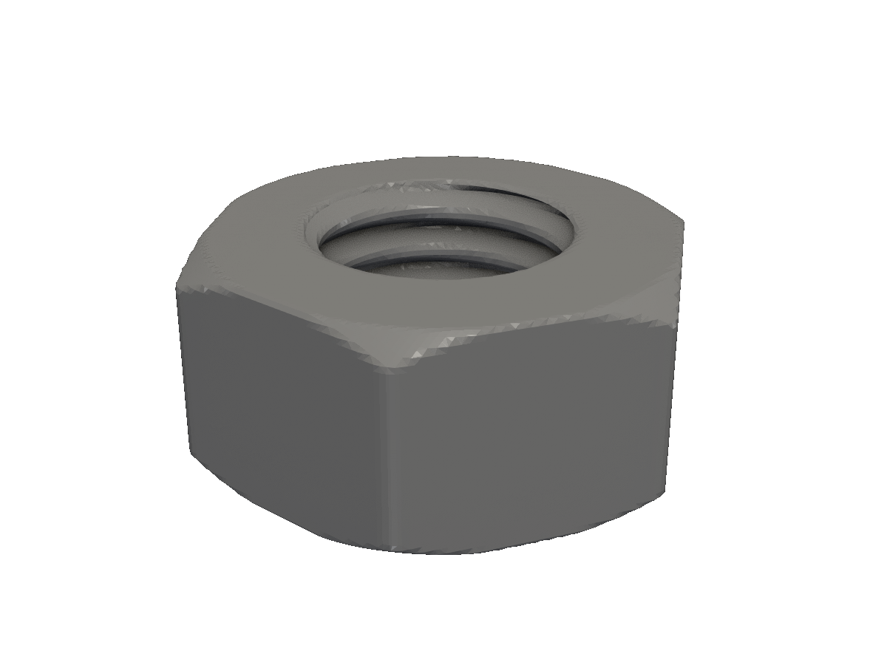
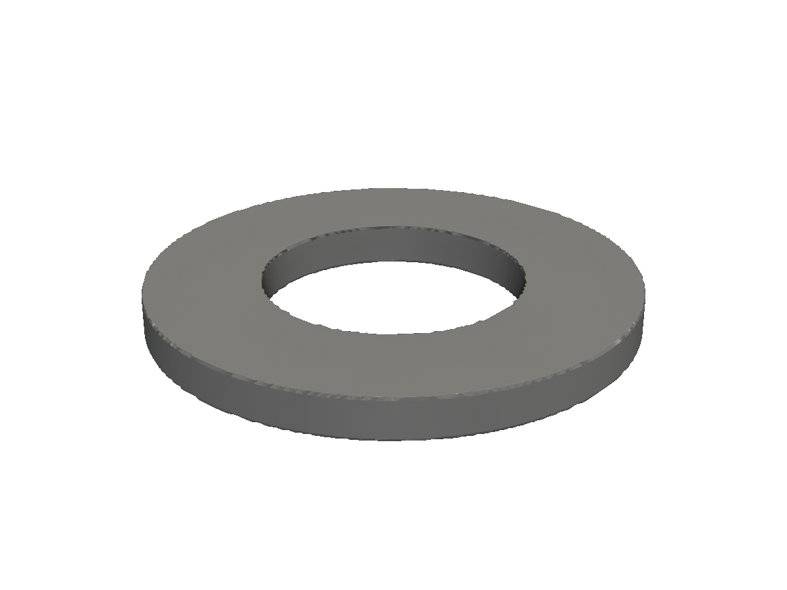
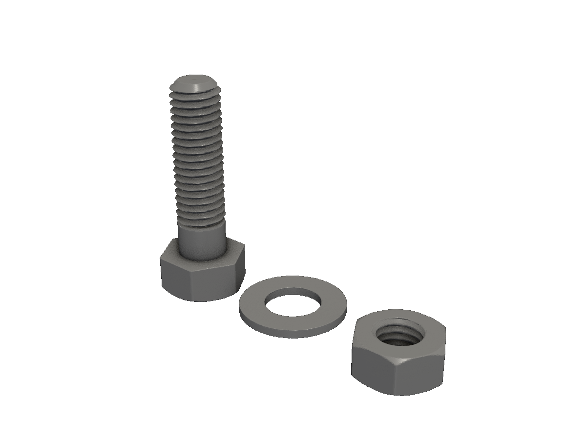

# Bolt assembly

A complete fastener — hex bolt, matching nut, and washer — built from obj.Bolt, obj.Nut, and obj.Washer3D.

This recipe walks through a full M8×1.25 fastener assembly. Each step is one running program; the final step combines them into a single exploded layout.

## Step 1 — A single hex bolt

`obj.Bolt(BoltParms)` builds the entire fastener — head, shank, threads — in one call. The `Thread` field uses sdfx's standard thread-name table (`"M8x1.25"`, `"unc_5/8"`, etc.). `Style` controls the head: `"hex"` or `"knurl"`.

<!-- src: tutorial/18-cookbook-bolt/01-bolt-only/main.go -->
```go
// Bolt assembly cookbook step 1: a single hex bolt.
//
// obj.Bolt builds the entire fastener — head, shank, threads — in one call.
// Every later step in this cookbook adds one more part beside it.
package main

import "github.com/snowbldr/fluent-sdfx/obj"

const thread = "M8x1.25"

func main() {
	bolt := obj.Bolt(obj.BoltParms{
		Thread:      thread,
		Style:       "hex",
		TotalLength: 25,
		ShankLength: 0,
	})

	bolt.STL("out.stl", 6.0)
}
```

<figure>
  
  <figcaption>An M8×1.25 hex bolt, fully threaded over its 25mm length.</figcaption>
</figure>

## Step 2 — Add a smooth shank

Real bolts often have an unthreaded smooth section just below the head — a "shank" — that rides through a clearance hole without chewing the bore. `ShankLength` sets it.

<!-- src: tutorial/18-cookbook-bolt/02-with-shank/main.go -->
```go
// Bolt assembly cookbook step 2: bolt with a smooth shank.
//
// ShankLength carves an unthreaded section out of TotalLength immediately
// below the head. Useful when the bolt rides through a smooth hole and
// you don't want the threads chewing the bore.
package main

import "github.com/snowbldr/fluent-sdfx/obj"

const thread = "M8x1.25"

func main() {
	bolt := obj.Bolt(obj.BoltParms{
		Thread:      thread,
		Style:       "hex",
		TotalLength: 30,
		ShankLength: 8,
	})

	bolt.STL("out.stl", 6.0)
}
```

<figure>
  
  <figcaption>The same bolt with an 8mm smooth shank below the head.</figcaption>
</figure>

## Step 3 — A different thread + style

A printable thumbscrew: smaller M5 thread, `"knurl"` head style for finger grip.

<!-- src: tutorial/18-cookbook-bolt/03-different-thread/main.go -->
```go
// Bolt assembly cookbook step 3: try a different thread standard.
//
// "Knurl" head style produces a knurled cap instead of hex; useful for
// printable thumbscrews. Thread "M5x0.8" is a common metric small bolt.
package main

import "github.com/snowbldr/fluent-sdfx/obj"

func main() {
	obj.Bolt(obj.BoltParms{
		Thread:      "M5x0.8",
		Style:       "knurl",
		TotalLength: 20,
		ShankLength: 4,
	}).STL("out.stl", 8.0)
}
```

<figure>
  
  <figcaption>A knurled M5 thumbscrew for tool-free assembly.</figcaption>
</figure>

## Step 4 — A matching nut

`obj.Nut(NutParms)` pairs with the bolt by `Thread` name. `Tolerance` adds a printable clearance to the *internal* threads — a positive value makes the nut a slightly looser fit, which prints reliably.

<!-- src: tutorial/18-cookbook-bolt/04-matching-nut/main.go -->
```go
// Bolt assembly cookbook step 4: a matching nut.
//
// obj.Nut takes a thread name and a style. The internal thread is sized
// to mate with a bolt of the same name; Tolerance adds a positive
// clearance to the internal thread radius for a printable fit.
package main

import "github.com/snowbldr/fluent-sdfx/obj"

const thread = "M8x1.25"

func main() {
	obj.Nut(obj.NutParms{
		Thread:    thread,
		Style:     "hex",
		Tolerance: 0.1,
	}).STL("out.stl", 6.0)
}
```

<figure>
  
  <figcaption>An M8×1.25 hex nut with 0.1mm internal-thread tolerance.</figcaption>
</figure>

## Step 5 — A washer

`obj.Washer3D(WasherParms)` is the simplest helper — a flat ring with optional wedge cut for split-washer behaviour.

<!-- src: tutorial/18-cookbook-bolt/05-washer/main.go -->
```go
// Bolt assembly cookbook step 5: a washer.
//
// InnerRadius is sized to clear the bolt; OuterRadius gives the load-
// spreading face. Remove > 0 cuts a wedge for a "split" / lock-washer
// look; leave at 0 for a plain washer.
package main

import "github.com/snowbldr/fluent-sdfx/obj"

func main() {
	obj.Washer3D(obj.WasherParms{
		Thickness:   1.5,
		InnerRadius: 4.5, // ~M8 clearance
		OuterRadius: 8.5,
		Remove:      0,
	}).STL("out.stl", 8.0)
}
```

<figure>
  
  <figcaption>A flat M8 washer, 17mm OD × 9mm ID × 1.5mm thick.</figcaption>
</figure>

## Step 6 — The full assembly

Bring everything together in one program. Two modelling concerns:

1. **Stack-up math.** The total bolt-plus-washer-plus-nut height is `TotalLength + 1.5 + nutHeight`. We use `TotalLength` as the canonical reference so the constants stay in one place.
2. **Exploded layout.** Lay the parts side-by-side along X for an at-a-glance render.

<!-- src: tutorial/18-cookbook-bolt/06-assembly/main.go -->
```go
// Bolt assembly cookbook step 6: the full assembly — bolt, washer, nut.
//
// Three concerns in this step:
//  1. Position each part at its correct Z coordinate.
//  2. Use TotalLength as the canonical reference for stack-up math.
//  3. Lay out the parts side-by-side in X for an exploded-view render.
package main

import (
	"github.com/snowbldr/fluent-sdfx/obj"
	"github.com/snowbldr/fluent-sdfx/solid"
)

const (
	thread      = "M8x1.25"
	totalLength = 30.0
	shankLength = 6.0
)

func main() {
	bolt := obj.Bolt(obj.BoltParms{
		Thread:      thread,
		Style:       "hex",
		TotalLength: totalLength,
		ShankLength: shankLength,
	})

	washer := obj.Washer3D(obj.WasherParms{
		Thickness:   1.5,
		InnerRadius: 4.5,
		OuterRadius: 8.5,
	})

	nut := obj.Nut(obj.NutParms{
		Thread:    thread,
		Style:     "hex",
		Tolerance: 0.1,
	})

	// Exploded layout along X. An exploded view is one of the few cases
	// where literal `Translate` reads better than an anchor verb — each
	// part keeps its natural Z, only X is shifted.
	parts := solid.UnionAll(
		bolt.TranslateX(-20),
		washer,
		nut.TranslateX(20),
	)
	parts.STL("out.stl", 6.0)
}
```

<figure>
  
  <figcaption>The complete exploded fastener — bolt, washer, nut.</figcaption>
</figure>

## Where to next

- For the **enclosure that uses this fastener**, see the [Enclosure cookbook](/cookbook-enclosure/) — it adds matching screw holes to a panel-mounted box.
- For **less-standard fasteners** (countersunk, button head, threaded inserts), use `obj.ThreadedCylinder` and combine with the standard primitives. Or skip `obj` entirely and build directly from `solid.Cylinder` + `shape.AcmeThread.Screw(...)`.
- For **printable thread tolerances**, `BoltParms.Tolerance > 0` shrinks the external threads — the analog of `NutParms.Tolerance` for nuts. A few iterations on a test print usually settle on values around `0.1`–`0.2`mm.
