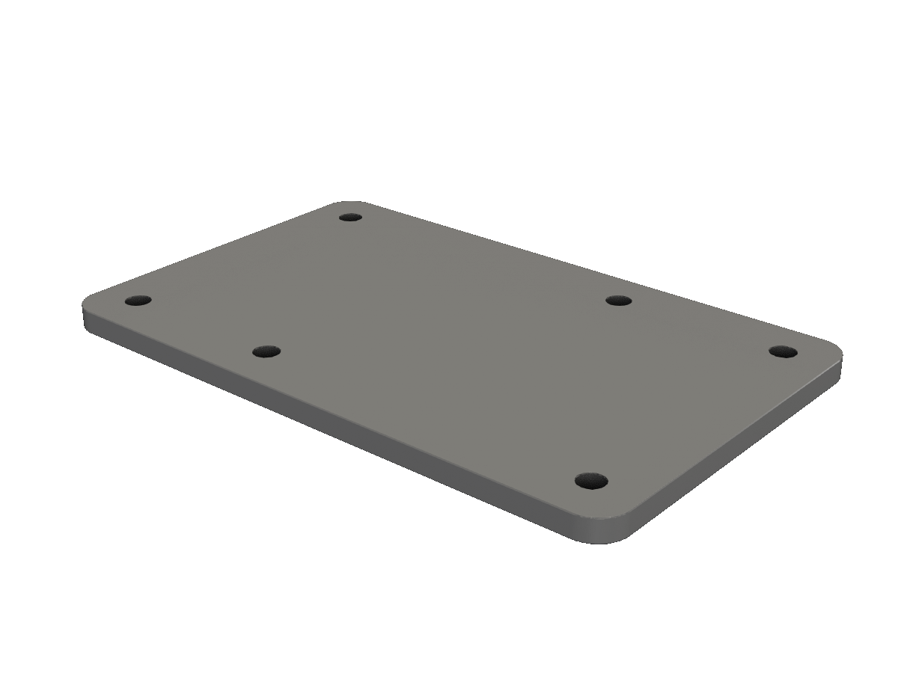
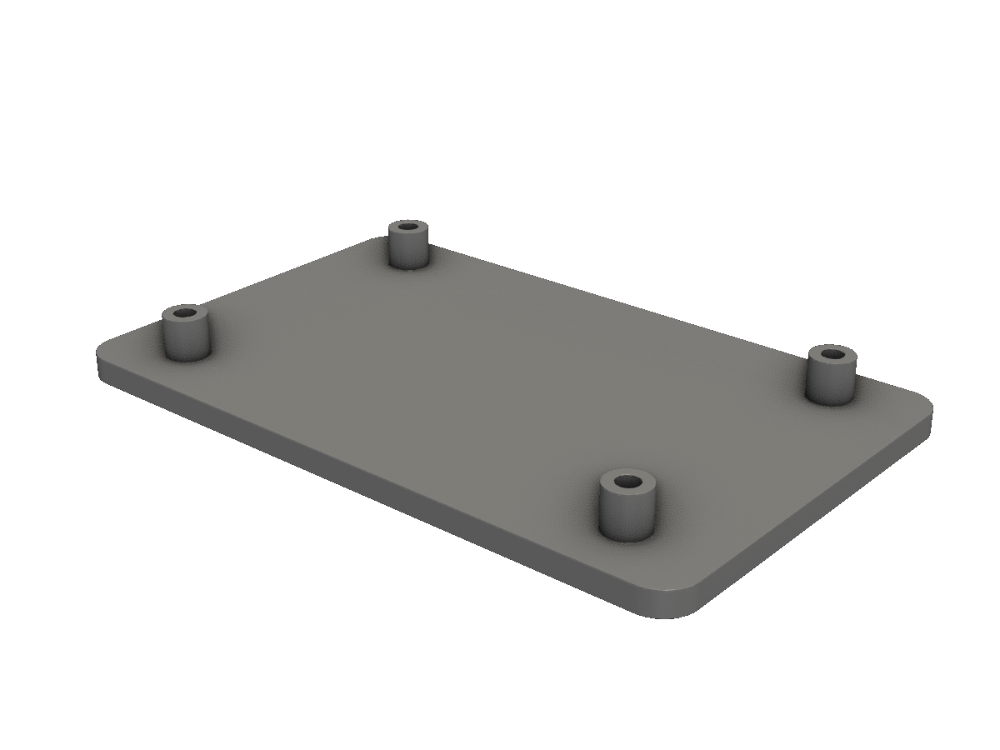
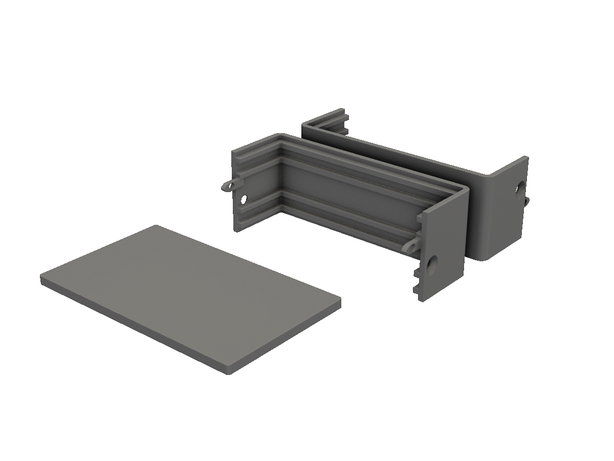
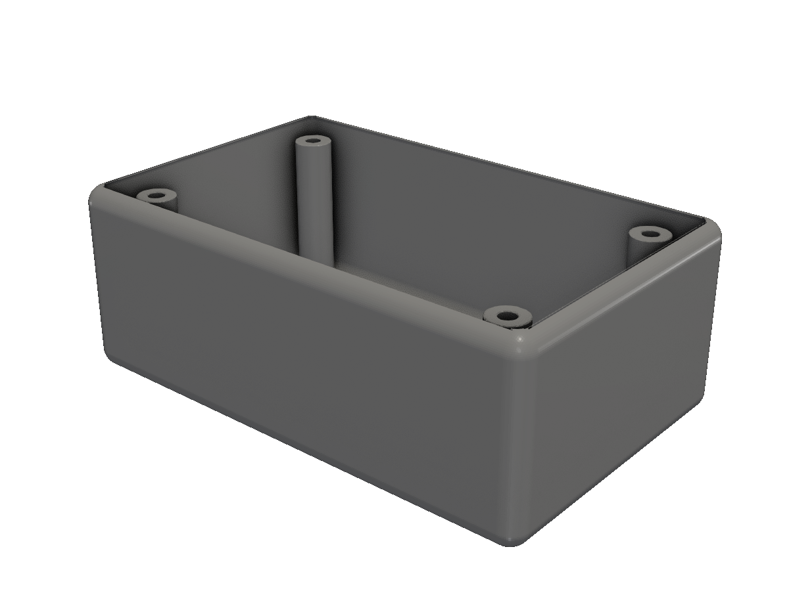
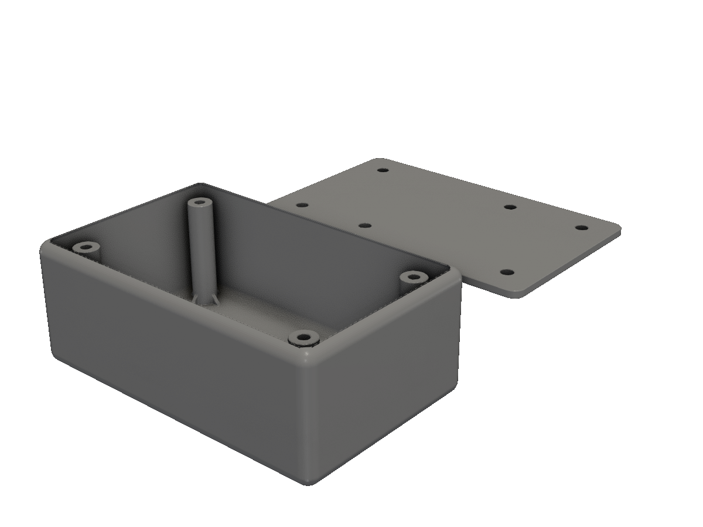

# Enclosure

A printable two-part panel-mounted enclosure — body, lid, mounting standoffs, screw holes.

A common project: a small tray-shaped enclosure for a microcontroller board, a circuit, or whatever you've designed in the last few weeks. This recipe builds it up from `obj.Panel3D` and `obj.Standoff3D`, then shows the alternative `obj.PanelBox3D` shortcut.

## Step 1 — Just the panel

Start with the front face: a rounded rectangle with mounting holes.

<!-- src: tutorial/19-cookbook-enclosure/01-panel/main.go -->
```go
// Enclosure cookbook step 1: a panel-mounted front face.
//
// obj.Panel3D handles the rounded corners and per-edge mounting holes.
// We'll add internal structure in the next steps.
package main

import (
	"github.com/snowbldr/fluent-sdfx/obj"
	v2 "github.com/snowbldr/fluent-sdfx/vec/v2"
)

func main() {
	panel := obj.Panel3D(obj.PanelParms{
		Size:         v2.XY(80, 50),
		CornerRadius: 4,
		HoleDiameter: 3.2, // M3 clearance
		HoleMargin:   [4]float64{6, 6, 6, 6},
		HolePattern:  [4]string{"x.x", "x", "x.x", "x"},
		Thickness:    3,
	})

	panel.STL("out.stl", 6.0)
}
```

<figure>
  
  <figcaption>An 80×50mm panel with rounded corners and 3.2mm M3-clearance mounting holes.</figcaption>
</figure>

## Step 2 — Add PCB standoffs

The panel is the front face. Now add four standoffs flush against its back, sized to receive an M2.5 board screw.

<!-- src: tutorial/19-cookbook-enclosure/02-with-standoffs/main.go -->
```go
// Enclosure cookbook step 2: panel with PCB standoffs at the corners.
//
// `layout.RectCorners(w, d)` returns the 4 corner positions of a rectangle
// centered on the origin — drop them into the variadic `.Multi(...)` and
// you get one standoff at each. `.OnTopOf(panel.Top())` flushes the
// standoffs to the panel's back face without bbox math.
package main

import (
	"github.com/snowbldr/fluent-sdfx/layout"
	"github.com/snowbldr/fluent-sdfx/obj"
	v2 "github.com/snowbldr/fluent-sdfx/vec/v2"
)

func main() {
	standoff := obj.Standoff3D(obj.StandoffParms{
		PillarHeight:   10,
		PillarDiameter: 5,
		HoleDepth:      8,
		HoleDiameter:   2.5,
		NumberWebs:     0,
	})

	panel := obj.Panel3D(obj.PanelParms{
		Size:         v2.XY(80, 50),
		CornerRadius: 4,
		Thickness:    3,
	})

	standoff.OnTopOf(panel.Top()).Solid().
		Multi(layout.RectCorners(60, 36)...).
		Union(panel).
		STL("out.stl", 6.0)
}
```

<figure>
  
  <figcaption>The panel with four 10mm-tall standoffs at the back, ready for a PCB.</figcaption>
</figure>

## Step 3 — Or use obj.PanelBox3D

`obj.PanelBox3D` does the whole "panel-front, body-shell, panel-back, optional snap-tabs" assembly in one call. It returns `[]*solid.Solid` — typically four parts: front panel, body, back panel, and a tab structure.

<!-- src: tutorial/19-cookbook-enclosure/03-panelbox/main.go -->
```go
// Enclosure cookbook step 3: switch to obj.PanelBox3D for a full
// panel-and-shell assembly.
//
// PanelBox3D returns a slice of 4 solids: [front-panel, body-shell,
// back-panel, ...screws]. We lay them out side-by-side for an exploded
// preview.
package main

import (
	"github.com/snowbldr/fluent-sdfx/obj"
	"github.com/snowbldr/fluent-sdfx/solid"
	v3 "github.com/snowbldr/fluent-sdfx/vec/v3"
)

func main() {
	parts := obj.PanelBox3D(obj.PanelBoxParms{
		Size:       v3.XYZ(80, 50, 30),
		Wall:       2,
		Panel:      3,
		Rounding:   3,
		FrontInset: 2,
		BackInset:  2,
		Clearance:  0.05,
		Hole:       3.2,
		SideTabs:   "T.B",
	})

	// Lay out each piece along Y for an exploded view.
	exploded := make([]*solid.Solid, len(parts))
	for i, p := range parts {
		exploded[i] = p.TranslateY(float64(i-len(parts)/2) * 60)
	}
	solid.UnionAll(exploded...).STL("out.stl", 4.0)
}
```

<figure>
  
  <figcaption>The four output pieces from PanelBox3D, exploded along Y.</figcaption>
</figure>

`SideTabs` is a 3-character string controlling per-side mounting tabs: `'T'`/`'t'` for top, `'B'`/`'b'` for bottom, `'.'` for none. Empty tabs work, but if you set `Hole` you must include at least one tab character so the screws have something to bite.

## Step 4 — Body with internal mounts

For full control — non-standard wall thickness, tray-style open top, custom standoff layout — skip `PanelBox3D` and compose primitives directly:

<!-- src: tutorial/19-cookbook-enclosure/04-mounts/main.go -->
```go
// Enclosure cookbook step 4: add internal screw mounts to a single shell.
//
// Build the shell as outer-box minus an inner cavity. Anchor verbs
// (`BottomAt`, `OnTopOf`) keep the cavity flush with the inner floor and
// drop the standoffs into place without manual Z math; `layout.RectCorners`
// gives the 4 corner positions for the standoff array.
package main

import (
	"github.com/snowbldr/fluent-sdfx/layout"
	"github.com/snowbldr/fluent-sdfx/obj"
	"github.com/snowbldr/fluent-sdfx/solid"
	v3 "github.com/snowbldr/fluent-sdfx/vec/v3"
)

func main() {
	const w, h, d = 80.0, 50.0, 30.0
	const wall = 2.0

	shell := solid.Box(v3.XYZ(w, h, d), 3)
	// Cavity sits on the inner floor and pokes 1mm above the top —
	// that opens the top cleanly without leaving a thin lip.
	cavity := solid.Box(v3.XYZ(w-2*wall, h-2*wall, d-wall+1), 2).
		BottomAt(shell.Bottom().Point.Z + wall)

	standoff := obj.Standoff3D(obj.StandoffParms{
		PillarHeight:   d - 2*wall,
		PillarDiameter: 6,
		HoleDepth:      d - 2*wall - 2,
		HoleDiameter:   2.5,
		NumberWebs:     4,
		WebHeight:      6,
		WebDiameter:    10,
		WebWidth:       1,
	})

	shell.Cut(cavity).
		Union(standoff.Multi(layout.RectCorners(w-16, h-16)...)).
		STL("out.stl", 4.0)
}
```

<figure>
  
  <figcaption>A tray-shaped shell with reinforced standoffs at the corners, ready for a PCB and lid.</figcaption>
</figure>

The shell is `outerBox.Cut(innerBox)` for the cavity, then the top face is opened with another `Cut`. The standoffs use `NumberWebs: 4` for triangular gussets — they hold the standoff square to the floor under tightening torque.

## Step 5 — Body + matching lid

The lid is just another `obj.Panel3D` with mounting holes that align with the standoff screws. Lay body and lid side-by-side for the assembly view:

<!-- src: tutorial/19-cookbook-enclosure/05-assembly/main.go -->
```go
// Enclosure cookbook step 5: the full enclosure with a tray shell, four
// PCB standoffs, and a separate screw-on lid.
//
// `body` and `lid` are kept named because they're the two conceptual
// pieces of the assembly — the final Union lays them out exploded along Y
// using `BehindOf` to put the lid one panel-width plus 20mm behind the
// body without measuring anything by hand.
package main

import (
	"github.com/snowbldr/fluent-sdfx/layout"
	"github.com/snowbldr/fluent-sdfx/obj"
	"github.com/snowbldr/fluent-sdfx/solid"
	v2 "github.com/snowbldr/fluent-sdfx/vec/v2"
	v3 "github.com/snowbldr/fluent-sdfx/vec/v3"
)

func main() {
	const w, h, d = 80.0, 50.0, 30.0
	const wall = 2.0
	const sx, sy = (w - 16) / 2, (h - 16) / 2

	standoff := obj.Standoff3D(obj.StandoffParms{
		PillarHeight:   d - 2*wall,
		PillarDiameter: 6,
		HoleDepth:      d - 2*wall - 2,
		HoleDiameter:   2.5,
		NumberWebs:     4,
		WebHeight:      6,
		WebDiameter:    10,
		WebWidth:       1,
	})

	shell := solid.Box(v3.XYZ(w, h, d), 3)
	cavity := solid.Box(v3.XYZ(w-2*wall, h-2*wall, d-wall+1), 2).
		BottomAt(shell.Bottom().Point.Z + wall)

	body := shell.Cut(cavity).
		Union(standoff.Multi(layout.RectCorners(w-16, h-16)...))

	// Lid: a panel sized to match the shell, with mounting holes that
	// align with the standoff screws.
	lid := obj.Panel3D(obj.PanelParms{
		Size:         v2.XY(w, h),
		CornerRadius: 3,
		HoleDiameter: 3.2,
		HoleMargin:   [4]float64{(h-2*sy)/2 - 0.001, (w-2*sx)/2 - 0.001, (h-2*sy)/2 - 0.001, (w-2*sx)/2 - 0.001},
		HolePattern:  [4]string{"x.x", "x", "x.x", "x"},
		Thickness:    wall,
	})

	lid.BehindOf(body.Back(), 20).Union().STL("out.stl", 4.0)
}
```

<figure>
  
  <figcaption>The complete enclosure: body with standoffs in front and the screw-on lid behind.</figcaption>
</figure>

## Tips

> [!TIP]
> **Print clearances.** A snug cover-on-tray fit prints better at `Clearance` ≈ `0.1`–`0.2`mm — your printer's precision varies. The PanelBoxParms `Clearance` field handles this for you; for hand-rolled enclosures, grow the lid pocket by the clearance amount.

> [!NOTE]
> **Adapt the dimensions** to your board. Standoff XY position, the tray's internal Z height, and the lid hole pattern are the things you'll tweak. Pull them out into named constants at the top of the file (as we do with `w`, `h`, `d`, `wall`, `sx`, `sy`) and the rest of the geometry follows.

## Beyond the basics

- **Cooling vents.** `obj.CircleGrille2D(CircleGrilleParms{...}).ExtrudeRounded(...)` cut from the body adds a circular grille. For straight slots, use `Array` of `solid.Box` Cuts.
- **Cable cutouts.** Carve `solid.Box(...)` shapes from any face with `Cut`. Pair with `Shrink` for a small mating ridge that reinforces the cutout.
- **Stencilled labels.** Use `shape.Text(font, "...", h).Cache().ExtrudeRounded(0.6, 0.1)` and `Cut` from a face to engrave; `Union` it raised onto the surface for embossed text.

For more on the underlying obj helpers, see [Parametric helpers](/obj-overview/).
