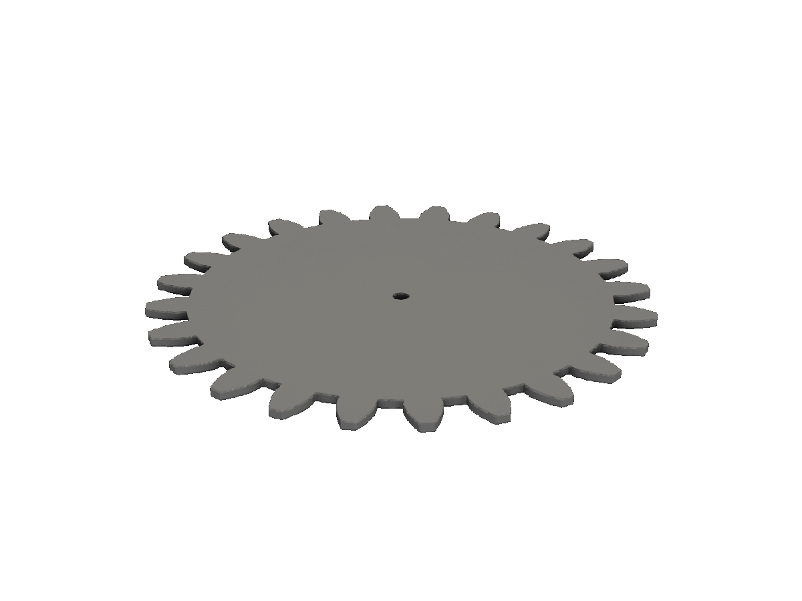
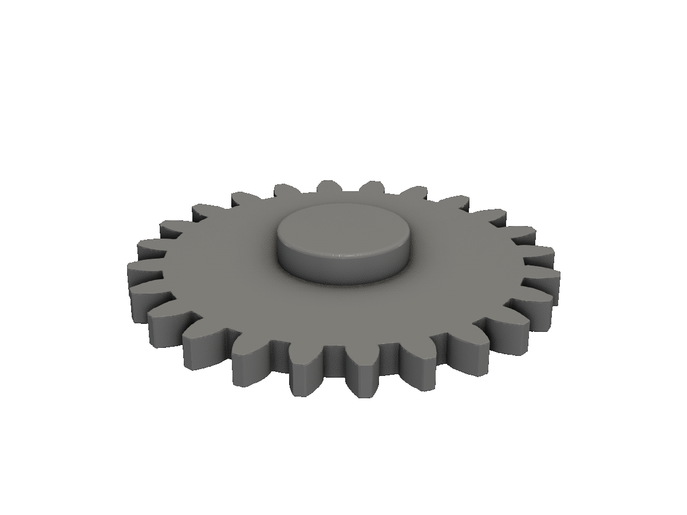
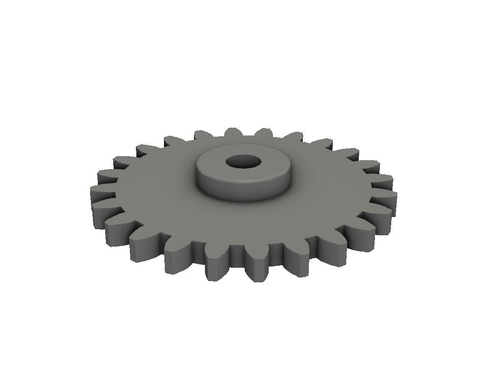
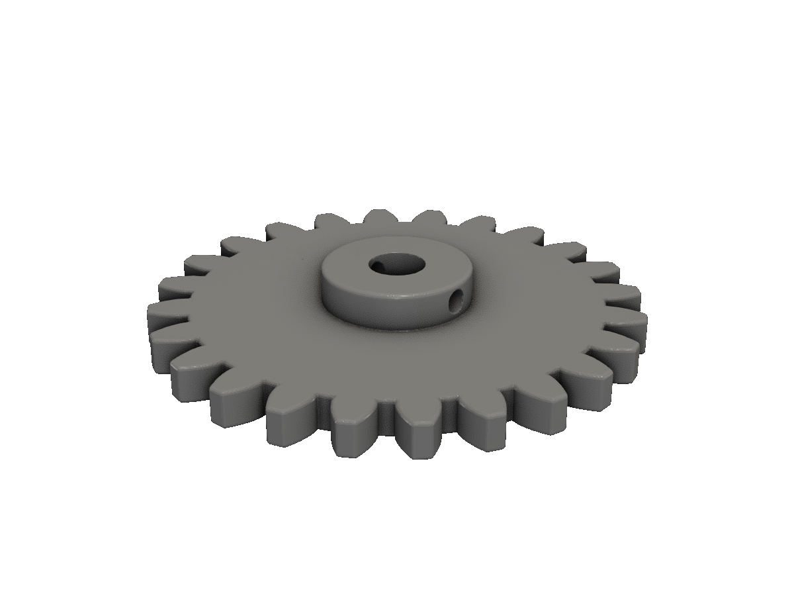

# Gear

A printable involute spur gear with hub, shaft bore, and set-screw — built up step by step from obj.InvoluteGear.

A 24-tooth involute spur gear, designed for a 6mm shaft with a radial set-screw. Module 2, pressure angle 20°, ~4mm thick.

## Step 1 — The gear profile

`obj.InvoluteGear(InvoluteGearParms)` returns a 2D `*Shape`. The big knob is `Module`: pitch diameter = `NumberTeeth × Module`, so 24 teeth at module 2 gives a 48mm pitch circle. That's the "size" of the gear. Adjust `Module` and `NumberTeeth` to taste; mating gears must share `Module` and `PressureAngle`.

<!-- src: tutorial/20-cookbook-gear/01-gear-profile/main.go -->
```go
// Gear cookbook step 1: a 2D involute gear profile.
//
// obj.InvoluteGear is the workhorse. The pitch diameter equals
// NumberTeeth × Module — so 24 teeth at module 2 gives a 48mm pitch
// circle. Module also sets the tooth size.
//
// RingWidth is the radial thickness of the gear's wall, measured inward
// from the root circle. Set it large (≥ root radius) for a fully solid
// gear; smaller values produce a hollow ring.
package main

import (
	"github.com/snowbldr/fluent-sdfx/obj"
)

func main() {
	obj.InvoluteGear(obj.InvoluteGearParms{
		NumberTeeth:      24,
		Module:           2,
		PressureAngleDeg: 20, // 20° is the modern default
		Backlash:         0.05,
		Clearance:        0.2,
		RingWidth:        21, // ≥ root radius → fully solid gear
		Facets:           16,
	}).Extrude(1).STL("out.stl", 5)
}
```

<figure>
  
  <figcaption>A 24-tooth, module-2 involute gear, extruded 1mm thick.</figcaption>
</figure>

The other parameters:

- `PressureAngle` is in **radians** — convert from degrees with `units.DtoR(20)`. 20° is the modern default; older hobbyist gears use 14.5°.
- `Backlash` adds a per-tooth gap between mating gears. ~0.05–0.1 prints cleanly.
- `Clearance` adds extra root depth so the mating gear's tip doesn't bottom out.
- `RingWidth` is how much "meat" is left between the gear's root circle and its centre. Set it to 0 to get a pure tooth ring; non-zero values fill in toward the centre.
- `Facets` controls how many segments approximate each involute flank. 12–24 looks smooth; below 8 the teeth get visibly polygonal.

## Step 2 — Extrude with a centre hub

A real gear has thickness and usually a hub around the shaft. The hub strengthens the gear under torque and gives the set-screw something to bite into.

<!-- src: tutorial/20-cookbook-gear/02-with-hub/main.go -->
```go
// Gear cookbook step 2: extrude the gear to thickness and add a centre hub.
//
// The hub strengthens the gear around the shaft and keeps it from sagging
// when printed in plastic. `hub.OnTopOf(gear.Bottom())` flushes the hub's
// bottom face to the gear's bottom face, so the hub fuses into the gear
// from below and protrudes above as a raised boss.
package main

import (
	"github.com/snowbldr/fluent-sdfx/obj"
	"github.com/snowbldr/fluent-sdfx/solid"
)

func main() {
	gear := obj.InvoluteGear(obj.InvoluteGearParms{
		NumberTeeth:      24,
		Module:           2,
		PressureAngleDeg: 20,
		Backlash:         0.05,
		Clearance:        0.2,
		RingWidth:        21,
		Facets:           16,
	}).Extrude(4)

	hub := solid.Cylinder(8, 8, 0.5)
	hub.Bottom().On(gear.Bottom()).Union().STL("out.stl", 5.0)
}
```

<figure>
  
  <figcaption>The gear extruded 4mm thick with an 8mm-diameter centre hub.</figcaption>
</figure>

The hub is just `solid.Cylinder(8, 8, 0.5)` translated up so its centre aligns with the gear's centre. We use `solid.Cylinder` instead of another `obj` helper because the hub geometry is simple enough not to need parametrising.

## Step 3 — The shaft bore

<!-- src: tutorial/20-cookbook-gear/03-shaft-bore/main.go -->
```go
// Gear cookbook step 3: drill a shaft bore through gear and hub.
package main

import (
	"github.com/snowbldr/fluent-sdfx/obj"
	"github.com/snowbldr/fluent-sdfx/solid"
)

func main() {
	gear := obj.InvoluteGear(obj.InvoluteGearParms{
		NumberTeeth:      24,
		Module:           2,
		PressureAngleDeg: 20,
		Backlash:         0.05,
		Clearance:        0.2,
		RingWidth:        21,
		Facets:           16,
	}).Extrude(4)

	hub := solid.Cylinder(8, 8, 0.5)
	hub.Bottom().On(gear.Bottom()).Union().
		Cut(solid.Cylinder(20, 3, 0)).
		STL("out.stl", 5.0)
}
```

<figure>
  
  <figcaption>The gear with a 3mm-radius (6mm-diameter) shaft hole through the centre.</figcaption>
</figure>

The shaft cylinder is taller than the gear itself (`height: 20`) so the cut goes all the way through. fluent-sdfx is exact — a tool exactly as tall as the body leaves a single layer of mesh that may or may not survive marching cubes.

## Step 4 — Polished final

The polish pass adds three things:

1. **`ExtrudeRounded` instead of `Extrude`** for a soft 0.4mm fillet on the top and bottom edges.
2. **A radial set-screw hole** through the hub — `solid.Cylinder(...).RotateY(90)` to point along X, translated to the hub's mid-height.
3. **Print-shrinkage compensation** via `ScaleUniform(1/0.999)` and **mesh decimation** at `0.5` to halve the file size.

<!-- src: tutorial/20-cookbook-gear/04-final/main.go -->
```go
// Gear cookbook step 4: the polished final gear — chamfered tooth tops,
// shaft bore with set-screw hole, and shrinkage compensation.
package main

import (
	"github.com/snowbldr/fluent-sdfx/obj"
	"github.com/snowbldr/fluent-sdfx/solid"
)

const shrink = 1.0 / 0.999 // PLA ~0.1%

func main() {
	gear := obj.InvoluteGear(obj.InvoluteGearParms{
		NumberTeeth:      24,
		Module:           2,
		PressureAngleDeg: 20,
		Backlash:         0.05,
		Clearance:        0.2,
		RingWidth:        21,
		Facets:           16,
	}).ExtrudeRounded(4, 0.4) // soft top/bottom edges

	hub := solid.Cylinder(8, 8, 0.5)
	hub.Bottom().On(gear.Bottom()).Union().
		Cut(
			solid.Cylinder(20, 3, 0),                              // shaft bore
			solid.Cylinder(20, 1.25, 0).RotateY(90).TranslateZ(4), // radial set-screw
		).
		ScaleUniform(shrink).
		STL("out.stl", 6.0, 0.5)
}
```

<figure>
  
  <figcaption>The final gear: rounded edges, set-screw hole, shrinkage-compensated, decimated mesh.</figcaption>
</figure>

## Mating gears

Two gears mesh if they share `Module` and `PressureAngle`. The centre-to-centre distance is `(N1 + N2) × Module / 2`. For two 24-tooth gears at module 2, that's 48mm.

```go
const (
    module = 2.0
    paDeg  = 20
)

a := obj.InvoluteGear(obj.InvoluteGearParms{
    NumberTeeth: 24, Module: module, PressureAngle: units.DtoR(paDeg),
    Backlash: 0.05, Clearance: 0.2, RingWidth: 6, Facets: 16,
}).ExtrudeRounded(4, 0.4)

b := obj.InvoluteGear(obj.InvoluteGearParms{
    NumberTeeth: 16, Module: module, PressureAngle: units.DtoR(paDeg),
    Backlash: 0.05, Clearance: 0.2, RingWidth: 5, Facets: 16,
}).ExtrudeRounded(4, 0.4)

centerDistance := float64(24 + 16) * module / 2
assembly := a.Union(b.TranslateX(centerDistance))
```

## Beyond the basics

- For **internal (ring) gears**, set `RingWidth` to a value larger than the pitch radius and cut out the centre — the result is a ring with internal teeth.
- For **bevel gears, helical gears, or worm gears**, fluent-sdfx doesn't ship dedicated helpers. Build them by chaining `InvoluteGear` profiles with `LoftTo`, `TwistExtrude`, or `SweepHelix`.
- For **gear racks**, use `shape.GearRack(GearRackParms{...})` — a separate helper in the `shape` package.

For all the parameters and mating geometry, see the [InvoluteGear API](/api-reference/) section.
