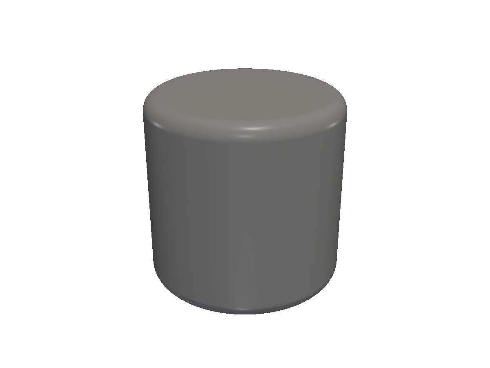
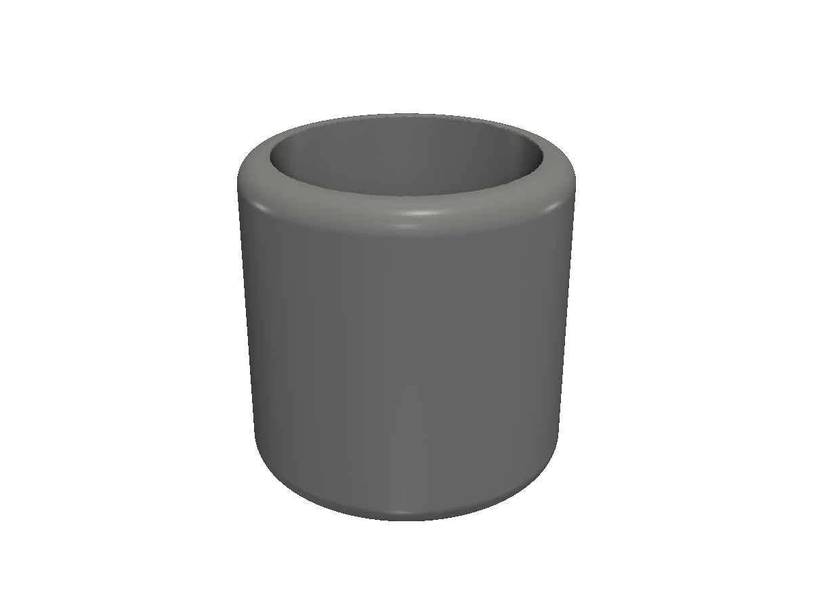
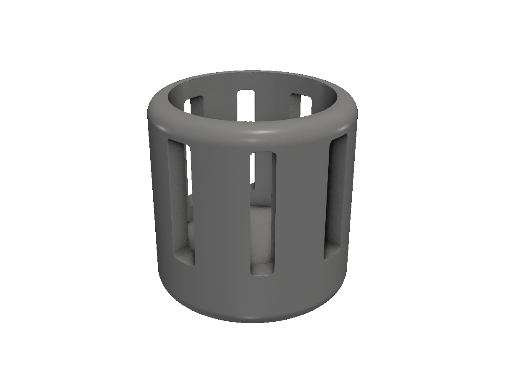
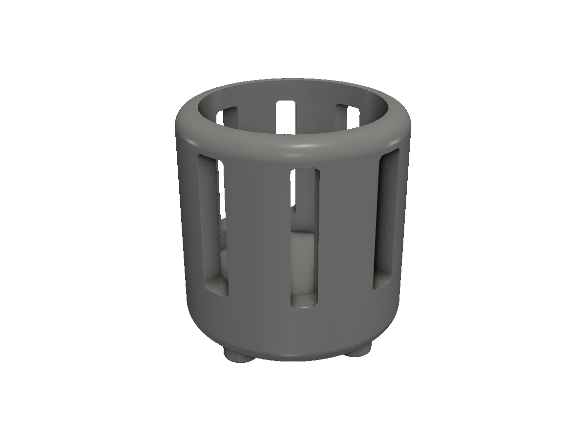

# Lantern

A small tea-light lantern, built up step by step. Every step uses one or more positioning verbs from the [positioning](/positioning/) page — anchor relations replace bbox math, `layout.Polar` produces the slot ring and the foot ring, and `OnTopOf` raises the lantern onto its feet without measuring anything by hand.

## Step 1 — body

Start with a fat round cylinder, edges rounded. `BottomAt(0)` lands the body so it sits on the build plate without any Translate / ZeroZ math — just a statement about where the bottom goes.

<!-- src: tutorial/21-cookbook-lantern/01-body/main.go -->
```go
// Lantern cookbook step 1: a rounded cylindrical body sitting flush on
// the build plate.
//
// `BottomAt(0)` lands the cylinder so its bottom face is exactly at z=0
// — no Translate / ZeroZ math, just a statement about where the bottom
// goes.
//
// The pattern across this cookbook: declare each part as a bare
// primitive at the top, then position and combine them in one fluent
// expression at the bottom.
package main

import "github.com/snowbldr/fluent-sdfx/solid"

const (
	bodyHeight = 50.0
	bodyRadius = 25.0
)

func main() {
	body := solid.Cylinder(bodyHeight, bodyRadius, 4)

	body.BottomAt(0).STL("out.stl", 4.0)
}
```

<figure>
  
  <figcaption>Round body sitting flush on the build plate.</figcaption>
</figure>

## Step 2 — pocket

Hollow out the tea-light pocket. `pocket.Top().On(body.Top())` aligns the pocket's top anchor with the body's top, returning a `Placement`; `.Cut()` is a Placement finalizer that subtracts the placed pocket from the body. One fluent expression, anchor-relational, no bbox math and no intermediate variables — the pocket extends downward from the open top, leaving a 5mm-thick wall and a 5mm floor for the candle to sit on.

<!-- src: tutorial/21-cookbook-lantern/02-pocket/main.go -->
```go
// Lantern cookbook step 2: hollow out the tea light pocket.
//
// `pocket.Top().On(body.BottomAt(0).Top())` aligns the pocket's top
// anchor with the seated body's top anchor, returning a Placement;
// `.Cut()` is a Placement finalizer that subtracts the placed pocket
// from the body. Parts at the top, assembly at the bottom — one fluent
// expression, anchor-relational, with no bbox math.
package main

import "github.com/snowbldr/fluent-sdfx/solid"

const (
	bodyHeight  = 50.0
	bodyRadius  = 25.0
	wallThick   = 5.0
	pocketDepth = 40.0
)

func main() {
	body := solid.Cylinder(bodyHeight, bodyRadius, 4)
	pocket := solid.Cylinder(pocketDepth, bodyRadius-wallThick, 0)

	pocket.Top().On(body.BottomAt(0).Top()).Cut().STL("out.stl", 4.0)
}
```

<figure>
  
  <figcaption>Pocket open at the top, walls and floor 5mm thick.</figcaption>
</figure>

## Step 3 — side slots

Punch a ring of decorative slots through the wall. `layout.Polar(slotRadius, 8)` returns 8 positions evenly spaced on a circle, ready to drop straight into `.Multi(...)` — no sin/cos loop. Spread the array of cut tools into Cut and they're all subtracted in one operation.

<!-- src: tutorial/21-cookbook-lantern/03-side-slots/main.go -->
```go
// Lantern cookbook step 3: punch decorative slots through the wall.
//
// Body, pocket, and slot are bare primitives at the top. The assembly
// chain at the bottom does all the work: place the pocket on the seated
// body and Cut, then Cut the polar slot ring out of the result.
package main

import (
	"github.com/snowbldr/fluent-sdfx/layout"
	"github.com/snowbldr/fluent-sdfx/solid"
	v3 "github.com/snowbldr/fluent-sdfx/vec/v3"
)

const (
	bodyHeight  = 50.0
	bodyRadius  = 25.0
	wallThick   = 5.0
	pocketDepth = 40.0

	slotCount  = 8
	slotRadius = bodyRadius - wallThick/2 // sit centred in the wall
	slotWidth  = 7.0
	slotHeight = 30.0
	slotZ      = bodyHeight - pocketDepth/2 // mid-pocket
)

func main() {
	body := solid.Cylinder(bodyHeight, bodyRadius, 4)
	pocket := solid.Cylinder(pocketDepth, bodyRadius-wallThick, 0)
	slot := solid.Box(v3.XYZ(slotWidth, slotWidth, slotHeight), 1)

	pocket.Top().On(body.BottomAt(0).Top()).Cut().
		Cut(slot.TranslateZ(slotZ).Multi(layout.Polar(slotRadius, slotCount)...)).
		STL("out.stl", 5.0)
}
```

<figure>
  
  <figcaption>Polar ring of slots in the upper wall.</figcaption>
</figure>

## Step 4 — feet

Build the feet on the build plate, then lift the lantern onto them. `lantern.OnTopOf(feet.Top())` raises the lantern so its bottom face lands on top of the feet — no math about foot height, the anchor verb does it.

<!-- src: tutorial/21-cookbook-lantern/04-feet/main.go -->
```go
// Lantern cookbook step 4: 4 small feet under the body.
//
// Body, pocket, slot, and foot are bare primitives at the top. The
// assembly chain places the pocket inside the body and cuts, cuts the
// polar slot ring, then raises the result onto a polar ring of feet via
// `OnTopOf(...).Union()`. Every relation is anchor-named.
//
// 4 feet (rather than 3) because `Polar` with an even count is bbox-
// symmetric — the feet array's bbox top centre sits on the world Z axis,
// so the lantern lands centred on the feet.
package main

import (
	"github.com/snowbldr/fluent-sdfx/layout"
	"github.com/snowbldr/fluent-sdfx/solid"
	v3 "github.com/snowbldr/fluent-sdfx/vec/v3"
)

const (
	bodyHeight  = 50.0
	bodyRadius  = 25.0
	wallThick   = 5.0
	pocketDepth = 40.0

	slotCount  = 8
	slotRadius = bodyRadius - wallThick/2
	slotWidth  = 7.0
	slotHeight = 30.0
	slotZ      = bodyHeight - pocketDepth/2

	footRadius = 4.0
	footHeight = 4.0
	footRing   = 18.0
)

func main() {
	body := solid.Cylinder(bodyHeight, bodyRadius, 4)
	pocket := solid.Cylinder(pocketDepth, bodyRadius-wallThick, 0)
	slot := solid.Box(v3.XYZ(slotWidth, slotWidth, slotHeight), 1)
	foot := solid.Cylinder(footHeight, footRadius, 0.8)

	pocket.Top().On(body.BottomAt(0).Top()).Cut().
		Cut(slot.TranslateZ(slotZ).Multi(layout.Polar(slotRadius, slotCount)...)).
		OnTopOf(foot.BottomAt(0).Multi(layout.Polar(footRing, 4)...).Top()).
		Union().
		STL("out.stl", 5.0)
}
```

<figure>
  
  <figcaption>Four feet evenly spaced around the bottom, lantern sitting on top.</figcaption>
</figure>

## Step 5 — cap and finial

Close the open top with a flat cap, then crown it with a decorative sphere knob. Two anchor stacks in one chain: the cap lands `OnTopOf(lantern.Top())` to close the lantern, then the sphere lands flush on the cap via `Bottom().On(capped.Top())`. No bbox math, no manual Z arithmetic — every relation is named.

<!-- src: tutorial/21-cookbook-lantern/05-finial/main.go -->
```go
// Lantern cookbook step 5: cap the lantern and add a finial knob.
//
// All six parts are bare primitives at the top. The single fluent
// expression at the bottom does the entire assembly: place the pocket
// inside the body and Cut, Cut the polar slot ring, raise onto the
// polar foot ring, place the cap on top, then sit the finial on the cap.
// Six anchor relations in one chain — no bbox math, no Z arithmetic.
package main

import (
	"github.com/snowbldr/fluent-sdfx/layout"
	"github.com/snowbldr/fluent-sdfx/solid"
	v3 "github.com/snowbldr/fluent-sdfx/vec/v3"
)

const (
	bodyHeight  = 50.0
	bodyRadius  = 25.0
	wallThick   = 5.0
	pocketDepth = 40.0

	slotCount  = 8
	slotRadius = bodyRadius - wallThick/2
	slotWidth  = 7.0
	slotHeight = 30.0
	slotZ      = bodyHeight - pocketDepth/2

	footRadius = 4.0
	footHeight = 4.0
	footRing   = 18.0

	capHeight    = 4.0
	finialRadius = 4.0
)

func main() {
	body := solid.Cylinder(bodyHeight, bodyRadius, 4)
	pocket := solid.Cylinder(pocketDepth, bodyRadius-wallThick, 0)
	slot := solid.Box(v3.XYZ(slotWidth, slotWidth, slotHeight), 1)
	foot := solid.Cylinder(footHeight, footRadius, 0.8)
	cap := solid.Cylinder(capHeight, bodyRadius, 1.5)
	finial := solid.Sphere(finialRadius)

	finial.Bottom().On(
		cap.OnTopOf(
			pocket.Top().On(body.BottomAt(0).Top()).Cut().
				Cut(slot.TranslateZ(slotZ).Multi(layout.Polar(slotRadius, slotCount)...)).
				OnTopOf(foot.BottomAt(0).Multi(layout.Polar(footRing, 4)...).Top()).
				Union().
				Top(),
		).Union().Top(),
	).Union().STL("out.stl", 5.0)
}
```

<figure>
  
  <figcaption>Polished final lantern — feet, slots, cap, finial.</figcaption>
</figure>

## Recap

| Step | Positioning verb |
|---|---|
| 1 | `BottomAt(0)` — sit on the build plate |
| 2 | `Top().On(body.Top()).Cut()` — placement finalizer subtracts the pocket from the body |
| 3 | `layout.Polar(r, n)` + `Multi` — radial pattern of cut tools |
| 4 | `layout.Polar` + `OnTopOf(feet.Top())` — raise the lantern onto its own feet |
| 5 | `OnTopOf(...)` + `Bottom().On(...)` — cap on lantern, finial on cap |

No bbox math, no sin/cos loops, no manual Z arithmetic — every positioning relationship is named.
