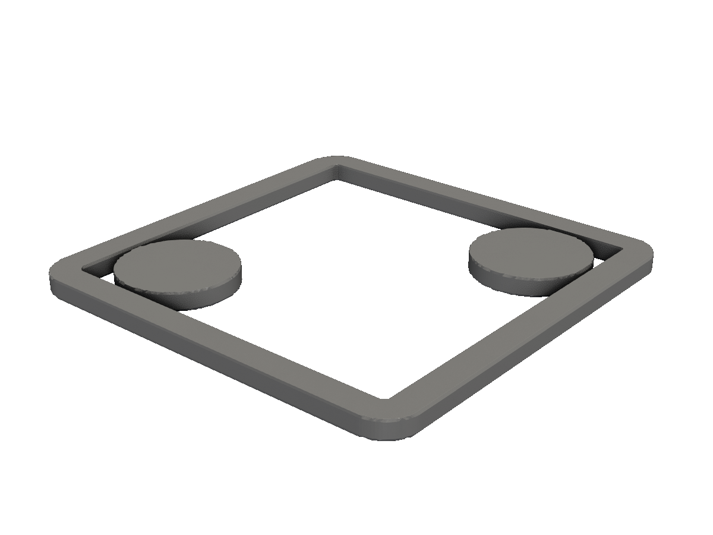
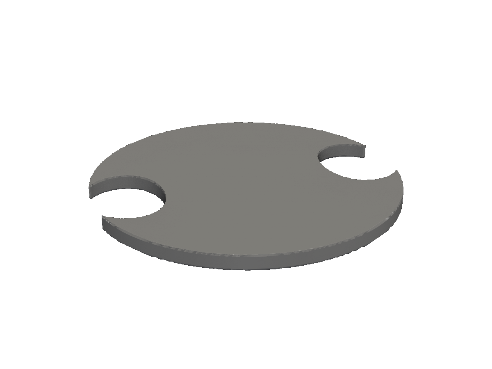
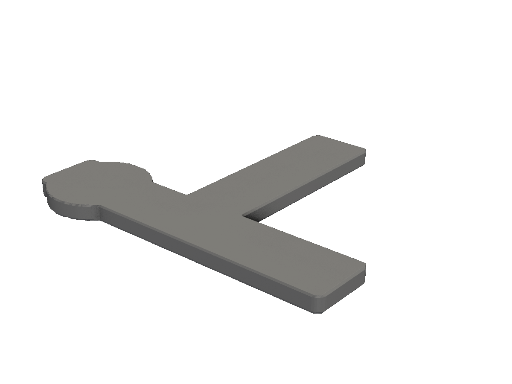

# Cross-sections

Slice a 3D solid with a plane to get a 2D profile — for inspection, laser cutting, or 2D documentation.

A cross-section turns a `*solid.Solid` back into a `*shape.Shape` by intersecting it with a plane. Useful for:

- Verifying internal structure (shell thickness, boss placement) without exporting and slicing in another tool.
- Generating laser-cuttable 2D profiles from a designed-in-3D part.
- Producing technical-drawing-style cross-section figures for documentation.

## The plane package

`plane.Plane` is `{ Origin, Normal }`. Construct one of three ways:

```go
plane.AtZ(10)              // horizontal plane at z=10
plane.AtX(0)               // YZ plane through origin
plane.At(origin, normal)   // arbitrary plane

plane.XY  // == plane.AtZ(0)
plane.XZ  // == plane.AtY(0)
plane.YZ  // == plane.AtX(0)
```

The unit-normal vectors `plane.X`, `plane.Y`, `plane.Z` are also exported as `v3.Vec` for use with the lower-level `Slice2D(origin, normal)`.

## SliceAt — the typical entry point

`shape.SliceAt(solid, plane)` returns a `*Shape` ready for the usual 2D operations.

<!-- src: tutorial/14-cross-sections/01-slice-z/main.go -->
```go
// Cross-sections: SliceAt cuts a 2D cross-section through a 3D solid.
//
// The result is a *Shape, ready for the usual 2D operations. Here we slice
// horizontally at z=0, then re-extrude the slice 1mm thick so we can
// render it back as a 3D part.
package main

import (
	"github.com/snowbldr/fluent-sdfx/plane"
	"github.com/snowbldr/fluent-sdfx/shape"
	"github.com/snowbldr/fluent-sdfx/solid"
	v3 "github.com/snowbldr/fluent-sdfx/vec/v3"
)

func main() {
	// A 3D solid with internal structure: a hollow box with two bosses.
	body := solid.Box(v3.XYZ(20, 20, 20), 1).Shell(1.5).
		Union(
			solid.Cylinder(20, 3, 0).TranslateXY(6, 6),
			solid.Cylinder(20, 3, 0).TranslateXY(-6, -6),
		)

	shape.SliceAt(body, plane.AtZ(0)).Extrude(1).STL("out.stl", 8.0)
}
```

<figure>
  
  <figcaption>A horizontal slice through a hollow box with two internal bosses.</figcaption>
</figure>

The slice reveals the 1.5mm wall, the central hole, and the two bosses — exactly what's there at z=0.

## Arbitrary planes

You're not limited to axis-aligned planes — `plane.At` takes any unit normal. A diagonal slice exposes features no axial slice could:

<!-- src: tutorial/14-cross-sections/02-slice-arbitrary-plane/main.go -->
```go
// Cross-sections: plane.At lets you slice on any oriented plane, not just
// axis-aligned ones. Here a sphere with a torus through it, sliced
// diagonally.
package main

import (
	"github.com/snowbldr/fluent-sdfx/plane"
	"github.com/snowbldr/fluent-sdfx/shape"
	"github.com/snowbldr/fluent-sdfx/solid"
	v3 "github.com/snowbldr/fluent-sdfx/vec/v3"
)

func main() {
	shape.SliceAt(
		solid.Sphere(10).Cut(solid.Torus(8, 2.5).RotateX(90)),
		plane.At(v3.Zero, v3.XYZ(1, 1, 1).Normalize()),
	).Extrude(1).STL("out.stl", 8.0)
}
```

<figure>
  
  <figcaption>A diagonal slice through a sphere with a torus cut from it.</figcaption>
</figure>

## Slice → SVG / DXF

A slice is just a `*Shape`, so it exports to DXF and SVG like any 2D shape. This is the workflow for 2D laser-cuttable parts derived from a 3D design:

<!-- src: tutorial/14-cross-sections/03-slice-to-svg/main.go -->
```go
// Cross-sections: a slice can be exported directly to SVG/DXF for
// laser cutting or 2D documentation. This step writes both the SVG and
// an extruded STL so the screenshot pipeline picks one up.
package main

import (
	"github.com/snowbldr/fluent-sdfx/plane"
	"github.com/snowbldr/fluent-sdfx/shape"
	"github.com/snowbldr/fluent-sdfx/solid"
	v3 "github.com/snowbldr/fluent-sdfx/vec/v3"
)

func main() {
	// A bracket-like part: an L-profile with a boss on one wing.
	slice := shape.SliceAt(
		solid.Box(v3.XYZ(20, 4, 14), 0.5).
			Union(
				solid.Box(v3.XYZ(4, 14, 14), 0.5).TranslateY(7),
				solid.Cylinder(14, 3, 0.5).TranslateXY(-7, 0),
			),
		plane.AtZ(0),
	)

	slice.ToSVG("bracket-section.svg", 200)
	slice.Extrude(1).STL("out.stl", 8.0)
}
```

<figure>
  
  <figcaption>A bracket cross-section, ready for the same shape to be exported to DXF for CAM.</figcaption>
</figure>

The `bracket-section.svg` written alongside is a CAM-ready vector file.

## When to use cross-sections

- **For documentation:** an "exploded" or "cut-away" view often reads better than a solid one. Slice the part, render to PNG, embed.
- **For laser cutting from a 3D design:** model in 3D, slice at the laser bed, export DXF.
- **For checking internal geometry:** does the standoff actually clear the boss? Slice at the relevant Z, export to SVG, eyeball it.

For 2D shape operations, see [2D shapes](/shapes-2d/). For the planning behind why this works on a signed-distance kernel, the underlying call is sdfx's `Slice2D` — refer to the sdfx docs for the math.
