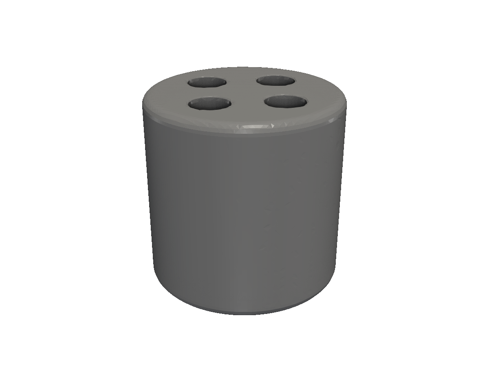
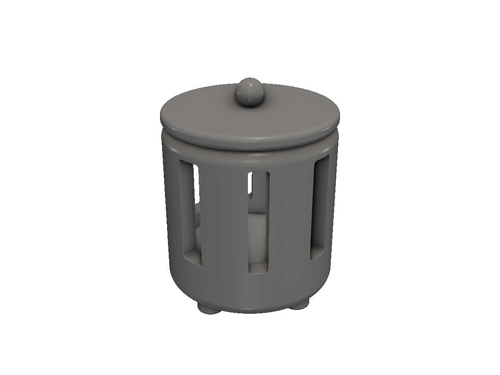

# Gallery

Eight parts built with fluent-sdfx, ordered roughly by complexity. Click through for the source — each one is a runnable cookbook or tutorial step in the repo.

<a class="gallery-item" href="/quickstart/">
  
  

    <strong>Quickstart final</strong>
    Cylinder with four polar holes, chamfered, decimated for print.
  

</a>

<a class="gallery-item" href="/cookbook-bolt/">
  
  

    <strong>Bolt assembly</strong>
    Hex bolt + washer + matching nut from <code>obj.Bolt</code> / <code>obj.Nut</code>.
  

</a>

<a class="gallery-item" href="/cookbook-gear/">
  
  

    <strong>Gear</strong>
    Involute teeth, hub, shaft bore, set-screw hole — five parts in one chain.
  

</a>

<a class="gallery-item" href="/cookbook-enclosure/">
  
  

    <strong>Enclosure</strong>
    Printable electronics enclosure with screw bosses and PCB standoffs.
  

</a>

<a class="gallery-item" href="/cookbook-lantern/">
  
  

    <strong>Lantern</strong>
    Six-part assembly showcasing the recipe pattern end-to-end.
  

</a>

<a class="gallery-item" href="/2d-to-3d/">
  
  

    <strong>Helical sweep</strong>
    2D profile swept along a helical path — threads, springs, screws.
  

</a>

<a class="gallery-item" href="/2d-to-3d/">
  
  

    <strong>Loft</strong>
    Smooth transition between two 2D profiles — fittings, ducts, transitions.
  

</a>

<a class="gallery-item" href="/obj-overview/">
  
  

    <strong>Gridfinity bin</strong>
    Standards-compliant Gridfinity storage bin via <code>obj.GridfinityBase</code> / <code>obj.GridfinityBody</code>.
  

</a>

Want to see how a part is built? Open the linked tutorial — every cookbook step has the running code on the same page as the render.
