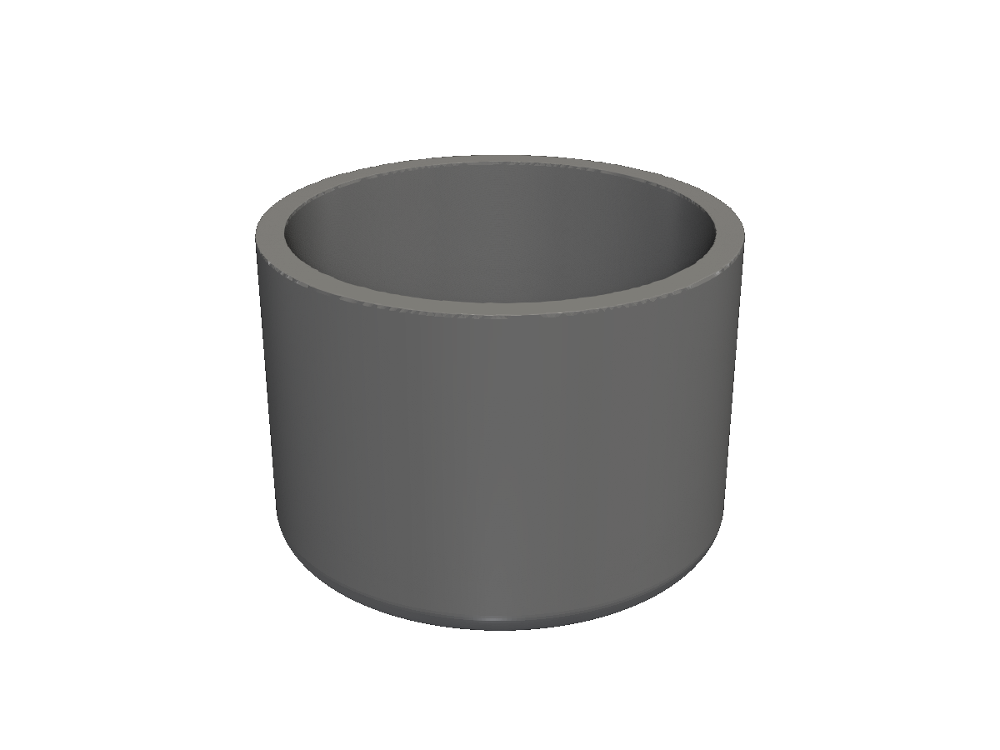
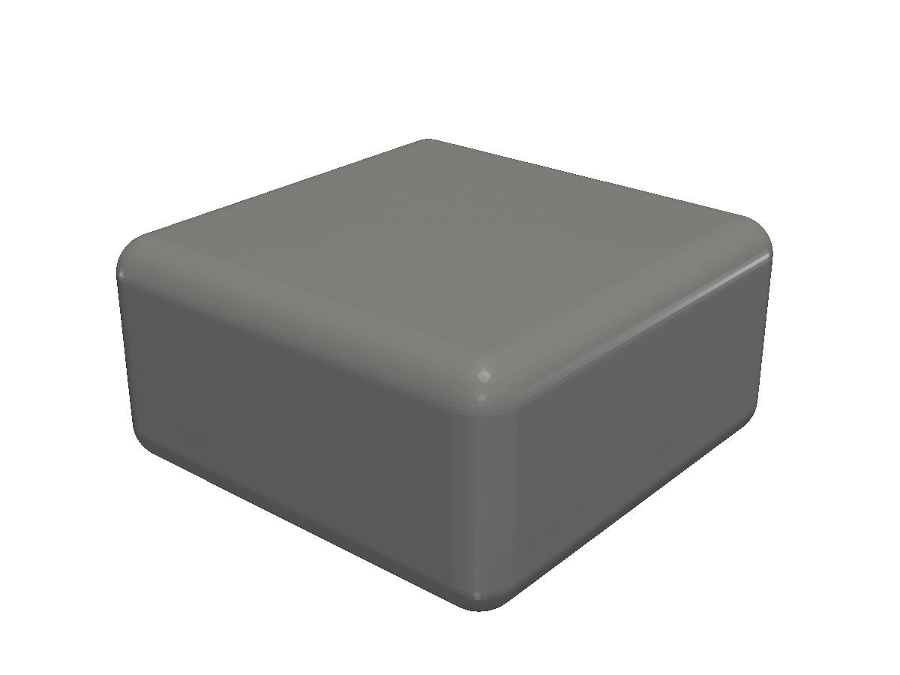
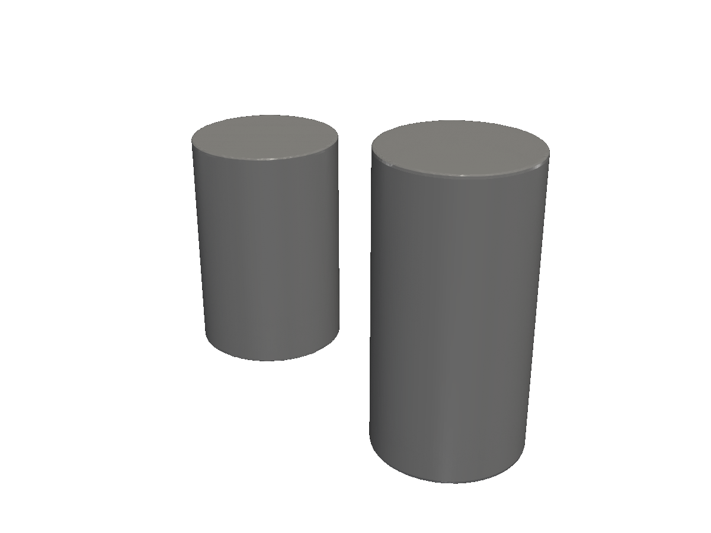
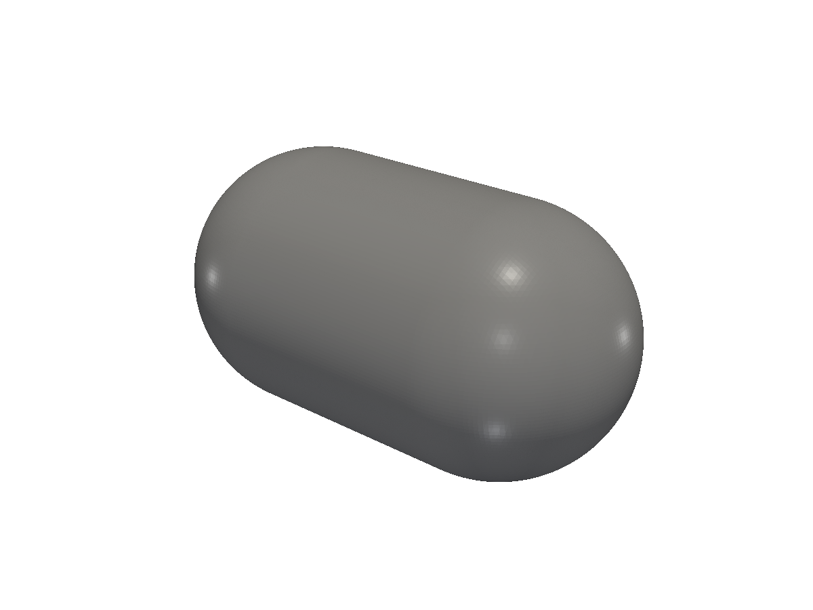

# Modifiers

Shell, Offset, Shrink, Grow, Elongate — operations that reshape an existing solid in place.

Where transforms move a solid and booleans combine solids, *modifiers* reshape an existing solid. They take the same input and produce a slightly bigger / smaller / hollowed / stretched version.

## Shell — hollow it out

`Shell(thickness)` carves out the interior, leaving walls of the given thickness. The result is closed on all sides — to actually open it (e.g. for a box or cup), `Cut` away the side you want to remove.

<!-- src: tutorial/12-modifiers/01-shell/main.go -->
```go
// Modifiers: Shell hollows out a solid, leaving a wall of the given thickness.
//
// Shell is closed on all sides; cut the top off to actually turn it into
// a cup. `BottomAt(7)` drops the cut tool so its bottom face sits at z=7
// — 3mm below the shelled cylinder's top — without thinking about the
// tool's own height.
package main

import "github.com/snowbldr/fluent-sdfx/solid"

func main() {
	solid.Cylinder(20, 12, 1).
		Shell(1.5).
		Cut(solid.Cylinder(4, 13, 0).BottomAt(7)).
		STL("out.stl", 6.0)
}
```

<figure>
  
  <figcaption>A 12mm cylinder shelled to 1.5mm walls, with the top cut off to make a cup.</figcaption>
</figure>

> [!WARNING]
> Shell is a true 3D inset, not a thin-wall extrusion. The wall thickness is uniform along surface normals — a sphere shells to a sphere, but a cube with rounded edges develops slightly thicker corners. For thick-walled prints, prefer modelling the wall as a separate `Cut` of two sized solids.

## Offset — move every surface along its normal

`Offset(distance)` moves every point on the surface outward (positive) or inward (negative) along its surface normal. Slightly different from Grow/Shrink: Offset uses the SDF's exact normal, more accurate around curves.

<!-- src: tutorial/12-modifiers/02-offset/main.go -->
```go
// Modifiers: Offset moves every surface along its outward normal by the
// given distance. Positive offset grows the solid, negative shrinks.
//
// Offset is similar to Shrink/Grow but uses the SDF's normal-aligned
// offset (more accurate around curved features).
package main

import (
	"github.com/snowbldr/fluent-sdfx/solid"
	v3 "github.com/snowbldr/fluent-sdfx/vec/v3"
)

func main() {
	solid.Box(v3.XYZ(20, 20, 8), 0).Offset(2).STL("out.stl", 5.0)
}
```

<figure>
  
  <figcaption>A 20×20×8mm box offset by +2mm — every surface pushed outward.</figcaption>
</figure>

## Shrink / Grow — inset or expand

`Shrink(amount)` and `Grow(amount)` move every surface uniformly toward / away from the inside. Cheap and good enough for press-fit clearances and most modelling tasks.

<!-- src: tutorial/12-modifiers/03-shrink-grow/main.go -->
```go
// Modifiers: Shrink/Grow uniformly inset or expand all surfaces by a
// scalar. A common use is press-fit clearance — grow the negative tool
// or shrink the positive part.
//
// Shown here as a side-by-side preview: post on the left, cleared hole
// on the right.
package main

import "github.com/snowbldr/fluent-sdfx/solid"

func main() {
	solid.Cylinder(15, 5, 0).TranslateX(-8).
		Union(solid.Cylinder(20, 5, 0).Grow(0.15).TranslateX(8)).
		STL("out.stl", 6.0)
}
```

<figure>
  
  <figcaption>Left: a 5mm-radius post. Right: a hole grown by 0.15mm so the post fits with a clearance.</figcaption>
</figure>

The Shrink/Grow vs Offset choice:

- **Shrink/Grow** is faster and uniform — distance is constant in the SDF sense. Good for clearances.
- **Offset** is geometrically more accurate near curves and corners. Use when you care about preserving the shape's profile.

In practice, Shrink/Grow are what you reach for 90% of the time.

## Elongate — stretch along an axis

`Elongate(h)` turns a solid into a "prism plus rounded ends." Inserts a flat-walled extrusion of length `h` between the two halves of the SDF, with the original geometry as caps. Take a sphere, elongate it by `(10, 0, 0)`, get a pill.

<!-- src: tutorial/12-modifiers/04-elongate/main.go -->
```go
// Modifiers: Elongate stretches a solid along the given axes by inserting
// a flat-walled "extrusion" between the two halves of the SDF. Great for
// turning a cylinder into a rounded slot, or a sphere into a pill.
package main

import (
	"github.com/snowbldr/fluent-sdfx/solid"
	v3 "github.com/snowbldr/fluent-sdfx/vec/v3"
)

func main() {
	solid.Sphere(6).Elongate(v3.XYZ(10, 0, 0)).STL("out.stl", 6.0)
}
```

<figure>
  
  <figcaption>A 6mm sphere elongated 10mm along X — a pill / capsule.</figcaption>
</figure>

Elongate works for any 3D solid, not just spheres — try elongating a cylinder, a cone, or a complex assembly. The result is the original shape with extruded "middle."

## Other modifiers

| Method | What it does |
|---|---|
| `Correct(factor)` | Fix distance overestimates from approximate SDFs. Rarely needed unless you've composed many transforms. |
| `Cache()` | Precompute and cache distances for slow SDFs (text, complex polygons). The result is a `*Solid` that evaluates much faster at the cost of one upfront sampling pass. |
| `Voxel(cells, progress chan)` | Convert an arbitrary SDF into a voxel grid. Handy for booleans involving very expensive procedural SDFs. |

For per-axis transforms (rotate, scale, translate), see [Transforms](/transforms/). For combining modifiers across multiple instances of the same shape, see [Patterns](/patterns/).
