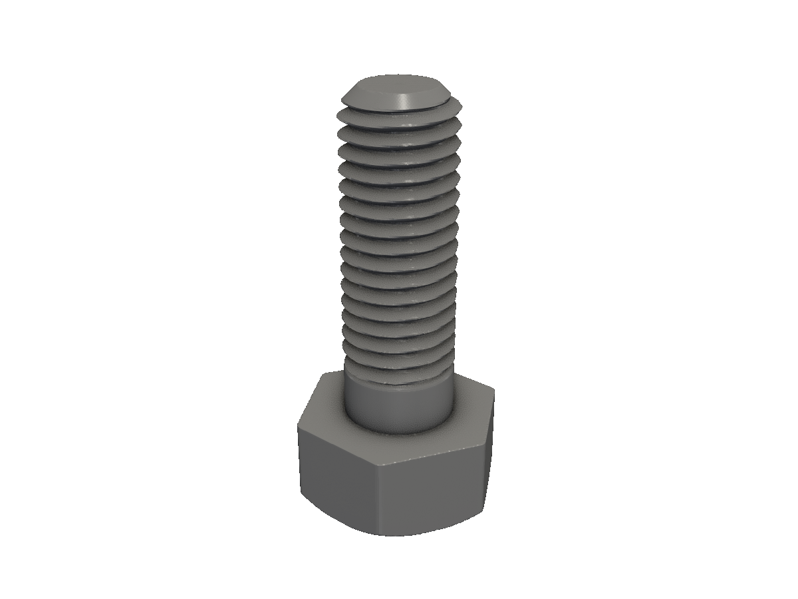
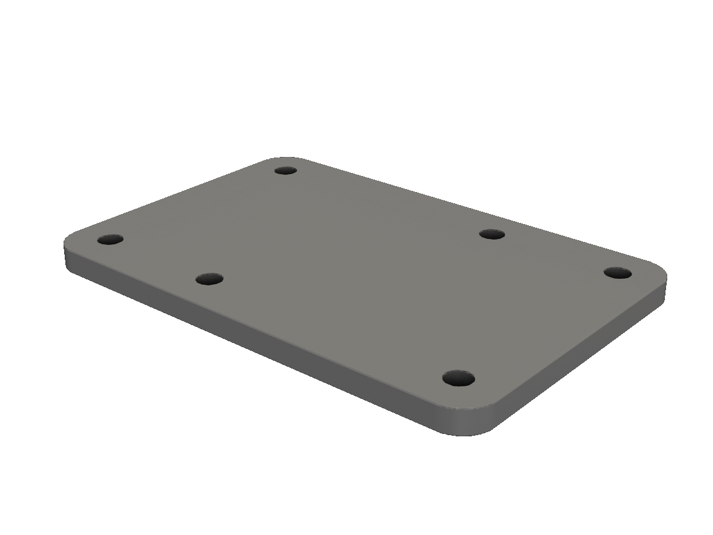
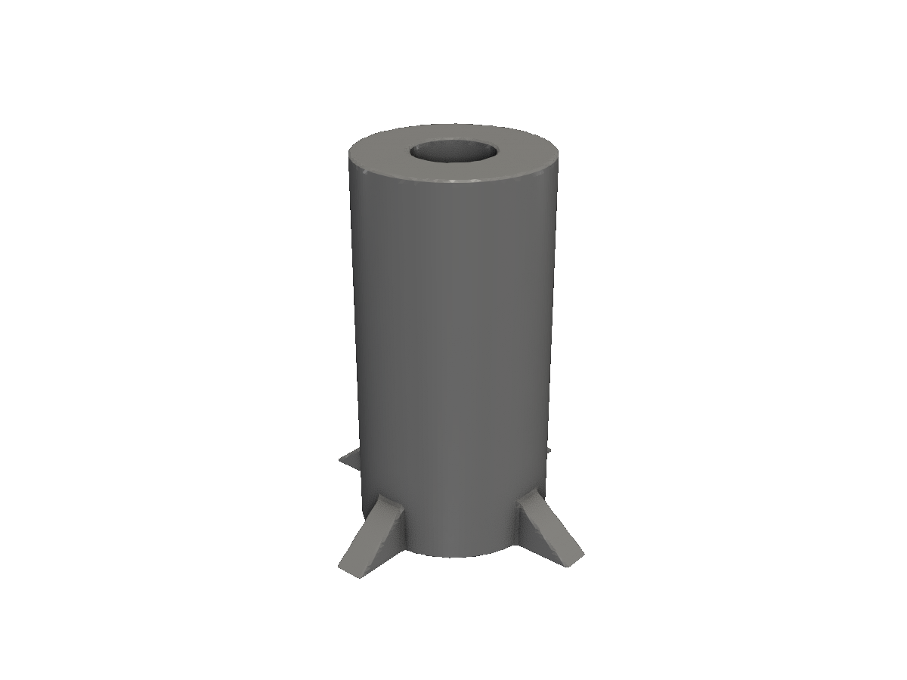
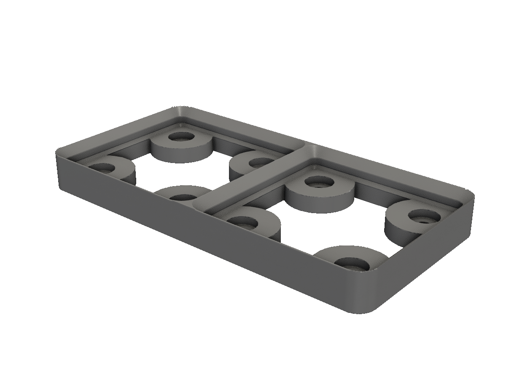

# Parametric helpers

The obj package — pre-built bolts, nuts, panels, gears, servos, gridfinity bins, and more.

The `obj` package is a curated library of *parametric helpers*: real-world parts you'd otherwise build from scratch. Every helper takes a parameter struct and returns a `*solid.Solid` (or `*shape.Shape`). They're not magic — each one is a thin Go layer over sdfx's `obj` package, which is itself ~3000 lines of careful CAD primitives.

This page tours four representative helpers. The full list is in [API reference](/api-reference/) under `obj`.

## Bolts and nuts

`obj.Bolt(BoltParms)` returns a 3D bolt. `obj.Nut(NutParms)` is the matching nut. The `Thread` field is a string name from sdfx's thread table — `"M10x1.5"`, `"unc_1/4"`, etc. — and is round-tripped through `shape.ThreadLookup` if you need the underlying parameters.

<!-- src: tutorial/16-obj-overview/01-hex-bolt/main.go -->
```go
// Parametric helpers: a hex-head bolt via obj.Bolt.
//
// Thread is one of the standard names in sdfx's thread table — "M8x1.25",
// "unc_1/4", etc. See sdf.ThreadLookup or shape.ThreadLookup.
package main

import "github.com/snowbldr/fluent-sdfx/obj"

func main() {
	obj.Bolt(obj.BoltParms{
		Thread:      "M10x1.5",
		Style:       "hex",
		TotalLength: 30,
		ShankLength: 5,
	}).STL("out.stl", 6.0)
}
```

<figure>
  
  <figcaption>An M10×1.5 hex bolt, 30mm total length, 5mm shank.</figcaption>
</figure>

For the full bolt-and-nut assembly story, see the [bolt cookbook](/cookbook-bolt/).

## Panels

`obj.Panel3D(PanelParms)` produces a rectangular panel with rounded corners and per-edge mounting hole patterns. The `HolePattern` field is a 4-string array `[top, right, bottom, left]`; each string places one hole per character along that edge (`'x'` = hole, `'.'` = skip).

<!-- src: tutorial/16-obj-overview/02-panel/main.go -->
```go
// Parametric helpers: a Panel3D with rounded corners and mounting holes.
//
// HoleMargin and HolePattern are 4-element arrays in [top, right, bottom,
// left] order. Each pattern string places a hole per character: 'x' = hole,
// '.' = skip.
package main

import (
	"github.com/snowbldr/fluent-sdfx/obj"
	v2 "github.com/snowbldr/fluent-sdfx/vec/v2"
)

func main() {
	obj.Panel3D(obj.PanelParms{
		Size:         v2.XY(60, 40),
		CornerRadius: 4,
		HoleDiameter: 3,
		HoleMargin:   [4]float64{5, 5, 5, 5},
		HolePattern:  [4]string{"x.x", "x", "x.x", "x"},
		Thickness:    3,
	}).STL("out.stl", 6.0)
}
```

<figure>
  
  <figcaption>A 60×40mm panel with rounded corners and asymmetric mounting holes.</figcaption>
</figure>

For the popular Eurorack module size, use `obj.EuroRackPanel3D(EuroRackParms{ U: 1, HP: 8 })` — it does the math for you.

## PCB standoffs

`obj.Standoff3D(StandoffParms)` — a printable PCB standoff with optional triangular gussets at the base for stiffness.

<!-- src: tutorial/16-obj-overview/03-standoff/main.go -->
```go
// Parametric helpers: a PCB standoff via obj.Standoff3D.
//
// PillarHeight × PillarDiameter is the cylinder body. HoleDepth > 0 makes
// a tapped/screw-receiving hole; HoleDepth < 0 produces a support stub.
// NumberWebs adds triangular gussets around the base for stiffness.
package main

import "github.com/snowbldr/fluent-sdfx/obj"

func main() {
	obj.Standoff3D(obj.StandoffParms{
		PillarHeight:   12,
		PillarDiameter: 6,
		HoleDepth:      8,
		HoleDiameter:   2.5,
		NumberWebs:     4,
		WebHeight:      4,
		WebDiameter:    10,
		WebWidth:       1,
	}).STL("out.stl", 8.0)
}
```

<figure>
  
  <figcaption>A 12mm tall, 6mm-diameter standoff with a 2.5mm screw hole and four reinforcing webs.</figcaption>
</figure>

`HoleDepth > 0` makes a tapped/screw-receiving hole; `HoleDepth < 0` produces a support stub instead.

## Gridfinity

The popular [Gridfinity](https://gridfinity.xyz) modular storage system. `obj.GfBase` builds a base; `obj.GfBody` builds a bin or container that mates with it.

<!-- src: tutorial/16-obj-overview/04-gridfinity/main.go -->
```go
// Parametric helpers: a 2x1 Gridfinity base.
//
// Size is in Gridfinity units (42mm per cell). Magnet/Hole flags add the
// standard 6mm magnet pockets and M3 mounting holes.
package main

import (
	"github.com/snowbldr/fluent-sdfx/obj"
	v2i "github.com/snowbldr/fluent-sdfx/vec/v2i"
)

func main() {
	obj.GfBase(obj.GfBaseParms{
		Size:   v2i.XY(2, 1),
		Magnet: true,
		Hole:   true,
	}).STL("out.stl", 5.0)
}
```

<figure>
  
  <figcaption>A 2×1 Gridfinity base with magnet pockets and M3 mounting holes.</figcaption>
</figure>

## What else is in obj

A non-exhaustive list, grouped by purpose:

**Fasteners.** `Bolt`, `Nut`, `Washer2D/3D`, `ThreadedCylinder`.

**Holes & patterns.** `CounterBoredHole3D`, `ChamferedHole3D`, `CounterSunkHole3D`, `BoltCircle2D/3D`, `CircleGrille2D/3D`, `KeyedHole2D/3D`, `Keyway2D/3D`.

**Panels & enclosures.** `Panel2D/3D`, `EuroRackPanel2D/3D`, `PanelBox3D` (returns the parts of a panel-box enclosure).

**Mechanical & motion.** `Servo2D/3D` + `ServoLookup`, `ServoHorn`, `Spring2D/3D`, `InvoluteGear`, `Geneva2D` (Geneva drive: returns driver and driven), `FlatFlankCam`, `ThreeArcCam`, `GearRack`.

**Pipes.** `Pipe3D(oR, iR, L)`, `StdPipe3D(name, units, L)`, `PipeConnector3D` (multi-port), `StdPipeConnector3D`.

**Structural.** `Standoff3D`, `Angle2D/3D` (L-bracket), `TruncRectPyramid3D`, `KnurledHead3D`, `Knurl3D`.

**Specialty.** `Display(DisplayParms)`, `DroneMotorArm`, `DrainCover`, `FingerButton2D`, `IsocelesTrapezoid2D`, `IsocelesTriangle2D`, `Arrow3D` + `DirectedArrow3D` + `Axes3D` (debugging/diagrams).

**Mesh import.** `ImportSTL(path, ...)`, `ImportTriMesh(tris, ...)` for using existing geometry as an SDF source.

**Tabs (for cuts that need to stay rejoinable).** `NewStraightTab`, `NewAngleTab`, `NewScrewTab`, `AddTabs`.

For complete signatures and parameter struct fields, see [API reference](/api-reference/) — the `obj` section enumerates every type.

## Pattern: building on top of obj

The most useful pattern for real projects is to *combine* obj helpers with your own geometry:

```go
case := obj.PanelBox3D(...)
mounted := case.Union(
    obj.Standoff3D(...).Translate(...),
    obj.Standoff3D(...).Translate(...),
)
```

The full bolt-assembly cookbook walks through a longer example: [Bolt assembly cookbook](/cookbook-bolt/).
