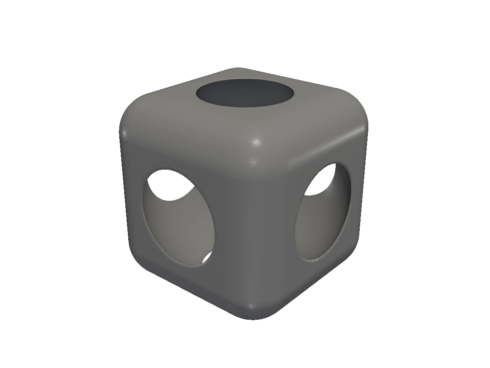
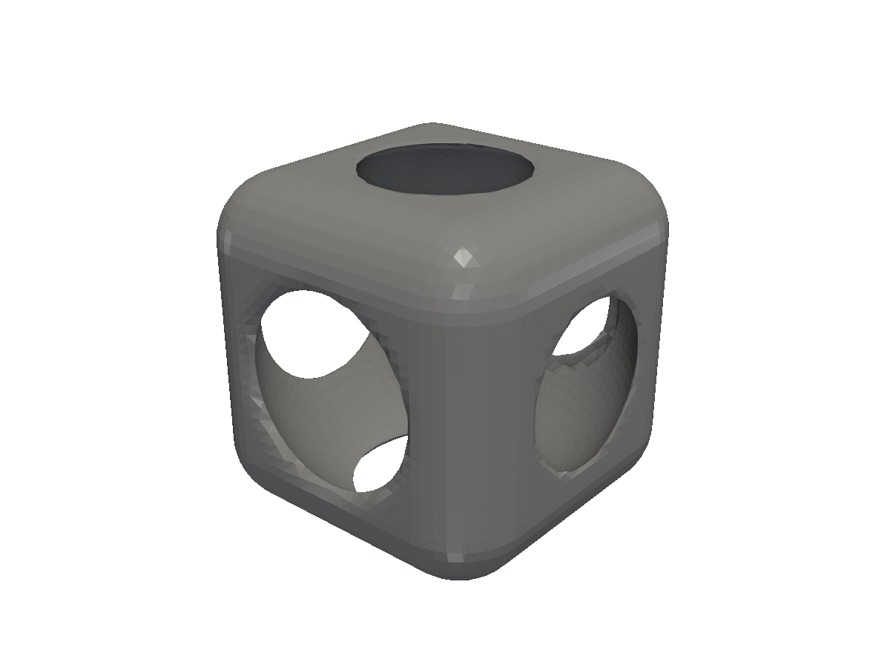
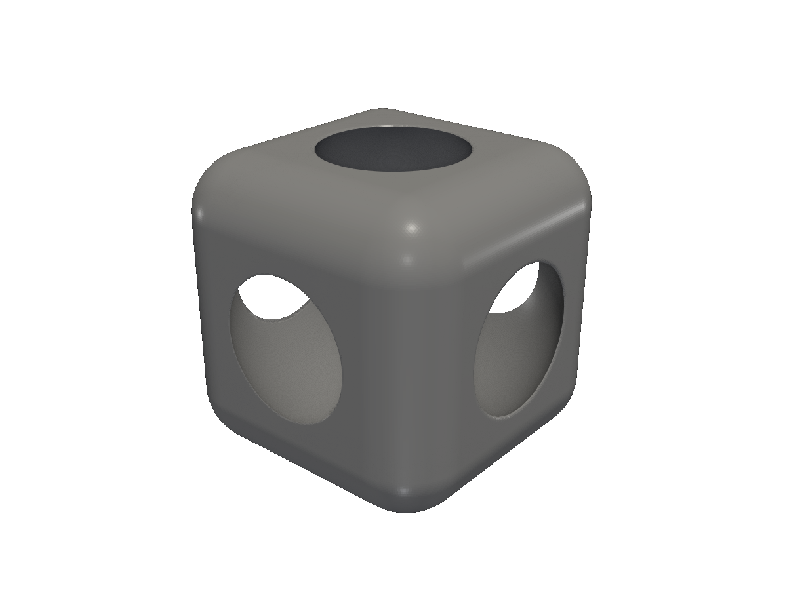

# Output & resolution

STL, 3MF, mesh density, decimation — picking the right export settings for previews vs final output.

Once you have a `*solid.Solid`, you write it to disk with `STL` or `ThreeMF`. Both take a `cellsPerMM` density argument that controls how finely the part is meshed.

## STL

```go
part.STL("output.stl", 5.0)            // 5 cells per mm
part.STL("output.stl", 5.0, 0.5)       // optional: decimate to 50% triangles
```

STL is ASCII or binary; fluent-sdfx writes binary by default — smaller and faster to parse. Slicers, viewers, and most CAM tools read both interchangeably.

## ThreeMF (3MF)

```go
part.ThreeMF("output.3mf", 5.0)
```

3MF is a modern XML-based format with explicit units, colour, and metadata baked in. Slicers (PrusaSlicer, BambuStudio, etc.) prefer it for multi-material parts. Use 3MF when you have either, otherwise STL is fine.

<!-- src: tutorial/17-output-resolution/04-3mf/main.go -->
```go
// Output: ThreeMF (.3mf) is the modern alternative to STL — a zipped
// XML format with explicit units, colour, and metadata. Same density
// parameter as STL.
//
// We also write an STL alongside so the screenshot pipeline picks one up.
package main

import (
	"github.com/snowbldr/fluent-sdfx/solid"
	v3 "github.com/snowbldr/fluent-sdfx/vec/v3"
)

func main() {
	part := solid.Box(v3.XYZ(20, 20, 20), 4).Cut(solid.Sphere(11))
	part.ThreeMF("out.3mf", 5.0)
	part.STL("out.stl", 5.0)
}
```

<figure>
  
  <figcaption>A part exported to both .stl and .3mf.</figcaption>
</figure>

## Picking cellsPerMM

`cellsPerMM` is mesh density along the longest bounding-box axis — *cells per real-world millimetre*. The number is independent of part size, which is what makes it useful: the same density gives the same visual quality on a 1mm gear and a 500mm enclosure.

| Scenario | `cellsPerMM` | Resulting cells on longest axis |
|---|---|---|
| 500mm enclosure, rough preview | `0.2` | 100 |
| 500mm enclosure, final | `2.0` | 1000 |
| 50mm bracket, typical | `5.0` | 250 |
| 10mm gear, detailed | `20.0` | 200 |
| 1mm sphere | `12.0` | 32 (floored) |

Render time scales roughly with **cells³** — halving `cellsPerMM` is an 8× speedup. That's how to keep iteration fast: low density during dev, crank for final.

### Low resolution — fast preview

<!-- src: tutorial/17-output-resolution/01-low-res/main.go -->
```go
// Output: cellsPerMM=0.5 — fast preview render. Visible faceting on
// curved surfaces, but writes in milliseconds.
package main

import (
	"github.com/snowbldr/fluent-sdfx/solid"
	v3 "github.com/snowbldr/fluent-sdfx/vec/v3"
)

func main() {
	solid.Box(v3.XYZ(20, 20, 20), 4).
		Cut(solid.Sphere(11)).
		STL("out.stl", 0.5)
}
```

<figure>
  
  <figcaption>cellsPerMM=0.5 — visible faceting, but renders in milliseconds.</figcaption>
</figure>

### High resolution — final output

<!-- src: tutorial/17-output-resolution/02-high-res/main.go -->
```go
// Output: cellsPerMM=8 — final-quality render. Smooth curves, much
// larger STL and longer build time.
package main

import (
	"github.com/snowbldr/fluent-sdfx/solid"
	v3 "github.com/snowbldr/fluent-sdfx/vec/v3"
)

func main() {
	solid.Box(v3.XYZ(20, 20, 20), 4).
		Cut(solid.Sphere(11)).
		STL("out.stl", 8.0)
}
```

<figure>
  
  <figcaption>cellsPerMM=8 — smooth curves, larger STL, longer build time.</figcaption>
</figure>

### MinCells floor

Tiny parts hit `solid.MinCells` (default 32) — a one-millimetre sphere at `cellsPerMM=3` still produces 32 cells along the longest axis instead of 3, so the output mesh is recognisable. Bump `MinCells` higher for finer sub-mm detail, or set it to `1` to disable the floor for raw behavior.

## Decimation

The optional second-after-density argument to `STL` is a triangle-keep fraction passed through [meshoptimizer](https://github.com/zeux/meshoptimizer):

<!-- src: tutorial/17-output-resolution/03-decimated/main.go -->
```go
// Output: high-res render decimated to 25% triangle count. Visually
// similar to the full mesh but a fraction of the file size.
//
// The trailing argument is the keep-fraction passed through meshoptimizer.
package main

import (
	"github.com/snowbldr/fluent-sdfx/solid"
	v3 "github.com/snowbldr/fluent-sdfx/vec/v3"
)

func main() {
	solid.Box(v3.XYZ(20, 20, 20), 4).
		Cut(solid.Sphere(11)).
		STL("out.stl", 8.0, 0.25)
}
```

<figure>
  
  <figcaption>The same high-res mesh decimated to 25% triangles — visually nearly identical, much smaller file.</figcaption>
</figure>

A `keep` of `0.5` cuts the file roughly in half; `0.1` keeps 10% of triangles. Visually the difference is negligible at typical print resolutions; the savings are large for 3D-printer slicers and for anything you'll send over a network.

> [!NOTE]
> Decimation requires CGo (the `meshoptimizer` C library is statically linked in). If your build target rules out CGo, omit the decimation argument and rely on a lower `cellsPerMM` instead.

## Iterating on a part

The recommended dev loop:

1. **`cellsPerMM` ~1–2** while iterating — fast rebuilds.
2. **`cellsPerMM` ~5–10** for the final export.
3. **Add decimation (e.g. `0.5`)** if the slicer takes too long to load the file.

Pair this with [stldev](/dev-loop/) to auto-rebuild and reload on save.

## 2D outputs

For `*shape.Shape`, the equivalents are:

```go
profile.ToDXF(path, meshCells)   // DXF for laser cutters / CAD
profile.ToSVG(path, meshCells)   // SVG for web / Inkscape
profile.ToPNG(path, w, h)        // PNG (distance-field heatmap)
```

Where `meshCells` is the resolution of the marching-squares pass over the shape's bounding box. See [Text & 2D output](/text-2d-output/) for the cookbook.

## Lower-level access

The `render` package exposes the underlying machinery:

- `render.ToSTL`, `render.To3MF`, `render.ToDXF`, `render.ToSVG`, `render.ToPNG` — same as the methods, but take a raw SDF.
- `render.NewMarchingCubesOctreeParallel` — the 3D mesher fluent-sdfx uses by default.
- `render.NewMarchingSquaresQuadtree`, `render.NewDualContouring2D` — alternative 2D meshers.
- `render.NewPNG(path, bb, pixels)` and `render.NewDXF(path)` — interactive 2D output targets you can drive with explicit `RenderSDF2`, `Triangle`, `Line`, `Box`, `Points` calls.

Use these when you want to mesh into your own pipeline or composite multiple SDFs into a single canvas.
