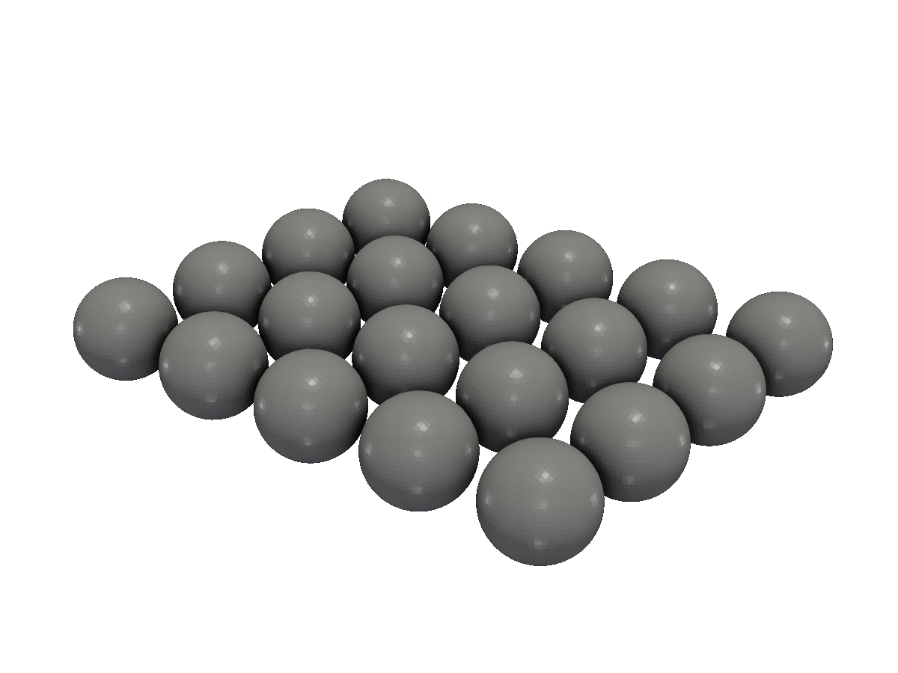
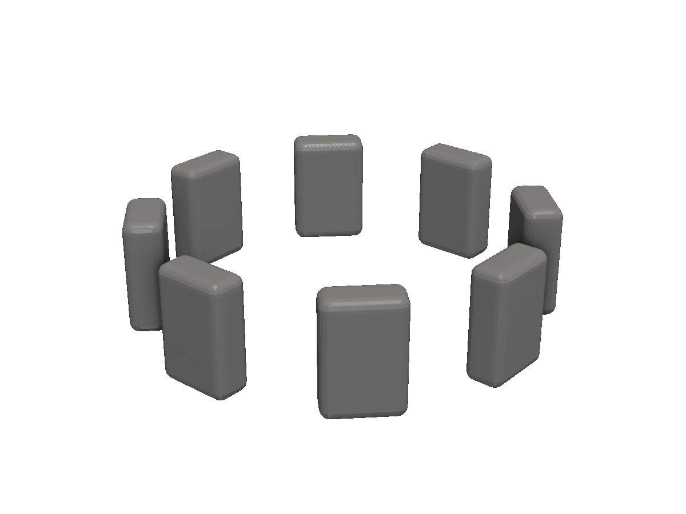
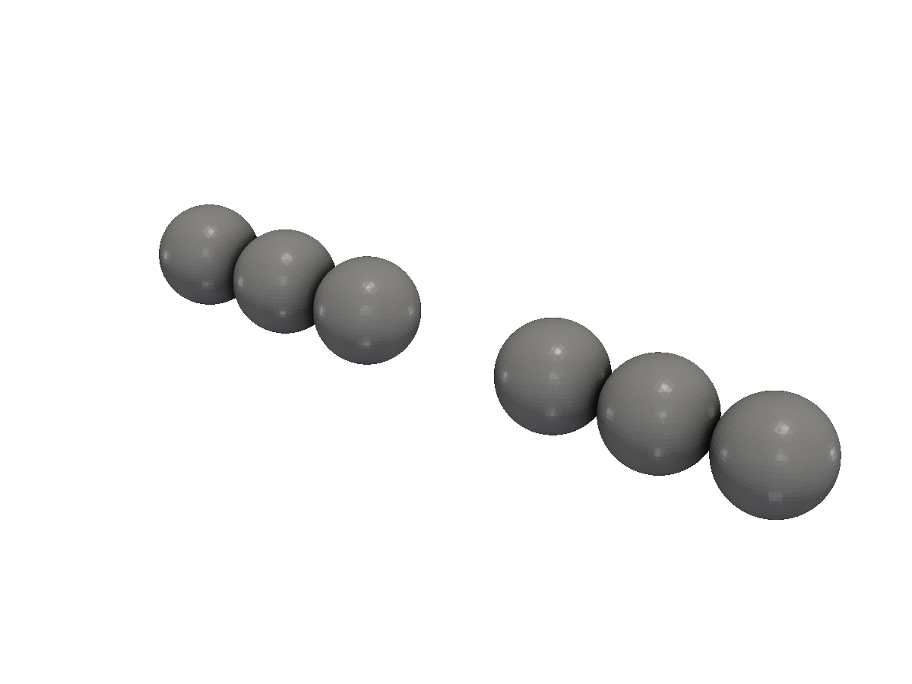
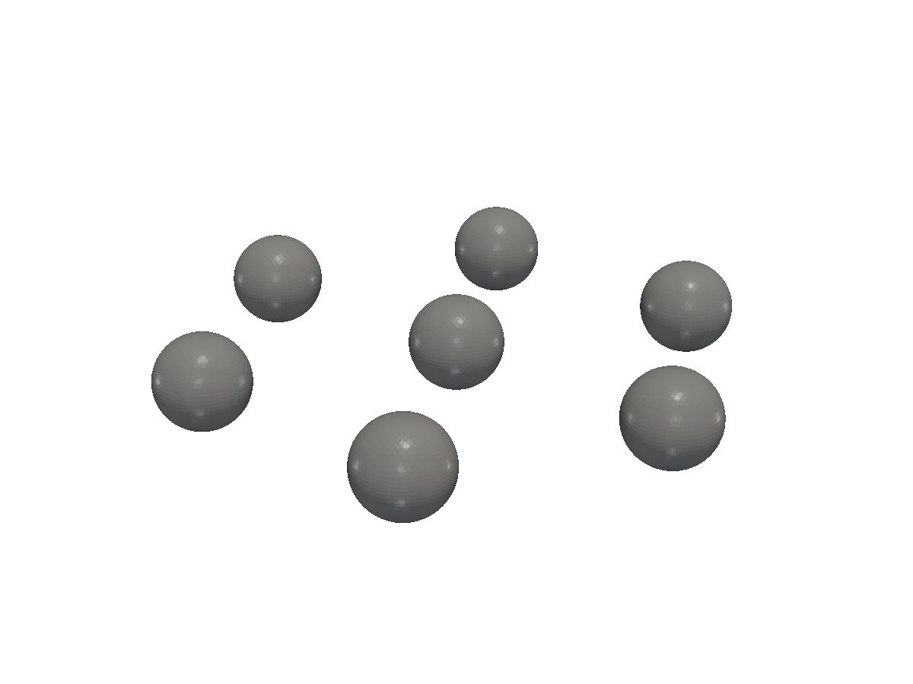
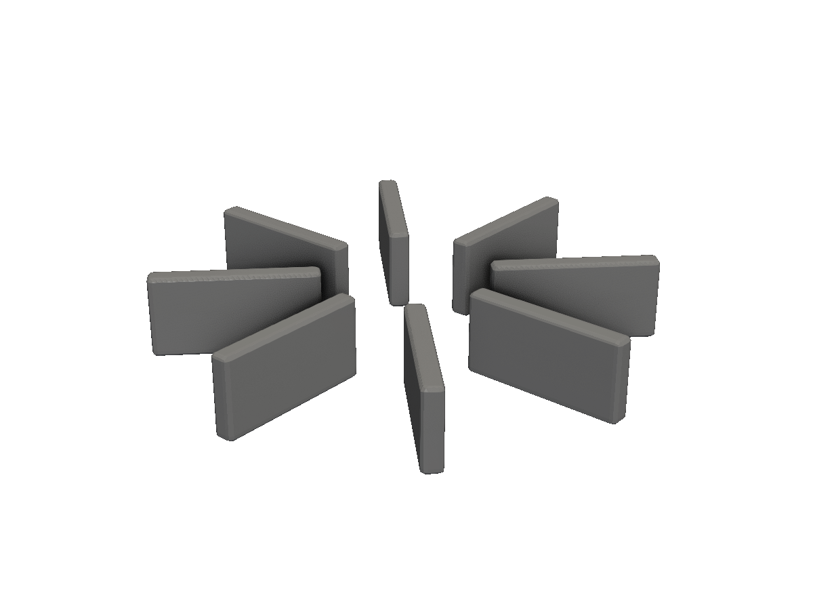

# Patterns

Repeat a single solid into arrays, rings, lines, and explicit lists — without re-evaluating the source SDF for each copy.

A pattern operation takes one solid and produces many — without manually unioning translated copies. The key benefit isn't ergonomics, it's *performance*: the source SDF is evaluated once, and the pattern reuses that evaluation for every copy.

| Method | Layout |
|---|---|
| `Array(nx, ny, nz, step)` | Regular 3D grid. |
| `RotateCopyZ(n)` | `n` copies evenly spaced around the Z axis. |
| `LineOf(p0, p1, pattern)` | Copies along a line, with per-slot enable. |
| `Multi(positions...)` | Explicit list of positions (variadic). |
| `Orient(base, dirs)` | Copies aligned to a list of unit vectors. |

The 2D shape package mirrors these — `Array(nx, ny, step)`, `RotateCopy(n)`, `LineOf(...)`, `Multi(...)` — all returning `*Shape`.

## Array — regular grid

<!-- src: tutorial/13-patterns/01-array/main.go -->
```go
// Patterns: Array repeats a solid on a regular grid.
//
// Array(numX, numY, numZ, step) — counts along each axis, with `step`
// being the distance between cells.
package main

import (
	"github.com/snowbldr/fluent-sdfx/solid"
	v3 "github.com/snowbldr/fluent-sdfx/vec/v3"
)

func main() {
	solid.Sphere(2).Array(5, 4, 1, v3.XYZ(5, 5, 0)).STL("out.stl", 6.0)
}
```

<figure>
  
  <figcaption>A 5×4 grid of spheres, 5mm spacing.</figcaption>
</figure>

Use `1` for axes you don't want to repeat — e.g. `Array(5, 4, 1, ...)` for a flat grid in XY.

## RotateCopyZ — radial array

<!-- src: tutorial/13-patterns/02-rotate-copy/main.go -->
```go
// Patterns: RotateCopyZ duplicates a solid n times around the Z axis,
// evenly spaced. The receiver should sit off-axis so the copies don't
// overlap themselves.
package main

import (
	"github.com/snowbldr/fluent-sdfx/solid"
	v3 "github.com/snowbldr/fluent-sdfx/vec/v3"
)

func main() {
	solid.Box(v3.XYZ(2, 4, 6), 0.5).
		TranslateX(10).
		RotateCopyZ(8).
		STL("out.stl", 6.0)
}
```

<figure>
  
  <figcaption>Eight teeth around a centre — a stylised gear.</figcaption>
</figure>

Position the source solid where you want a single copy to sit; `RotateCopyZ(n)` orbits the rest around the Z axis evenly.

## LineOf — with per-slot enable

`LineOf(p0, p1, pattern)` divides the segment from `p0` to `p1` into `len(pattern)` slots and places a copy at each slot where the corresponding character is `'x'`. `'.'` skips the slot.

<!-- src: tutorial/13-patterns/03-line-of/main.go -->
```go
// Patterns: LineOf places copies of a solid along a line from p0 to p1.
//
// The pattern string is a single character per slot — 'x' places a copy,
// '.' skips it. Length of the string is the number of slots.
package main

import (
	"github.com/snowbldr/fluent-sdfx/solid"
	v3 "github.com/snowbldr/fluent-sdfx/vec/v3"
)

func main() {
	solid.Sphere(2).
		LineOf(v3.XYZ(-15, 0, 0), v3.XYZ(15, 0, 0), "xxx.xxx").
		STL("out.stl", 6.0)
}
```

<figure>
  
  <figcaption>Beads along a line with a gap in the middle — the pattern <code>"xxx.xxx"</code>.</figcaption>
</figure>

Useful for cog/sprocket teeth, perforations, mounting hole rows, and anything else with a regular-but-skippable spacing.

## Multi — explicit positions

When the layout isn't a regular grid or line, list the positions directly. `Multi` is variadic, so drop them in as args (or spread a slice with `Multi(positions...)`):

<!-- src: tutorial/13-patterns/04-multi/main.go -->
```go
// Patterns: Multi places copies of a solid at an explicit list of
// positions. Variadic — drop the positions in directly, or pass a slice
// with `Multi(positions...)`.
package main

import (
	"github.com/snowbldr/fluent-sdfx/solid"
	v3 "github.com/snowbldr/fluent-sdfx/vec/v3"
)

func main() {
	solid.Sphere(1.5).Multi(
		v3.XYZ(0, 0, 0),
		v3.XYZ(8, 0, 0),
		v3.XYZ(4, 7, 0),
		v3.XYZ(-4, 7, 0),
		v3.XYZ(-8, 0, 0),
		v3.XYZ(-4, -7, 0),
		v3.XYZ(4, -7, 0),
	).STL("out.stl", 8.0)
}
```

<figure>
  
  <figcaption>A 7-position daisy pattern from an explicit position list.</figcaption>
</figure>

## Orient — aligned to direction vectors

`Orient(base, directions)` places copies oriented along a list of unit vectors, with `base` being the receiver's natural orientation. Useful for radial fins, antennae, and mounting tabs that point in arbitrary directions.

<!-- src: tutorial/13-patterns/05-orient/main.go -->
```go
// Patterns: Orient places copies of a solid pointed in a list of
// directions. The 'base' argument is the receiver's natural orientation.
//
// Useful for things like radial fins, antennae, or mounting tabs that need
// to point along arbitrary vectors.
package main

import (
	"github.com/snowbldr/fluent-sdfx/solid"
	v3 "github.com/snowbldr/fluent-sdfx/vec/v3"
)

func main() {
	// A single fin pointing along +X by default, oriented to eight
	// directions in the XY plane.
	solid.Box(v3.XYZ(8, 1, 4), 0.2).TranslateX(8).
		Orient(v3.X(1), []v3.Vec{
			v3.XYZ(1, 0, 0),
			v3.XYZ(0, 1, 0),
			v3.XYZ(-1, 0, 0),
			v3.XYZ(0, -1, 0),
			v3.XYZ(1, 1, 0).Normalize(),
			v3.XYZ(-1, 1, 0).Normalize(),
			v3.XYZ(-1, -1, 0).Normalize(),
			v3.XYZ(1, -1, 0).Normalize(),
		}).STL("out.stl", 6.0)
}
```

<figure>
  
  <figcaption>One fin pointing along +X, replicated to eight directions in the XY plane.</figcaption>
</figure>

## Smooth pattern variants

`SmoothArray` and `SmoothRotateUnion` work the same as their plain counterparts, but smooth-union each copy to its neighbours instead of doing a hard union. See [Smooth blends](/smooth-blends/) for the example.
