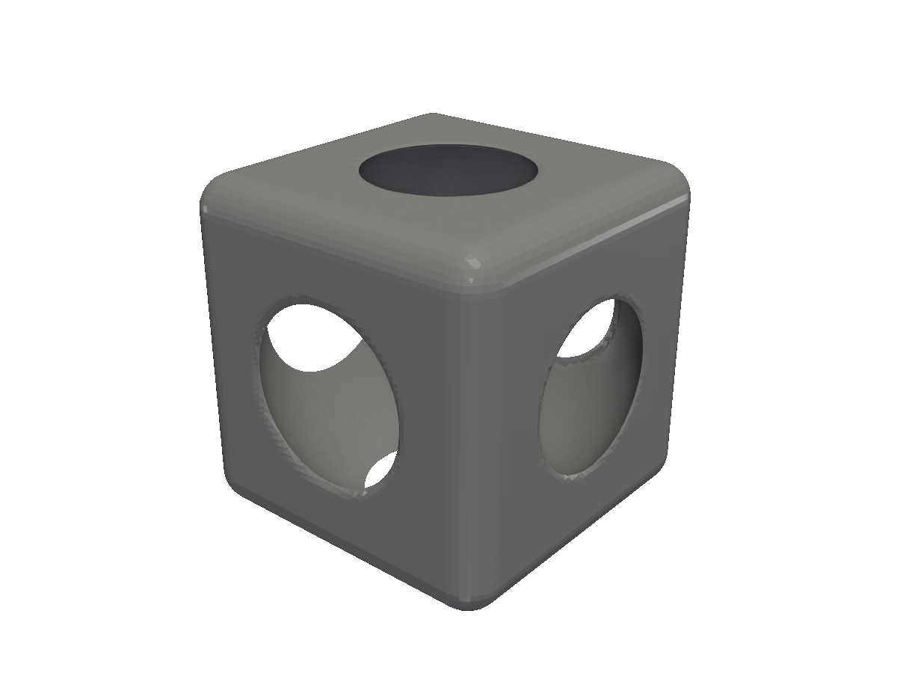

# Project setup

Scaffold a Go module, write your first part, and produce an STL — in three commands.

A fluent-sdfx project is just a Go module with a `main.go` that produces an STL. There's no scaffolding tool, no special directory layout, and no config file. This page is the literal three-command setup.

## 1. Create a module

```bash
mkdir my-part && cd my-part
go mod init my-part
go get github.com/snowbldr/fluent-sdfx
```

That gives you a `go.mod` and a `go.sum`. You're ready to write code.

## 2. Write the smallest interesting part

A box with a sphere cut from the center, in a dozen lines:

<!-- src: tutorial/02-project-setup/01-hello-part/main.go -->
```go
// Project setup: a minimal main.go that proves your fluent-sdfx install works.
package main

import (
	"github.com/snowbldr/fluent-sdfx/solid"
	"github.com/snowbldr/fluent-sdfx/vec/v3"
)

func main() {
	solid.Box(v3.XYZ(20, 20, 20), 2).
		Cut(solid.Sphere(11)).
		STL("out.stl", 3.0)
}
```
Drop that into `main.go`. It uses three things you'll see everywhere in fluent-sdfx:

- A primitive constructor — `solid.Box(size, round)` and `solid.Sphere(radius)`.
- A vector helper — `v3.XYZ(20, 20, 20)`. The package `vec/v3` re-exports sdfx's 3D vector type with named constructors so you can skip the `Vec{X: ..., Y: ..., Z: ...}` boilerplate.
- A boolean — `body.Cut(tool)` removes one solid from another.
- An exporter — `STL(path, cellsPerMM)`. The `cellsPerMM` is mesh density along the longest axis; we'll cover it on [Output & resolution](/output-resolution/).

## 3. Run it

```bash
go run .
# rendering out.stl (60x60x60, resolution 0.33)
#   28156 triangles
```

Open the result in f3d:

```bash
f3d out.stl
```


<figure>
  
  <figcaption>A 20×20×20mm box with a sphere cut from the center.</figcaption>
</figure>

That's it. From here, every page in this guide is a refinement: more primitives, more transforms, more booleans, more parametric helpers.

## What goes in a real project

For anything more than a single part, you'll want:

- **Multiple `main` packages**, one per part. A common layout:
  ```text
  my-project/
  ├── go.mod
  ├── parts/
  │   ├── bracket/main.go
  │   ├── housing/main.go
  │   └── lid/main.go
  └── shared/
      └── dimensions.go
  ```
  Run a single part with `go run ./parts/bracket`.

- **Shared dimensions** in a `shared/` package — fastener sizes, wall thicknesses, fit tolerances. Constants and a few struct types go a long way.

- **A Makefile** that runs every part and outputs to a `build/` directory. Pairs naturally with the [stldev dev loop](/dev-loop/) — `stldev -cmd "go run ./parts/bracket" build/bracket.stl`.

> [!NOTE]
> fluent-sdfx is plain Go. Anything you'd do in a normal Go module — testing with `go test`, parametric design via flags or env vars, importing third-party libraries — works exactly the same here.
