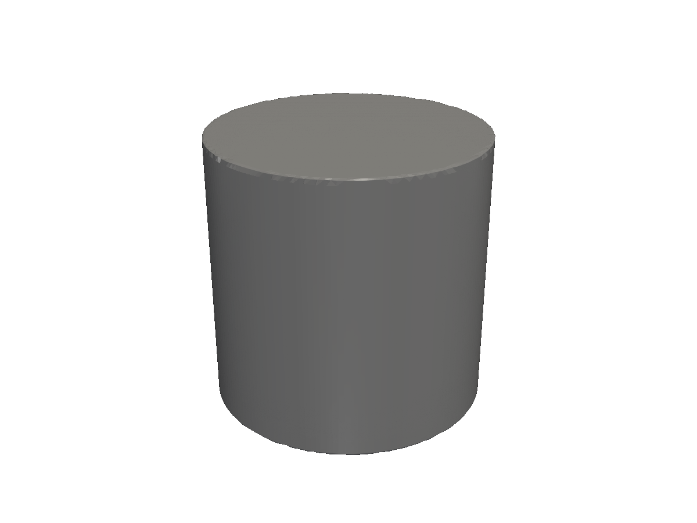
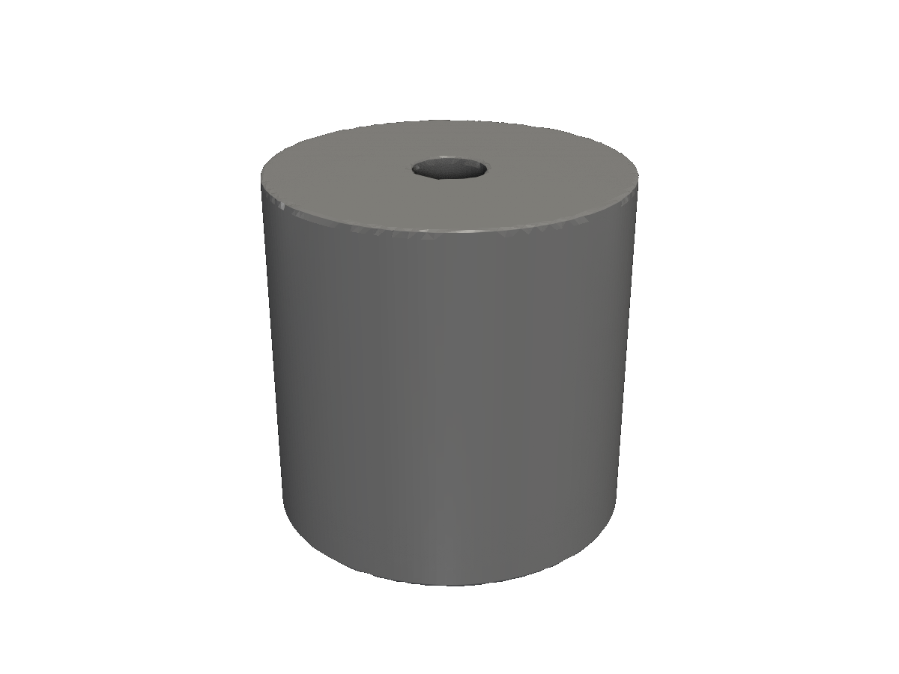
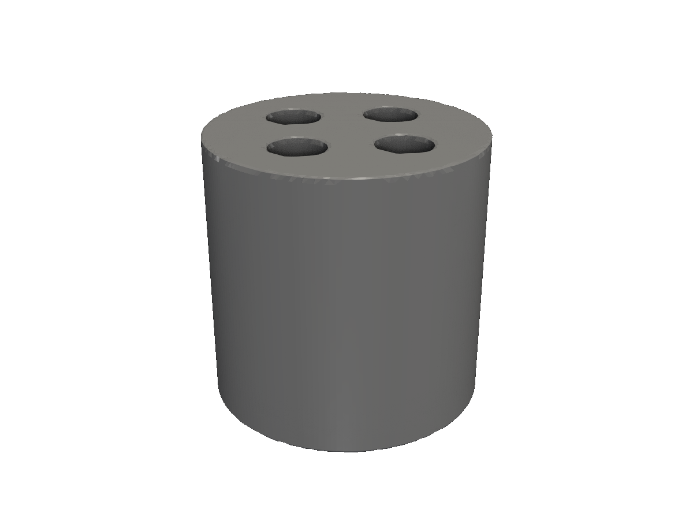
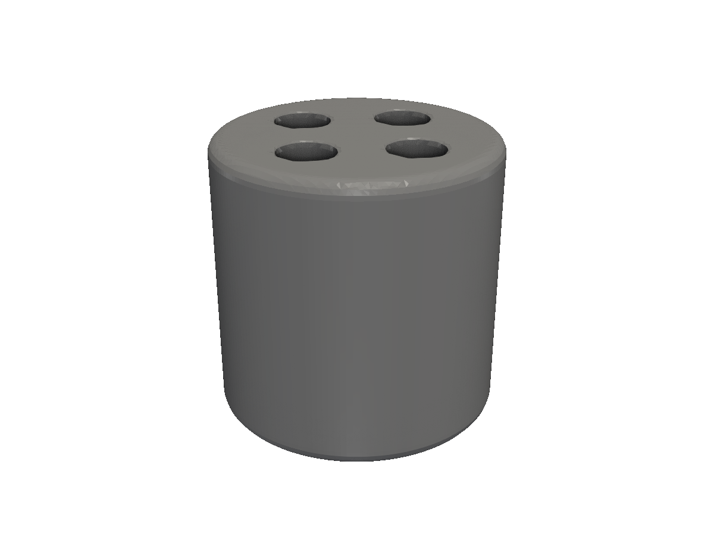

# Quickstart

Build a cylinder with four bolt holes from scratch in five incremental steps. Every step is a runnable program.

This quickstart walks through five versions of a small part, starting from a single cylinder and ending with a polished, print-ready model. Each step is a complete `package main` — copy it, run it, see the result.

If you haven't already, [install the library](/install/) and either grab `f3d` (to view STLs) or set up the [stldev dev loop](/dev-loop/) before you start.

## Step 1 — A cylinder

The smallest possible fluent-sdfx program. `solid.Cylinder(height, radius, round)` returns a `*Solid`; `STL(path, cellsPerMM)` writes it to disk.

<!-- src: tutorial/04-quickstart/01-cylinder/main.go -->
```go
// Quickstart step 1: a plain cylinder.
package main

import "github.com/snowbldr/fluent-sdfx/solid"

func main() {
	solid.Cylinder(20, 10, 0).STL("out.stl", 3.0)
}
```

<figure>
  
  <figcaption>A 20mm-tall, 10mm-radius cylinder.</figcaption>
</figure>

The third argument to `Cylinder` is an edge round; we'll use it later. The `cellsPerMM=3.0` resolution gives ~60 cells along the longest axis — fast to mesh, fine for previewing.

## Step 2 — Drill a hole

Booleans are methods on `*Solid` that take other `*Solid` values. `Cut` is set difference: it removes the tool from the body.

<!-- src: tutorial/04-quickstart/02-with-one-hole/main.go -->
```go
// Quickstart step 2: drill one hole down the middle with Cut.
package main

import "github.com/snowbldr/fluent-sdfx/solid"

func main() {
	solid.Cylinder(20, 10, 0).
		Cut(solid.Cylinder(25, 2, 0)).
		STL("out.stl", 3.0)
}
```

<figure>
  
  <figcaption>One hole through the cylinder. The tool is taller than the body so the cut goes all the way through.</figcaption>
</figure>

> [!TIP]
> Make your cutting tools longer than the body. fluent-sdfx is exact — a hole that's exactly as tall as the body will leave a single layer of mesh that may or may not survive the marching-cubes step depending on resolution.

## Step 3 — Drill four holes

`Multi(positions...)` places copies of the receiver at each position and unions them — so one variadic call replaces four manual `TranslateX/Y` calls. Pair it with `Cut` to drill all four holes in a single operation.

<!-- src: tutorial/04-quickstart/03-with-four-holes/main.go -->
```go
// Quickstart step 3: drill four holes via Multi — places copies of the
// tool at the given positions, then Cut subtracts them all in one op.
//
// `layout.Polar(5, 4)` returns 4 positions evenly spaced on a circle of
// radius 5 in the XY plane — ready to spread straight into Multi.
package main

import (
	"github.com/snowbldr/fluent-sdfx/layout"
	"github.com/snowbldr/fluent-sdfx/solid"
)

func main() {
	solid.Cylinder(20, 10, 0).
		Cut(solid.Cylinder(25, 2, 0).Multi(layout.Polar(5, 4)...)).
		STL("out.stl", 3.0)
}
```

<figure>
  
  <figcaption>Four holes in a square pattern around the axis.</figcaption>
</figure>

## Step 4 — Round the body's edges

The third argument to `Cylinder` is the corner-round radius. Setting it to `1` gives a 1mm fillet on the top and bottom edges — much friendlier to a printed part than a sharp 90° corner.

<!-- src: tutorial/04-quickstart/04-with-rounded-edges/main.go -->
```go
// Quickstart step 4: round the body's top and bottom edges by setting the round parameter.
package main

import (
	"github.com/snowbldr/fluent-sdfx/layout"
	"github.com/snowbldr/fluent-sdfx/solid"
)

func main() {
	solid.Cylinder(20, 10, 1).
		Cut(solid.Cylinder(25, 2, 0).Multi(layout.Polar(5, 4)...)).
		STL("out.stl", 3.0)
}
```

<figure>
  
  <figcaption>The same part with 1mm rounded top and bottom edges.</figcaption>
</figure>

## Step 5 — Polish for printing

Two more changes for a print-ready file:

- **Shrinkage compensation.** Most plastics shrink slightly as they cool. PLA shrinks about 0.1%, so we scale up by `1 / 0.999` before exporting.
- **Mesh decimation.** The final argument to `STL` is an optional decimation factor — `0.5` keeps half the triangles. The visible quality is nearly identical at typical print resolutions, but the file is half the size.

<!-- src: tutorial/04-quickstart/05-polished-final/main.go -->
```go
// Quickstart step 5: print-shrinkage compensation and mesh decimation for a smaller STL.
package main

import (
	"github.com/snowbldr/fluent-sdfx/layout"
	"github.com/snowbldr/fluent-sdfx/solid"
)

const shrink = 1.0 / 0.999 // PLA shrinks ~0.1% on cooling.

func main() {
	solid.Cylinder(20, 10, 1).
		Cut(solid.Cylinder(25, 2, 0).Multi(layout.Polar(5, 4)...)).
		ScaleUniform(shrink).
		// 0.5 keeps half the triangles after meshoptimizer decimation.
		STL("out.stl", 3.0, 0.5)
}
```

<figure>
  
  <figcaption>The polished part: rounded edges, scaled for shrinkage, decimated mesh.</figcaption>
</figure>

## What you just learned

In under 20 lines of Go you used:

- A primitive constructor (`solid.Cylinder`).
- A boolean (`Cut`).
- A scatter pattern (`Multi`) combined with a layout helper (`layout.Polar`) that places copies of a tool at multiple positions.
- A uniform scale (`ScaleUniform`) for shrink compensation.
- The mesh exporter with optional decimation (`STL`).

The same five operations cover most parts. The rest of the docs walks through every primitive, every transform, every boolean, every parametric helper.

Next: pick up [vectors and the type system](/vectors-types/) to stop guessing about `v2.XY` vs `v3.X` etc., or jump straight to [2D shapes](/shapes-2d/).
