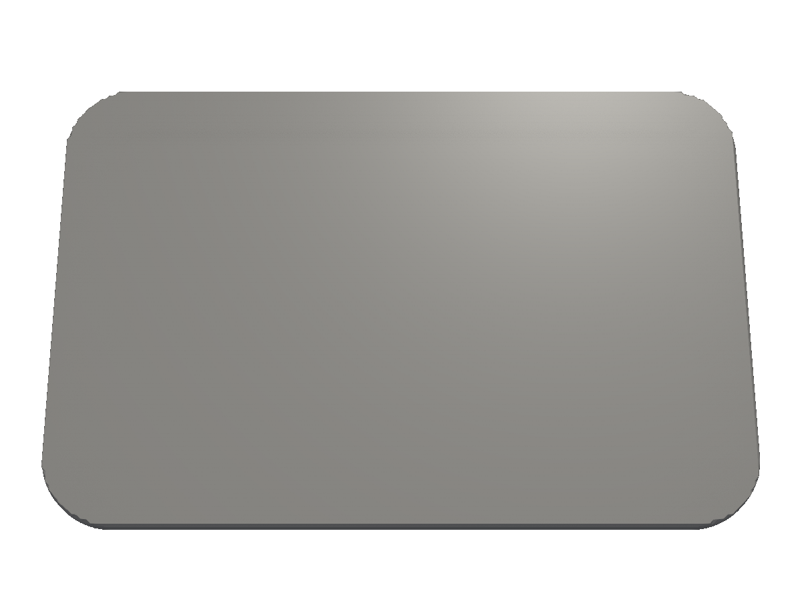
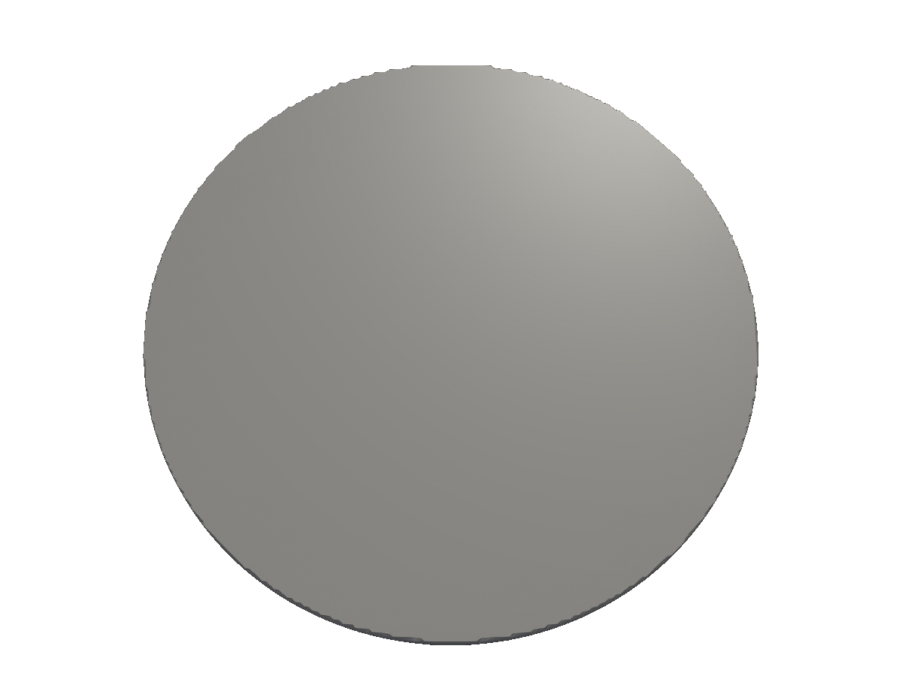
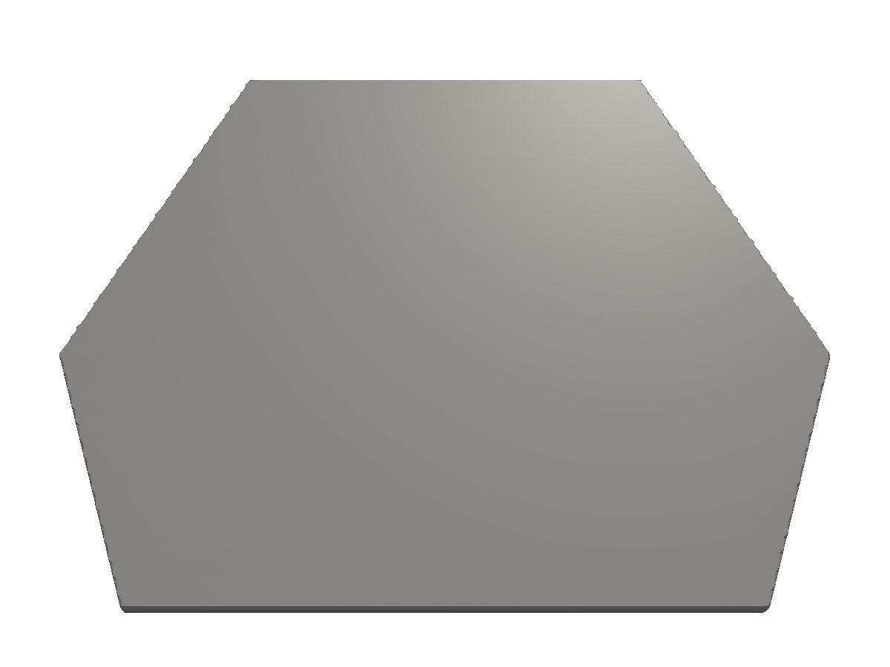
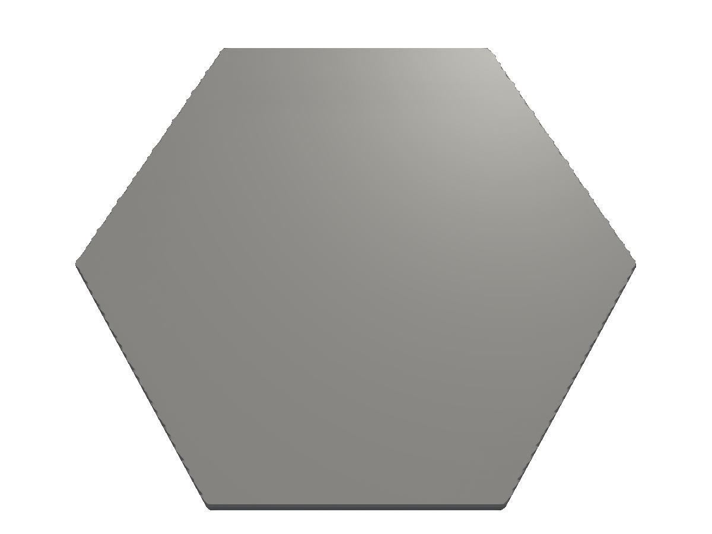
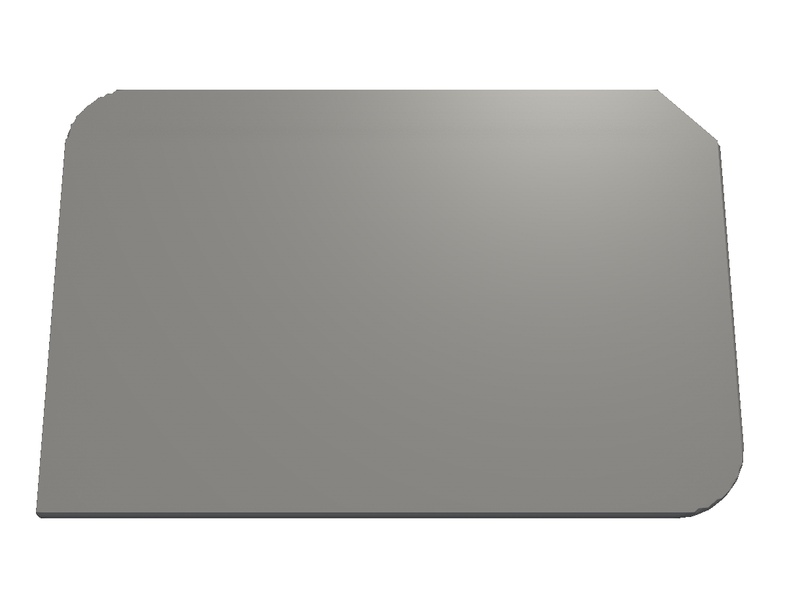
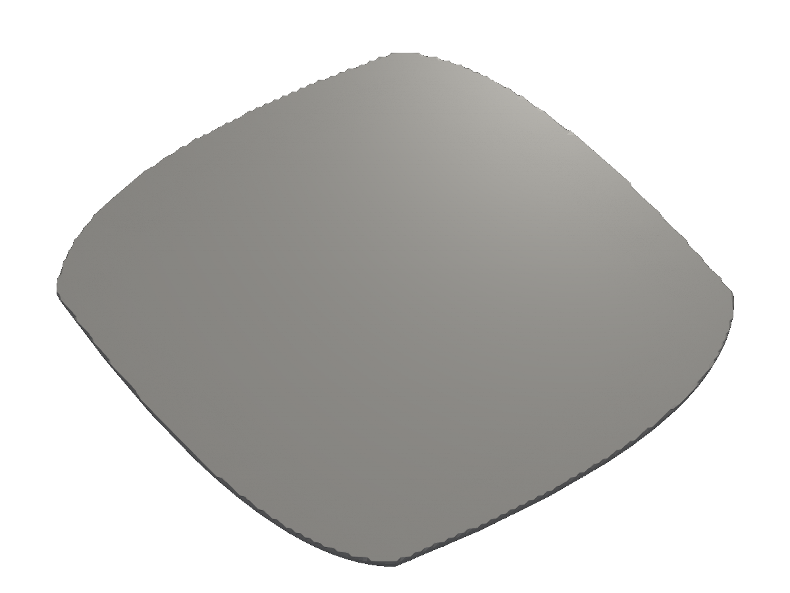

# 2D shapes

Primitives, builders, and outputs for 2D profiles. Most 3D parts start from a 2D sketch.

A `*shape.Shape` is the 2D building block for everything else. You construct one from a primitive (rect, circle, polygon, hexagon, star, …), refine it with transforms (translate, rotate, scale, mirror) and booleans (union, cut, intersect), and then either output it directly (DXF, SVG, PNG) or promote it to a 3D `*solid.Solid` via [extrusion or revolution](/2d-to-3d/).

All examples below extrude the resulting shape 1mm thick so you can see the silhouette in 3D.

## Rectangles

`shape.Rect(size, round)` — the cornerstone primitive. The `round` argument fillets all four corners.

<!-- src: tutorial/06-shapes-2d/01-rect/main.go -->
```go
// 2D shapes: a rounded rectangle.
package main

import (
	"github.com/snowbldr/fluent-sdfx/shape"
	v2 "github.com/snowbldr/fluent-sdfx/vec/v2"
)

func main() {
	shape.Rect(v2.XY(30, 20), 3).Extrude(1).STL("out.stl", 5)
}
```

<figure>
  
  <figcaption>A 30×20mm rectangle with 3mm rounded corners.</figcaption>
</figure>

## Circles

<!-- src: tutorial/06-shapes-2d/02-circle/main.go -->
```go
// 2D shapes: a circle.
package main

import "github.com/snowbldr/fluent-sdfx/shape"

func main() {
	shape.Circle(15).Extrude(1).STL("out.stl", 5)
}
```

<figure>
  
  <figcaption>A 15mm-radius circle.</figcaption>
</figure>

## Arbitrary polygons

`shape.Polygon(pts)` takes a slice of `v2.Vec` vertices. The polygon doesn't need to be convex; the underlying SDF handles arbitrary closed shapes. For complex polygons with many vertices, `shape.Polygon` automatically uses a cache-friendly backend.

<!-- src: tutorial/06-shapes-2d/03-polygon/main.go -->
```go
// 2D shapes: an arbitrary polygon from a list of vertices.
package main

import (
	"github.com/snowbldr/fluent-sdfx/shape"
	v2 "github.com/snowbldr/fluent-sdfx/vec/v2"
)

func main() {
	shape.Polygon([]v2.Vec{
		v2.XY(-12, -10),
		v2.XY(12, -10),
		v2.XY(15, 0),
		v2.XY(8, 12),
		v2.XY(-8, 12),
		v2.XY(-15, 0),
	}).Extrude(1).STL("out.stl", 5)
}
```

<figure>
  
  <figcaption>A six-sided polygon defined by an explicit vertex list.</figcaption>
</figure>

## Regular hexagons

For the very common case of a regular hexagon:

<!-- src: tutorial/06-shapes-2d/04-hexagon/main.go -->
```go
// 2D shapes: a regular hexagon by inscribed radius.
package main

import "github.com/snowbldr/fluent-sdfx/shape"

func main() {
	shape.Hexagon(12).Extrude(1).STL("out.stl", 5)
}
```

<figure>
  
  <figcaption>A regular hexagon, 12mm inscribed radius.</figcaption>
</figure>

## Stars

`shape.Star(outer, inner, points)` — the outer and inner radii control the depth of the points; `points` is the count.

<!-- src: tutorial/06-shapes-2d/05-star/main.go -->
```go
// 2D shapes: a 5-pointed star with outer/inner radius and point count.
package main

import "github.com/snowbldr/fluent-sdfx/shape"

func main() {
	shape.Star(15, 7, 5).Extrude(1).STL("out.stl", 5)
}
```

<figure>
  
  <figcaption>A 5-pointed star, outer radius 15mm, inner radius 7mm.</figcaption>
</figure>

## The polygon builder — fillets, chamfers, arcs

Hand-rolling vertex lists gets tedious for shapes with rounded corners. `shape.NewPoly()` is a fluent builder where each `.Add(x, y)` returns a vertex you can decorate:

- `.Smooth(radius, facets)` — fillet this corner.
- `.Chamfer(size)` — 45° chamfer.
- `.Arc(radius, facets)` — replace the prior edge with a circular arc.
- `.Rel()` — interpret this vertex as relative to the previous.
- `.Polar()` — interpret as polar (radius, angle).

<!-- src: tutorial/06-shapes-2d/06-polybuilder-with-arcs/main.go -->
```go
// 2D shapes: a fluent polygon builder with smoothed and chamfered corners.
//
// NewPoly accepts vertices via Add(x, y). Each returns a PolyVertex you can
// modify with .Smooth(r, facets) for a fillet, .Chamfer(c) for a 45° cut,
// or .Arc(r, facets) to replace the prior edge with an arc.
package main

import "github.com/snowbldr/fluent-sdfx/shape"

func main() {
	p := shape.NewPoly()
	p.Add(-15, -10)
	p.Add(15, -10).Smooth(3, 6)
	p.Add(15, 10).Chamfer(4)
	p.Add(-15, 10).Smooth(3, 6)
	p.Close()

	p.Build().Extrude(1).STL("out.stl", 5)
}
```

<figure>
  
  <figcaption>A rectangle with two filleted corners and one chamfered corner.</figcaption>
</figure>

The result is just a `*Shape`, so all the regular operations work — `.Translate`, `.Cut`, `.Extrude`, etc.

## Bezier curves

For smooth curves, `shape.NewBezier()` lets you place endpoints with explicit slope handles. `HandleFwd(thetaDeg, r)` sets the forward control handle at angle `thetaDeg` (in degrees, despite the underlying sdfx using radians) and length `r`.

<!-- src: tutorial/06-shapes-2d/07-bezier/main.go -->
```go
// 2D shapes: a closed bezier curve via NewBezier with slope handles.
//
// HandleFwd(theta, r) sets the forward control-point handle at angle theta
// (degrees) and length r. A symmetric handle on each cardinal vertex
// produces a smooth, rounded blob.
package main

import "github.com/snowbldr/fluent-sdfx/shape"

func main() {
	b := shape.NewBezier()
	b.Add(-15, 0).HandleFwd(90, 6)
	b.Add(0, 12).HandleFwd(0, 6)
	b.Add(15, 0).HandleFwd(-90, 6)
	b.Add(0, -12).HandleFwd(180, 6)
	b.Close()

	b.Build().Extrude(1).STL("out.stl", 5)
}
```

<figure>
  
  <figcaption>A smooth, blob-like closed bezier curve.</figcaption>
</figure>

## Other 2D primitives

Beyond the ones above, the `shape` package ships:

| Constructor | Description |
|---|---|
| `Triangle(radius)` | Equilateral triangle inscribed in `radius`. |
| `Cross(width, thickness)` | A plus sign / cross. |
| `Line(length, round)` | A capsule-like line segment. |
| `WireGroove(radius, depth, tailAngle)` | Wire groove cross-section. |
| `Flange1(distance, centerR, sideR)` | Two tangent-joined circles. |
| `ArcSpiral(a, k, start, end, d)` | Archimedean spiral. |
| `CubicSpline(knots)` | Closed cubic spline. |
| `Nagon(n, radius)` | Vertices of a regular N-gon (returns `[]v2.Vec`). |
| `AcmeThread`, `ISOThread`, `ANSIButtressThread`, `PlasticButtressThread` | Standard screw thread profiles. |
| `ThreadLookup(name)` | Look up a standard thread by name. |
| `FlatFlankCam`, `ThreeArcCam` | Cam profiles. |
| `GearRack(params)` | Linear gear rack. |
| `Text(font, str, height)` | Truetype-rendered text — see [Text & 2D output](/text-2d-output/). |
| `Wrap2D(sdf2)` | Wrap an existing raw `sdf.SDF2`. |

For booleans on 2D shapes, see [Booleans](/booleans/) — the same `Union`, `Cut`, `Intersect` API works for both 2D and 3D. For combining shapes with smooth blends, see [Smooth blends](/smooth-blends/).
