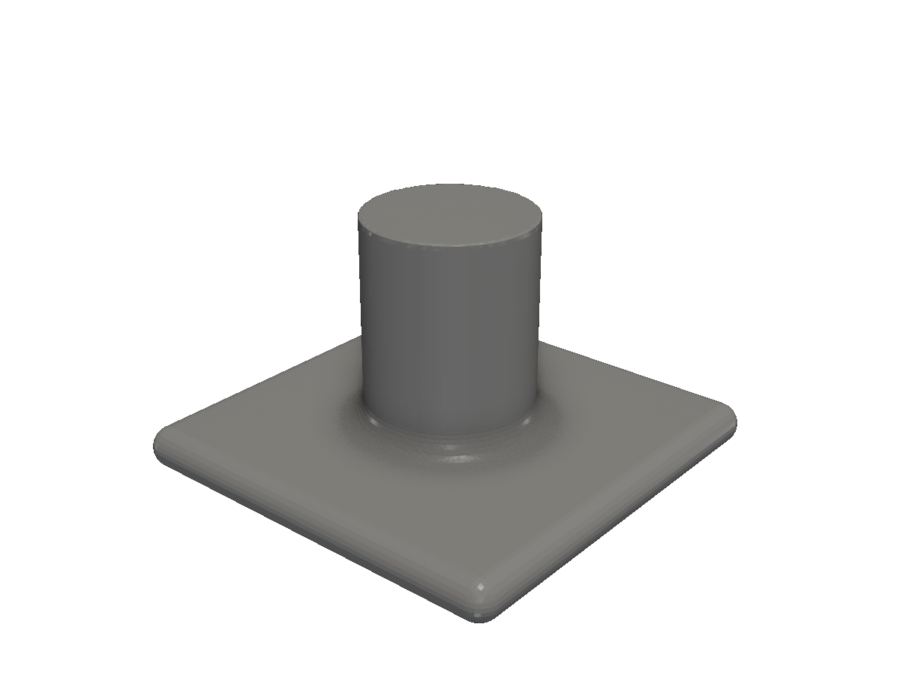
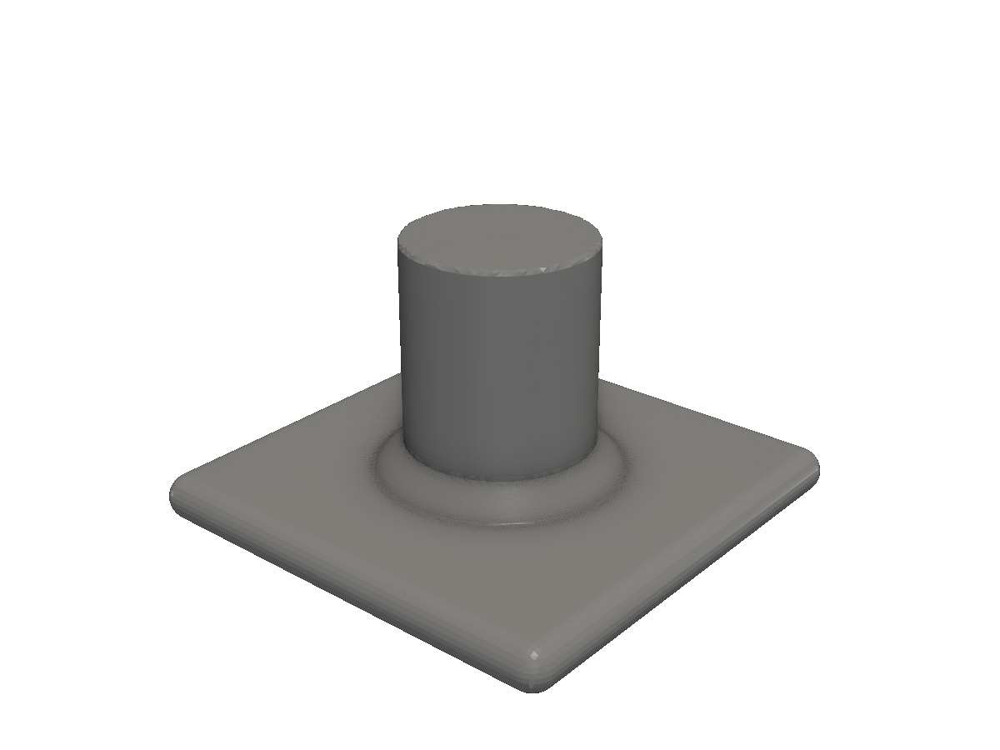
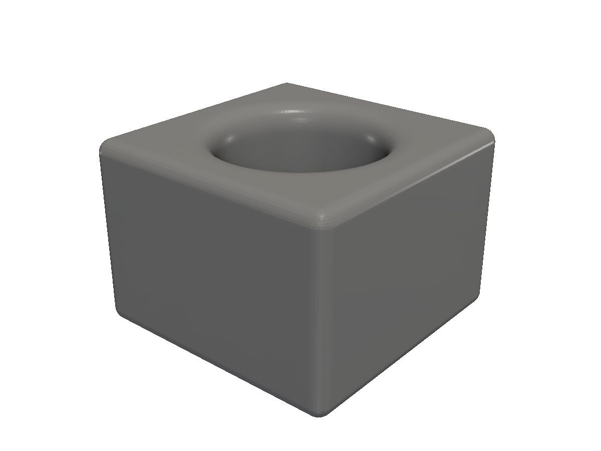
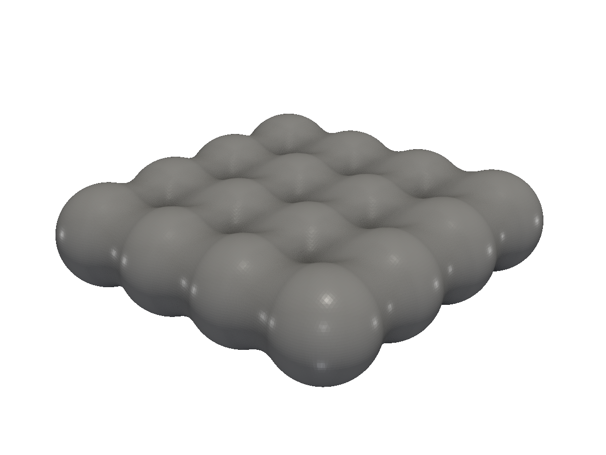

# Smooth blends

SmoothUnion, SmoothCut, SmoothIntersect — round the seams where solids meet.

The plain booleans (`Union`, `Cut`, `Intersect`) leave sharp creases where solids meet. The smooth variants take a *blend function* and fillet the join with a radius you control. The result is a single continuous surface — no extra geometry, no stitching.

| Plain | Smooth |
|---|---|
| `Union(others...)` | `SmoothUnion(min MinFunc, others...)` |
| `Cut(tools...)` | `SmoothCut(max MaxFunc, tools...)` |
| `Intersect(others...)` | `SmoothIntersect(max MaxFunc, others...)` |

The min/max function determines the *shape* of the blend. fluent-sdfx ships several:

| Constructor | Blend shape |
|---|---|
| `solid.RoundMin(k)` | A circular fillet of radius ~`k`. The most common choice. |
| `solid.ChamferMin(k)` | A 45° chamfer of width ~`k`. |
| `solid.ExpMin(k)` | An exponential blend — gentle far away, smooth near the seam. |
| `solid.PowMin(k)` | A power-law blend. |
| `solid.PolyMin(k)` | A polynomial smooth blend. |
| `solid.PolyMax(k)` | The smooth-max counterpart for `SmoothCut` / `SmoothIntersect`. |

The same constructors exist on the `shape` package for 2D blends.

## SmoothUnion with RoundMin

The default tool. A clean fillet wherever the two volumes meet.

<!-- src: tutorial/11-smooth-blends/01-round-min/main.go -->
```go
// Smooth blends: SmoothUnion with a RoundMin blend function fillets the
// junction between two solids with a circular radius.
package main

import (
	"github.com/snowbldr/fluent-sdfx/solid"
	v3 "github.com/snowbldr/fluent-sdfx/vec/v3"
)

func main() {
	solid.Box(v3.XYZ(20, 20, 2), 1).
		UnderneathOf(solid.Cylinder(10, 4, 0).Bottom()).
		SmoothAdd(solid.RoundMin(1.25)).
		STL("out.stl", 5.0)
}
```

<figure>
  
  <figcaption>A box and a vertical cylinder smooth-unioned with a 1.25mm round blend.</figcaption>
</figure>

## SmoothUnion with ChamferMin

Same geometry, chamfered seam. Better fit for faceted, mechanical-looking parts where a fillet would feel wrong.

<!-- src: tutorial/11-smooth-blends/02-chamfer-min/main.go -->
```go
// Smooth blends: ChamferMin produces a 45° chamfer at the union seam
// instead of a fillet. Useful when the design language is faceted rather
// than rounded.
package main

import (
	"github.com/snowbldr/fluent-sdfx/solid"
	v3 "github.com/snowbldr/fluent-sdfx/vec/v3"
)

func main() {
	solid.Box(v3.XYZ(20, 20, 2), 1).
		UnderneathOf(solid.Cylinder(10, 4, 0).Bottom()).
		SmoothAdd(solid.ChamferMin(1.25)).
		STL("out.stl", 5.0)
}
```

<figure>
  
  <figcaption>The same union with a chamfered seam instead of a round.</figcaption>
</figure>

## SmoothCut

For subtractions, you want a smooth max — `PolyMax` is the standard choice. The fillet appears on the *inside* corner where the tool leaves the body.

<!-- src: tutorial/11-smooth-blends/03-smooth-cut/main.go -->
```go
// Smooth blends: SmoothCut fillets the *inside* corner where a tool is
// subtracted from a body. Pair with PolyMax (the smooth-max counterpart of
// PolyMin) for a clean rounded pocket.
package main

import (
	"github.com/snowbldr/fluent-sdfx/solid"
	v3 "github.com/snowbldr/fluent-sdfx/vec/v3"
)

func main() {
	solid.Cylinder(20, 6, 0).
		Top().On(solid.Box(v3.XYZ(20, 20, 14), 1).Top()).
		SmoothCut(solid.PolyMax(2.0)).
		STL("out.stl", 6.0)
}
```

<figure>
  
  <figcaption>A pocket cut from a box with a smooth-filleted inside corner.</figcaption>
</figure>

## SmoothArray

`Array` and `RotateCopy` have smooth variants too. `SmoothArray` is great for organic-looking arrays — skin-like patterns, beaded surfaces, generative texture.

<!-- src: tutorial/11-smooth-blends/04-smooth-array/main.go -->
```go
// Smooth blends: SmoothArray repeats a solid in a grid where each
// neighbour is smooth-unioned to its peers, producing soft webs between
// what would otherwise be discrete copies.
package main

import (
	"github.com/snowbldr/fluent-sdfx/solid"
	v3 "github.com/snowbldr/fluent-sdfx/vec/v3"
)

func main() {
	solid.Sphere(4).
		SmoothArray(4, 4, 1, v3.XYZ(7, 7, 0), solid.RoundMin(2.5)).
		STL("out.stl", 5.0)
}
```

<figure>
  
  <figcaption>A 4×4 grid of spheres smooth-unioned together — they merge into a continuous surface.</figcaption>
</figure>

## Picking the right blend

Three rules of thumb:

1. **Use `RoundMin(k)` by default.** It produces predictable, intuitive fillets and matches what most people mean by "smooth blend."
2. **`k` is roughly the fillet radius**, not exactly. The smooth-min functions are approximations; the actual surface curvature varies slightly with the underlying SDFs being blended. Iterate visually.
3. **Smaller `k` = sharper transition; larger `k` = softer.** For a clean hand-look, try `k` between 5–15% of the part's overall size.

> [!WARNING]
> Smooth blends propagate the `k` distance back into the SDFs of both operands. A large `k` near a thin feature can deform that feature visibly — for instance, smooth-unioning a cylinder with `k=10` to a 2mm-thick wall will pull the wall toward the cylinder. Match `k` to the smallest local feature you don't want disturbed.

For the standard non-smooth booleans, see [Booleans](/booleans/).
