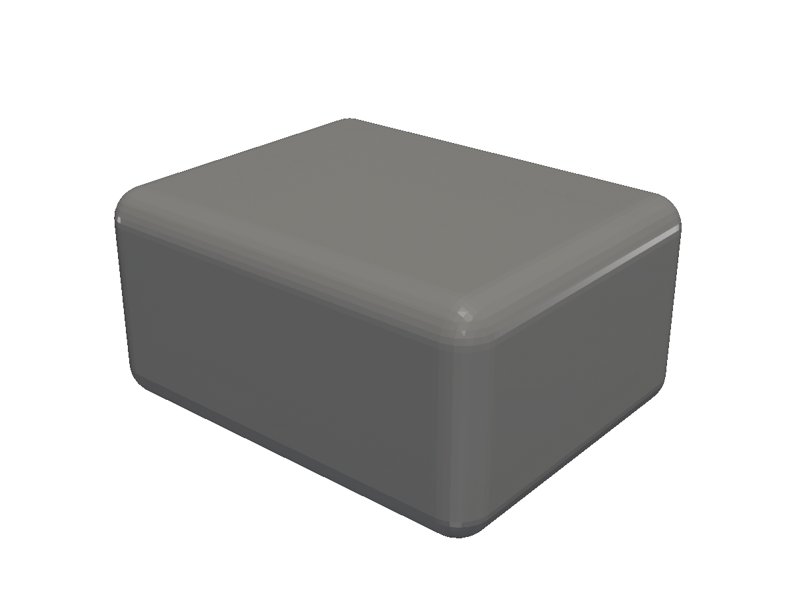
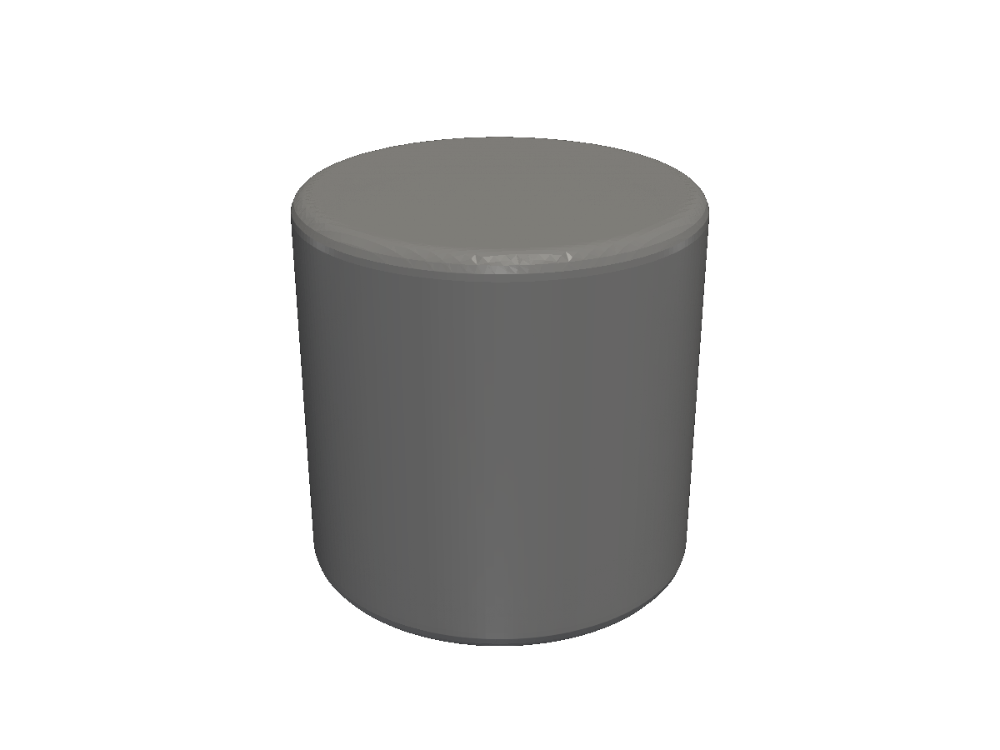
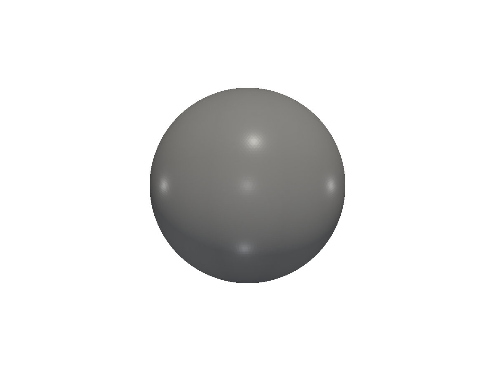
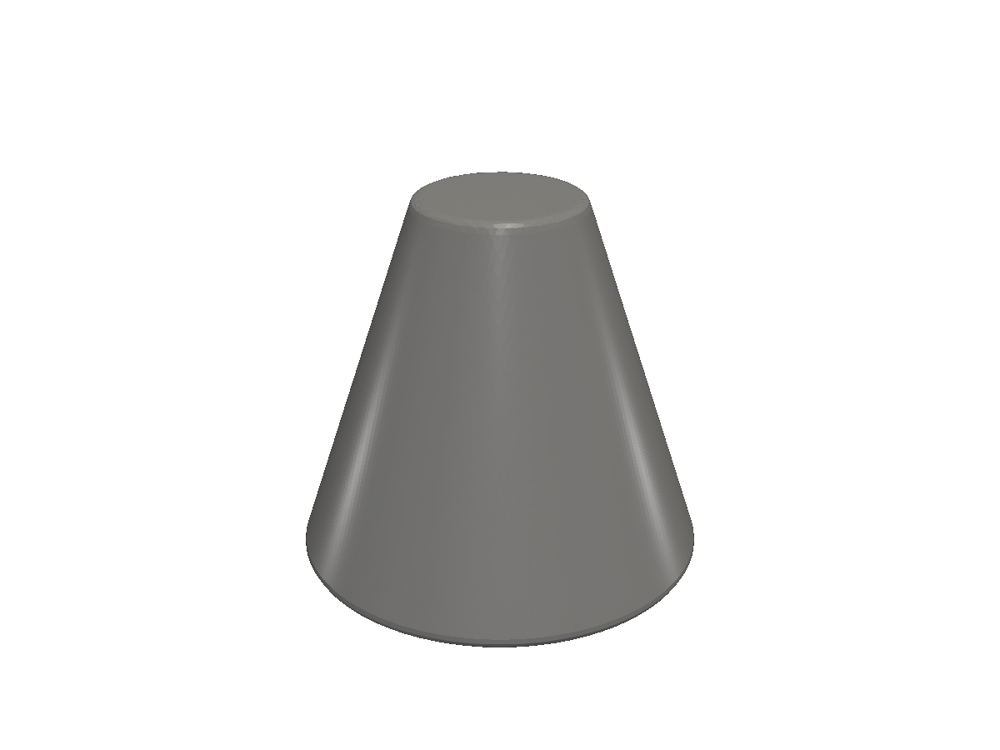
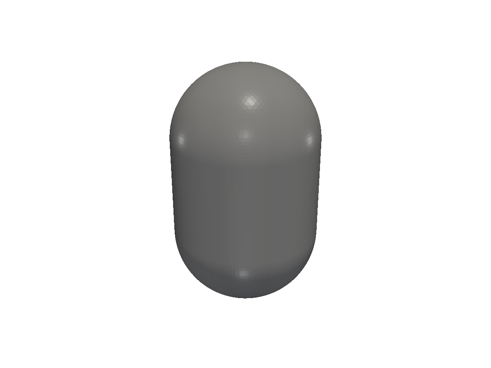
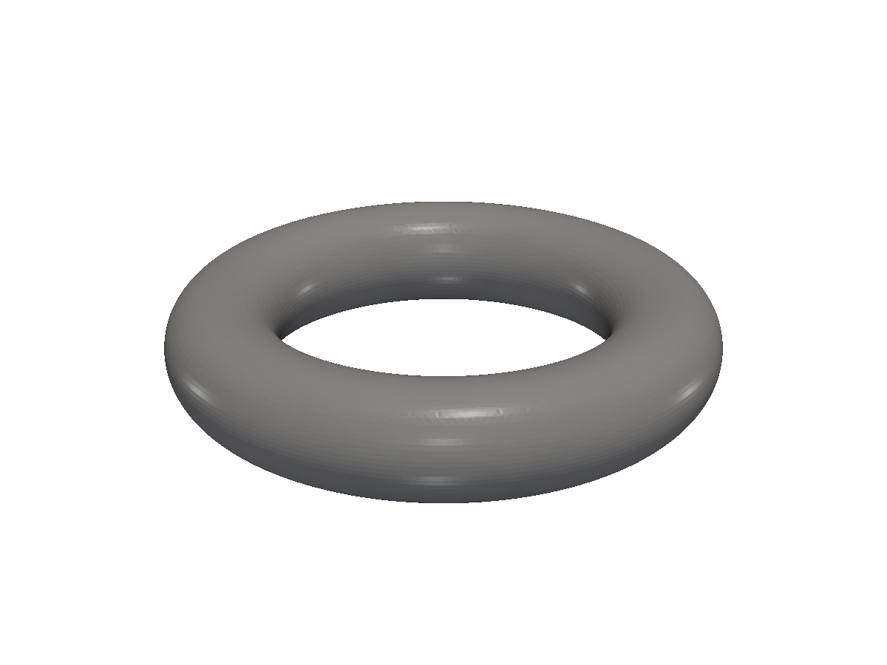

# 3D solids

Primitive 3D solids — boxes, cylinders, spheres, cones, capsules, tori — and how they compose.

A `*solid.Solid` is the 3D building block. Construct one from a primitive, refine it with transforms and booleans, and output it as STL or 3MF. Most non-trivial parts are unions and cuts of a handful of these primitives.

## Boxes

`solid.Box(size, round)` — the cornerstone 3D primitive. Size is a `v3.Vec`. The `round` argument fillets every edge.

<!-- src: tutorial/07-solids-3d/01-box/main.go -->
```go
// 3D solids: a rounded box via solid.Box(size, round).
package main

import (
	"github.com/snowbldr/fluent-sdfx/solid"
	v3 "github.com/snowbldr/fluent-sdfx/vec/v3"
)

func main() {
	solid.Box(v3.XYZ(20, 16, 10), 1.5).STL("out.stl", 4.0)
}
```

<figure>
  
  <figcaption>A 20×16×10mm rounded box.</figcaption>
</figure>

## Cylinders

`solid.Cylinder(height, radius, round)` — the most-used primitive after Box. Axis is along Z. The `round` argument fillets the top and bottom edges.

<!-- src: tutorial/07-solids-3d/02-cylinder/main.go -->
```go
// 3D solids: a cylinder via solid.Cylinder(height, radius, round).
package main

import "github.com/snowbldr/fluent-sdfx/solid"

func main() {
	solid.Cylinder(20, 10, 1).STL("out.stl", 3.0)
}
```

<figure>
  
  <figcaption>A 20mm-tall, 10mm-radius cylinder with 1mm rounded edges.</figcaption>
</figure>

## Spheres

<!-- src: tutorial/07-solids-3d/03-sphere/main.go -->
```go
// 3D solids: a sphere via solid.Sphere(radius).
package main

import "github.com/snowbldr/fluent-sdfx/solid"

func main() {
	solid.Sphere(12).STL("out.stl", 4.0)
}
```

<figure>
  
  <figcaption>A 12mm-radius sphere centred on the origin.</figcaption>
</figure>

## Cones

`solid.Cone(height, r0, r1, round)` — a truncated cone. `r0` is the bottom radius, `r1` is the top. Set one to `0` for a true cone.

<!-- src: tutorial/07-solids-3d/04-cone/main.go -->
```go
// 3D solids: a truncated cone — bottom radius 10, top radius 4, height 18.
package main

import "github.com/snowbldr/fluent-sdfx/solid"

func main() {
	solid.Cone(18, 10, 4, 0.5).STL("out.stl", 4.0)
}
```

<figure>
  
  <figcaption>A truncated cone — 10mm bottom radius, 4mm top, 18mm tall.</figcaption>
</figure>

## Capsules

`solid.Capsule(height, radius)` — a cylinder with hemispherical caps. The `height` is the distance between cap centres; total length is `height + 2*radius`.

<!-- src: tutorial/07-solids-3d/05-capsule/main.go -->
```go
// 3D solids: a capsule — a cylinder with hemispherical caps. The 'height'
// is the axial length between cap centres; total length = height + 2*radius.
package main

import "github.com/snowbldr/fluent-sdfx/solid"

func main() {
	solid.Capsule(20, 6).STL("out.stl", 4.0)
}
```

<figure>
  
  <figcaption>A 6mm-radius capsule with 20mm body length.</figcaption>
</figure>

## Tori

`solid.Torus(majorR, minorR)` — a torus with a major radius (centre to tube axis) and a minor radius (tube cross-section).

<!-- src: tutorial/07-solids-3d/06-torus/main.go -->
```go
// 3D solids: a torus with a major radius (centre-to-tube distance) and a
// minor radius (tube radius).
package main

import "github.com/snowbldr/fluent-sdfx/solid"

func main() {
	solid.Torus(12, 3).STL("out.stl", 4.0)
}
```

<figure>
  
  <figcaption>A torus, 12mm major radius, 3mm minor radius.</figcaption>
</figure>

## Other 3D primitives & generators

| Constructor | Description |
|---|---|
| `Gyroid(scale)` | Infinite gyroid surface. Useful for generative-looking infill or shells (intersect with another solid to bound it). |
| `Mesh(triangles)` | Build a solid from an explicit triangle mesh. |
| `MeshSlow(triangles)` | Same, slower but doesn't require a watertight mesh. |
| `obj.ImportSTL(path)` | Load an STL file as a solid. |

## From 2D profiles

A huge fraction of 3D parts are extrusions or revolutions of a 2D shape. fluent-sdfx provides:

- `*shape.Shape` methods: `.Extrude(h)`, `.ExtrudeRounded(h, round)`, `.TwistExtrude(h, twist)`, `.ScaleExtrude(h, scale)`, `.ScaleTwistExtrude(h, twist, scale)`, `.Revolve()`, `.RevolveAngle(deg)`, `.Screw(...)`, `.SweepHelix(...)`, `.LoftTo(top, h, round)`.

These are covered in detail on the [2D → 3D page](/2d-to-3d/).

## Where to next

- [Booleans](/booleans/) — combine these primitives into the part you're actually building.
- [Transforms](/transforms/) — translate, rotate, scale, mirror.
- [Parametric helpers](/obj-overview/) — bolts, nuts, panels, gears, and more, built from these primitives.
