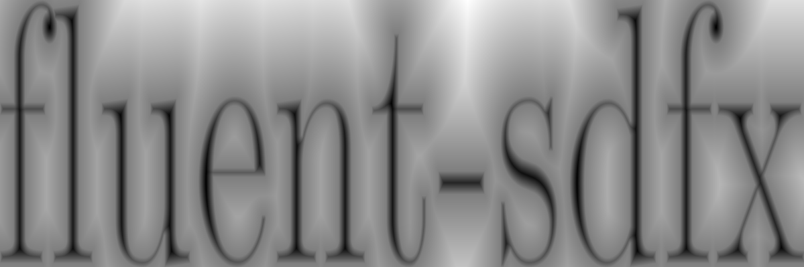
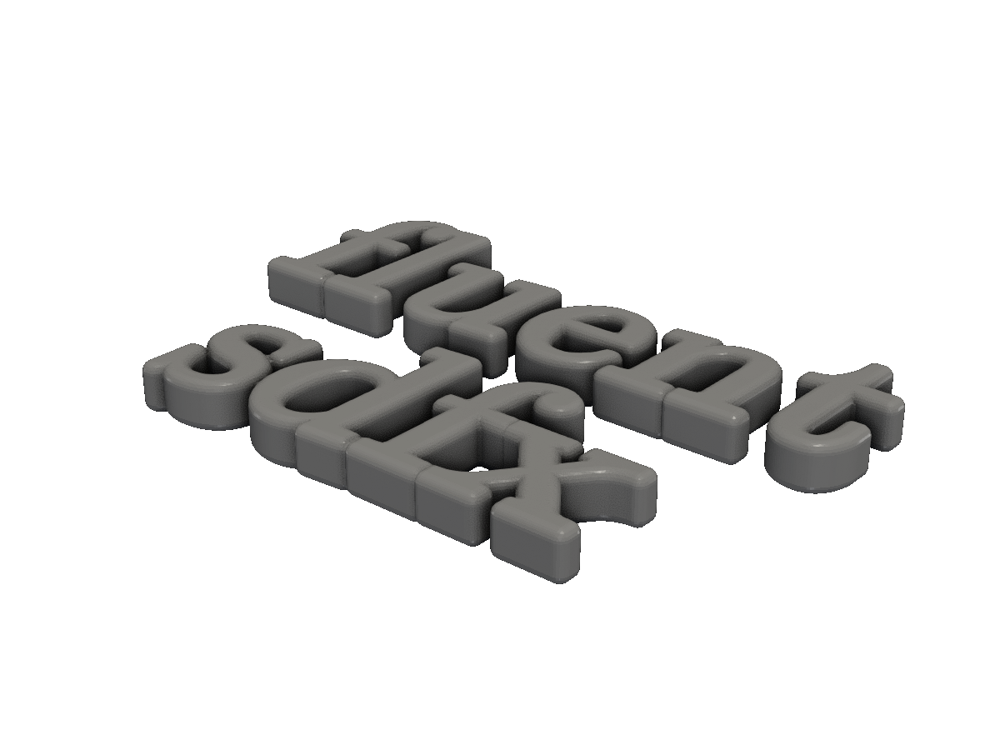

# Text & 2D output

Render TrueType text into a 2D shape, then output to DXF, SVG, PNG, or extrude into 3D.

`shape.Text(font, text, height)` rasterises a string into a 2D `*Shape` — perfect for engraving, embossing, signage, and labelling. Once you have a `*Shape`, the usual 2D output methods (DXF, SVG, PNG) and the 2D-to-3D operations (Extrude, ExtrudeRounded, Revolve) all apply.

## Loading a font

```go
import "github.com/snowbldr/fluent-sdfx/shape"

font := shape.LoadFont("path/to/font.ttf")
```

`LoadFont` panics on missing or invalid files. For tutorials we ship a small Computer Modern font under `tutorial/internal/tutorialfont` — use any TrueType font in your own projects.

## To PNG

`ToPNG(path, width, height)` renders the shape's signed-distance field as a grayscale image. Useful for previews, less so for laser-cuttable output (use SVG or DXF for that).

<!-- src: tutorial/15-text-2d-output/01-text-to-png/main.go -->
```go
// Text & 2D output: render a string with a TrueType font, write as PNG.
//
// shape.Text(font, text, height) returns a *Shape. height sets the cap
// height; the resulting shape is centred on the origin.
package main

import (
	"github.com/snowbldr/fluent-sdfx/shape"
	"github.com/snowbldr/fluent-sdfx/tutorial/internal/tutorialfont"
)

func main() {
	// The PNG renderer shows the SDF as a heatmap, so the actual file
	// for docs is the extruded STL produced alongside.
	shape.Text(tutorialfont.Load(), "fluent-sdfx", 10).
		ToPNG("out.png", 1200, 400)
}
```

<figure>
  
  <figcaption>The text <code>"fluent-sdfx"</code> rendered as a PNG distance-field heatmap.</figcaption>
</figure>

The fuzzy halo is the SDF's distance gradient — it's actually useful for shaders and stylised renders. For a clean outline, prefer SVG.

## To DXF

DXF is the format laser cutters and 2D CAD tools expect. For complex shapes — including text — wrap the call with `.Cache()` to pre-compute distances, otherwise the export samples each glyph outline thousands of times.

<!-- src: tutorial/15-text-2d-output/02-text-to-dxf/main.go -->
```go
// Text & 2D output: render a string and write to DXF (vector format used
// by laser cutters and CAD software).
//
// Cache the SDF for evaluation speedup — Text shapes are expensive to
// evaluate point-by-point because the SDF samples bezier outlines. We
// produce both a DXF (the actual output) and an extruded STL alongside
// so the screenshot pipeline has a 3D render to capture.
package main

import (
	"github.com/snowbldr/fluent-sdfx/shape"
	"github.com/snowbldr/fluent-sdfx/tutorial/internal/tutorialfont"
)

func main() {
	text := shape.Text(tutorialfont.Load(), "fluent-sdfx", 10).Cache()
	text.ToDXF("out.dxf", 600)
	text.Extrude(1).STL("out.stl", 8.0)
}
```
The cache pays off as soon as you generate the same geometry twice — once for DXF, once for the extruded preview.

## Extruded text — 3D signage

Extrude the text shape with `ExtrudeRounded` for soft edges, or `Extrude` for sharp corners.

<!-- src: tutorial/15-text-2d-output/03-text-extruded-3d/main.go -->
```go
// Text & 2D output: extrude a text profile into 3D with rounded edges.
package main

import (
	"github.com/snowbldr/fluent-sdfx/shape"
	"github.com/snowbldr/fluent-sdfx/tutorial/internal/tutorialfont"
)

func main() {
	shape.Text(tutorialfont.Load(), "fluent\nsdfx", 10).
		Cache().
		ExtrudeRounded(2, 0.4).
		STL("out.stl", 10.0)
}
```

<figure>
  
  <figcaption><code>"fluent / sdfx"</code> extruded 2mm with a 0.4mm rounded edge — ready for a 3D-printed sign or label.</figcaption>
</figure>

## SVG output

`shape.ToSVG(path, meshCells)` writes a similar geometry to a Scalable Vector Graphics file. The argument is the resolution of the marching-squares pass, in cells per shape.

```go
text.ToSVG("logo.svg", 600)
```

For text specifically, prefer SVG over DXF when targeting the web (browsers render SVG natively). DXF wins for laser cutters and traditional CAD pipelines.

## Tips

> [!TIP]
> Always wrap text shapes with `.Cache()` before further use. Text SDFs sample every glyph outline at every distance evaluation — caching cuts that cost down to a single upfront pass.

> [!NOTE]
> The `Text2D` API ships from sdfx and uses `freetype-go` for TTF parsing. The kerning is approximate; for fine typographic control, consider rendering the text in a vector tool (Inkscape, Illustrator) and importing the resulting DXF or polygon list with `shape.Polygon`.

## Other 2D outputs

| Method | Format | Notes |
|---|---|---|
| `ToDXF(path, meshCells)` | DXF | Industry-standard 2D CAD. |
| `ToSVG(path, meshCells)` | SVG | Web-friendly vector. |
| `ToPNG(path, w, h)` | PNG | Distance-field heatmap. |
| `ToPNGBox(path, bb, w, h)` | PNG | Same, with explicit bounding box. |

For low-level control — custom rendering, line-by-line drawing, mixed shape and triangle output — see the helpers in the `render` package: `NewPNG(path, bb, pixels)`, `NewDXF(path)`, etc.
