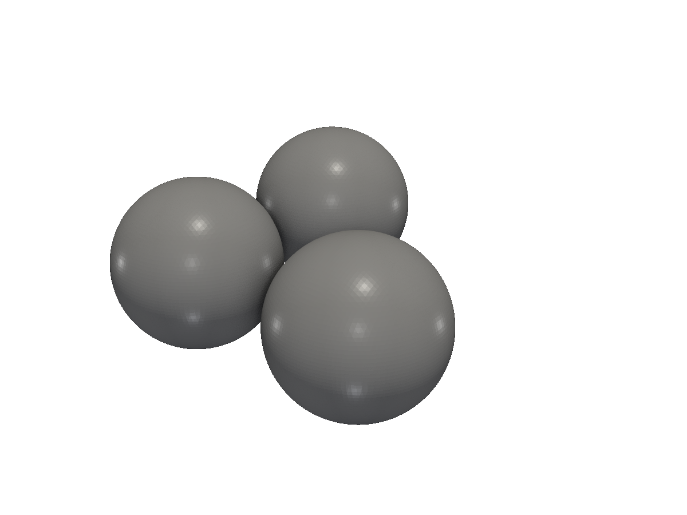
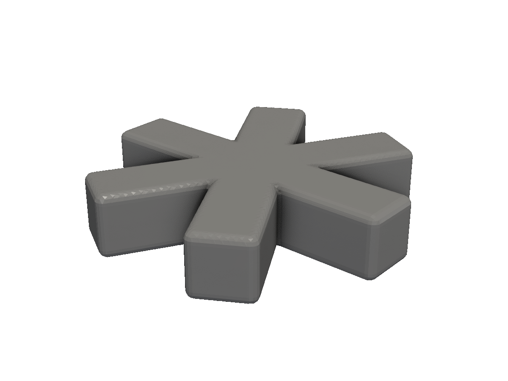
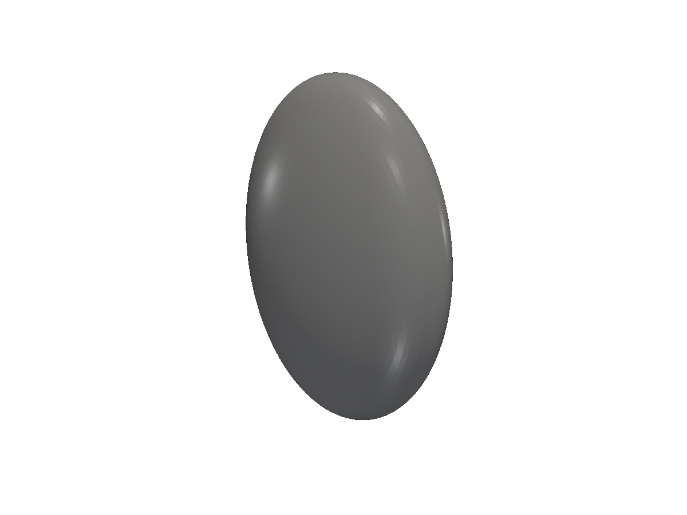
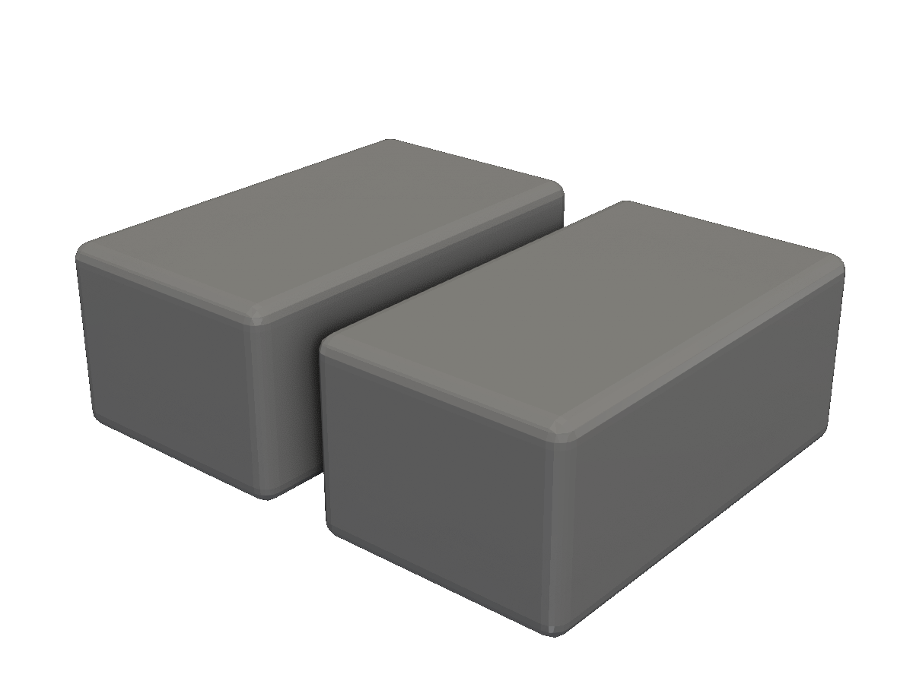
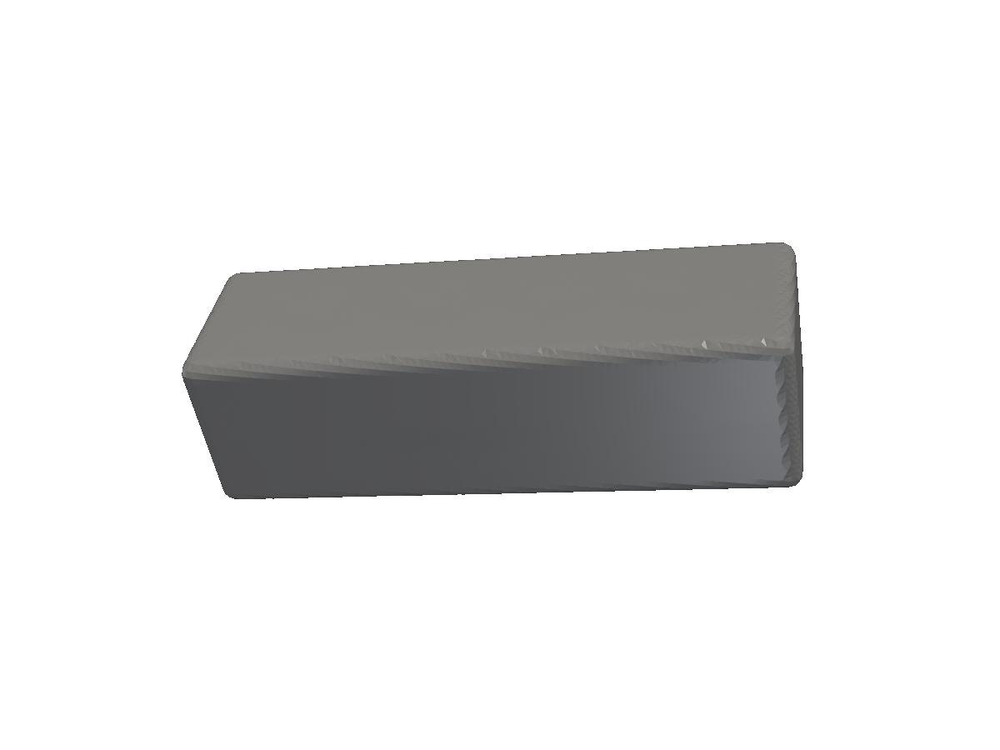

# Transforms

Translate, rotate, scale, mirror — the operations that position and orient a solid in space.

Transforms move, rotate, scale, or reflect a solid. Every transform returns a new value, so chaining is the natural style:

```go
solid.Cylinder(10, 5, 0).RotateX(90).TranslateZ(15)
```

## Translate

`Translate(v v3.Vec)` moves a solid by a vector. The axis-specific helpers — `TranslateX`, `TranslateY`, `TranslateZ`, plus pair versions like `TranslateXY(x, y)` and `TranslateXYZ(x, y, z)` — skip the `v3.XYZ(...)` boilerplate for the common cases.

<!-- src: tutorial/09-transforms/01-translate/main.go -->
```go
// Transforms: Translate moves a solid by a vector. The axis-specific
// helpers TranslateX / Y / Z avoid constructing a v3.Vec for the common case.
package main

import "github.com/snowbldr/fluent-sdfx/solid"

func main() {
	solid.Sphere(5).
		Union(
			solid.Sphere(5).TranslateX(12),
			solid.Sphere(5).TranslateY(12),
		).STL("out.stl", 5.0)
}
```

<figure>
  
  <figcaption>Three spheres laid out by per-axis translation.</figcaption>
</figure>

## Rotate

All rotations are in **degrees** — internally converted to radians, but you never have to think about it.

| Method | Rotation |
|---|---|
| `RotateX(deg)` | Around the X axis |
| `RotateY(deg)` | Around the Y axis |
| `RotateZ(deg)` | Around the Z axis |
| `RotateAxis(axis v3.Vec, deg)` | Around an arbitrary unit vector |
| `RotateToVector(from, to v3.Vec)` | Rotate so `from` aligns with `to` |

<!-- src: tutorial/09-transforms/02-rotate/main.go -->
```go
// Transforms: RotateX / Y / Z take an angle in degrees. RotateAxis lets
// you rotate around an arbitrary unit vector.
package main

import (
	"github.com/snowbldr/fluent-sdfx/solid"
	v3 "github.com/snowbldr/fluent-sdfx/vec/v3"
)

func main() {
	bar := solid.Box(v3.XYZ(20, 4, 4), 0.5)

	parts := bar.Union(
		bar.RotateZ(60),
		bar.RotateZ(120),
	)
	parts.STL("out.stl", 5.0)
}
```

<figure>
  
  <figcaption>A bar repeated at 0°, 60°, and 120° around Z.</figcaption>
</figure>

## Scale

`Scale(v v3.Vec)` scales each axis independently. `ScaleUniform(k)` is a single-factor shortcut.

<!-- src: tutorial/09-transforms/03-scale/main.go -->
```go
// Transforms: Scale takes a per-axis vector; ScaleUniform a single factor.
package main

import (
	"github.com/snowbldr/fluent-sdfx/solid"
	v3 "github.com/snowbldr/fluent-sdfx/vec/v3"
)

func main() {
	// Stretch a sphere along Z and squish along Y.
	solid.Sphere(8).Scale(v3.XYZ(1, 0.5, 1.5)).STL("out.stl", 4.0)
}
```

<figure>
  
  <figcaption>A sphere stretched along Z, squished along Y, unchanged along X.</figcaption>
</figure>

> [!TIP]
> `ScaleUniform` is the standard way to compensate for material shrinkage during printing. PLA shrinks ~0.1% on cooling, so multiplying the part by `1 / 0.999 ≈ 1.001` produces a slightly oversized model that finishes at the intended dimensions.

## Mirror

Reflect across one of the principal planes:

| Method | Plane | Effect |
|---|---|---|
| `MirrorXY()` | Z = 0 | Flip Z |
| `MirrorXZ()` | Y = 0 | Flip Y |
| `MirrorYZ()` | X = 0 | Flip X |
| `MirrorXeqY()` | X = Y plane | Swap X and Y |

Mirroring is the easiest way to get bilateral symmetry — design one half, mirror, union.

<!-- src: tutorial/09-transforms/04-mirror/main.go -->
```go
// Transforms: Mirror operations reflect a solid across an axis plane.
// Useful for making symmetric parts from one half.
package main

import (
	"github.com/snowbldr/fluent-sdfx/solid"
	v3 "github.com/snowbldr/fluent-sdfx/vec/v3"
)

func main() {
	// One asymmetric half, then mirror it through the YZ plane.
	half := solid.Box(v3.XYZ(8, 14, 6), 0.5).TranslateX(5)
	half.Union(half.MirrorYZ()).STL("out.stl", 5.0)
}
```

<figure>
  
  <figcaption>An asymmetric half mirrored across the YZ plane to create a symmetric whole.</figcaption>
</figure>

## Chaining

Every transform returns a new `*Solid`, so chaining is just function composition. The whole part below is one expression:

<!-- src: tutorial/09-transforms/05-chained/main.go -->
```go
// Transforms: every transform returns a new *Solid, so they chain.
// The whole part below is a single expression.
package main

import (
	"github.com/snowbldr/fluent-sdfx/solid"
	v3 "github.com/snowbldr/fluent-sdfx/vec/v3"
)

func main() {
	solid.
		Box(v3.XYZ(20, 6, 6), 0.5).
		RotateZ(30).
		RotateX(15).
		TranslateZ(8).
		ScaleUniform(0.9).
		STL("out.stl", 5.0)
}
```

<figure>
  
  <figcaption>A box rotated, lifted, and uniformly scaled in a single chain.</figcaption>
</figure>

> [!NOTE]
> Order matters. `RotateZ(30).TranslateZ(8)` rotates first, then lifts up — the part rises straight up from the rotated position. `TranslateZ(8).RotateZ(30)` lifts first, then rotates around the global Z axis — the part swings out into a circle. Fluent chains read left-to-right: each method applies in turn, so the leftmost transform happens first.

## Other useful transforms

| Method | What it does |
|---|---|
| `Center()` | Translate so the bounding box is centred on the origin. |
| `ZeroZ()` | Translate so the minimum Z is at 0 — the natural "sitting on the build plate" pose for a printer. |
| `Transform(m M44)` | Apply an arbitrary 4×4 affine transformation matrix. |

For *patterns* — array, rotate-copy, line-of, and friends — see the [Patterns](/patterns/) page. For shrinking, growing, shelling, and other geometry-modifying ops that aren't strictly transforms, see [Modifiers](/modifiers/).
