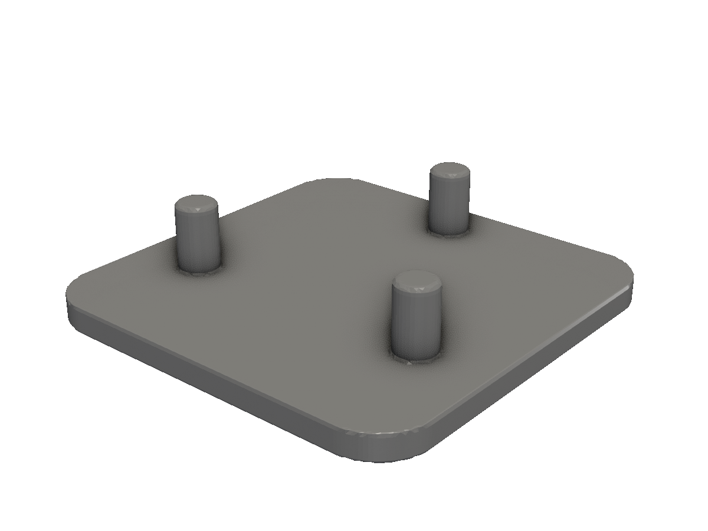

# Vectors & types

The two core types — Shape and Solid — and the vec packages that feed them.

fluent-sdfx exposes two top-level types and a small pile of vector packages. You'll see them in every example. This page is a tour, not a reference — for the full list, see [API reference](/api-reference/).

## The two core types

| Type | Wraps | Where it lives |
|---|---|---|
| `*shape.Shape` | An sdfx `SDF2` — a 2D signed-distance function | `github.com/snowbldr/fluent-sdfx/shape` |
| `*solid.Solid` | An sdfx `SDF3` — a 3D signed-distance function | `github.com/snowbldr/fluent-sdfx/solid` |

Both types are *immutable*: every method returns a new value, leaving the original untouched. That's what makes the chainable API safe — `body.TranslateX(5).RotateZ(30)` produces a new solid without disturbing `body`.

The two types interconvert in one direction at a time. A 2D `*Shape` becomes a 3D `*Solid` via `.Extrude(h)`, `.Revolve()`, `.Loft(...)`, `.SweepHelix(...)`, etc. A 3D `*Solid` becomes a 2D `*Shape` via `.SliceAt(plane)` (cross-section through the solid).

## The vec packages

Most APIs take or return vectors. Re-exports from sdfx with named constructors so you can skip the `Vec{X: ..., Y: ..., Z: ...}` ceremony:

```go
import (
	v2 "github.com/snowbldr/fluent-sdfx/vec/v2"
	v3 "github.com/snowbldr/fluent-sdfx/vec/v3"
	"github.com/snowbldr/fluent-sdfx/vec/p2"
)

v2.X(5)              // {X: 5, Y: 0}
v2.Y(3)              // {X: 0, Y: 3}
v2.XY(1, 2)          // {X: 1, Y: 2}

v3.X(5)              // {X: 5}
v3.YZ(2, 3)          // {Y: 2, Z: 3}
v3.XYZ(1, 2, 3)      // all three
v3.Zero              // origin

p2.R(10)             // polar: radius 10, theta 0
p2.T(math.Pi)        // polar: theta π, radius 0
p2.RT(10, math.Pi/4) // both
```

The `v2i` and `v3i` packages provide integer-component versions, used for grid-shaped patterns and resolutions (e.g. `Array(2, 3, 1, ...)` takes integer counts).

## A worked example

A small assembly built with all three vector flavours — a 30×30 base disc with three pegs around its perimeter, positioned in polar coordinates:

<!-- src: tutorial/05-vectors-types/01-vectors-demo/main.go -->
```go
// Vectors demo: build a small assembly using v2, v3, and p2 constructors.
//
// Three pegs around a base disc, positioned in polar form via p2.RT() and
// converted to cartesian via v2.FromP2 + .ToV3(z). Touches every vector
// constructor flavour we use elsewhere in the docs.
package main

import (
	"github.com/snowbldr/fluent-sdfx/shape"
	"github.com/snowbldr/fluent-sdfx/solid"
	"github.com/snowbldr/fluent-sdfx/units"
	"github.com/snowbldr/fluent-sdfx/vec/p2"
	v2 "github.com/snowbldr/fluent-sdfx/vec/v2"
	v3 "github.com/snowbldr/fluent-sdfx/vec/v3"
)

func main() {
	// 2D base profile via v2.XY: a rounded square 30mm on a side.
	base := shape.Rect(v2.XY(30, 30), 4)

	// Three peg positions in polar form (degrees → radians via units.DtoR).
	pegs := make([]*solid.Solid, 3)
	for i := range pegs {
		theta := units.DtoR(90 + float64(i*120))
		pos := v2.FromP2(p2.RT(11, theta))
		pegs[i] = solid.Cylinder(8, 1.5, 0.4).Translate(pos.ToV3(2))
	}

	// Lift the whole part up by 2 in Z via v3.Z (single-axis constructor).
	part := base.Extrude(2).Translate(v3.Z(0)).Union(pegs...)
	part.STL("out.stl", 4.0)
}
```

<figure>
  
  <figcaption>A flat base with three cylindrical pegs placed by polar coordinates.</figcaption>
</figure>

Three idioms worth noticing:

- `v2.XY(30, 30)` — a 2D size for `shape.Rect`.
- `p2.RT(11, theta)` — a polar (radius, theta) position for each peg. `theta` is in radians; `units.DtoR(deg)` converts from degrees.
- `v2.FromP2(...).ToV3(2)` — convert polar to cartesian, then promote to 3D by attaching a Z.

## Vector arithmetic

Each vec type carries a small toolbox: `.Add(b)`, `.Sub(b)`, `.Scale(k)`, `.Length()`, `.Normalize()`, `.Dot(b)`, `.Cross(b)`, etc. Useful for mid-build calculations:

```go
forward := v3.X(1)
side := v3.Y(1)
diagonal := forward.Add(side).Normalize().Scale(10)
```

For cross-type conversions, see the per-type method names: `v2.Vec.ToV3(z)`, `v3.Vec.XY()`, `v2.FromP2(...)` and so on. The unit-aware constants (`units.Pi`, `units.MillimetresPerInch`) and helpers (`units.DtoR`, `units.RtoD`) live in the `units` package.
